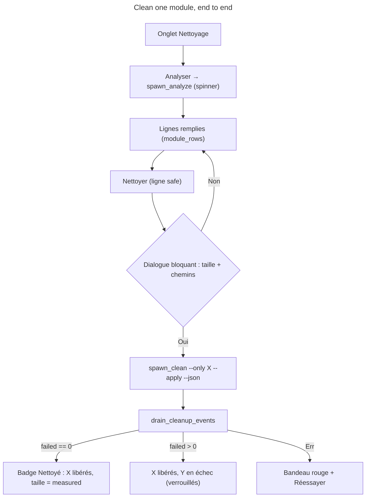

# Instruction: Integration into EguiApp (rename + wiring)

## Feature

- **Summary**: The last mile. The nav entry and heading « Applications » become « Nettoyage » (the `ActiveView::Applications` variant is renamed `Cleanup` for coherence — internal only, no persisted state involved). `render_applications_view` becomes the top half of `render_cleanup_view`; below it, `cleanup_view::render` is fed from new `EguiApp` state. `CleanupAction::Analyze` bumps a generation and calls `spawn_analyze`; `CleanupAction::Clean(module)` opens the existing blocking dialog (`ActiveDialog`) with a new `PendingAction::CleanModule(String)` variant recapping size and paths — on « Oui », `spawn_clean` runs and the row's `ModuleResult` lands in `last_runs`, refreshing its size from `measured` without a full re-analysis. Concurrency follows the brief's decision — one command at a time: a single `fn command_busy(&self) -> bool` (`action_running.is_some() || terminal_running || cleanup_running`) gates the cleanup buttons **and** extends `can_launch_card` plus the Terminal's Lancer button, so no path can run concurrently with a cleanup.
- **Stack**: unchanged. `report_spawning_enabled`'s test-gating pattern is reused as `cleanup_spawning_enabled` so kittest harness tests never spawn python.
- **Branch name**: `feature/cleanup-view/part-3-integration`
- **Sequence**: `3 of 3`
- **Parent Plan**: `./2026_08_17-cleanup-view-master.md`
- Confidence: 8/10 — every mechanism (drain loop, generation guard, blocking dialog, busy gate) already exists once in the file; the risk is churn in `egui_app.rs`'s existing tests, addressed explicitly below.

## Architecture projection

### Files to modify

- `src/ui/egui_app.rs` —
  - `ActiveView::Applications` → `ActiveView::Cleanup`; nav label « Nettoyage » ; heading in the view updated (« DevToolBox — Nettoyage »).
  - New state: `cleanup_rows: Option<Vec<ModuleRow>>`, `cleanup_error: Option<String>`, `cleanup_running: bool`, `cleanup_stale: bool`, `cleanup_generation: u64`, `cleanup_tx/rx: (Sender<CleanupEvent>, Receiver<CleanupEvent>)`, `cleanup_last_runs: HashMap<String, ModuleResult>`, `cleanup_spawning_enabled: bool`.
  - `drain_cleanup_events` (called next to `drain_application_events`): generation-checked; `Ok(Plan)` → rows via `module_rows`, clear stale; `Ok(Applied)` → merge `run.results` into `last_runs` + refresh that row's size from `measured`, honoring `run.status` (`"interrupted"` → failure-style message, never a success badge); `Err` → analysis banner or per-run status message (« Échec du nettoyage : … »), previous rows kept and marked stale.
  - `PendingAction::CleanModule(String)` + dialog copy: module label, total size, first paths, « re-téléchargement requis » when applicable. `resolve_pending_action` on confirm → `spawn_clean`. The enum's doc comment (« every variant is a removal by design ») and its `#[allow(clippy::enum_variant_names)]` are both premised on the shared `Remove` prefix: update the comment to cover `CleanModule` (still destructive, different prefix) and drop the `allow` if clippy no longer requires it.
  - `command_busy()` helper; `can_launch_card` gains the cleanup dimension (signature change covered by its pure unit tests); both Terminal launch paths (Lancer button and Enter in the input field) gated the same way.
- `src/ui/applications_view.rs` — heading string only (the apps grid is untouched — « informative, inchangée »).
- `src/ui/mod.rs` — no change expected beyond Part 2's declarations.

### Files to create / delete

- None (Part 1/2 created everything).

## Applicable rules

| Tool | Name | Path | Why it applies |
| ---- | ---- | ---- | --------------- |
| none | none | none | No installed AI-tool rules apply to this project. |

## User Journey

## Risk register

| Risk | Impact | Mitigation |
| ---- | ------ | ---------- |
| Renaming `ActiveView::Applications` breaks existing kittest tests (`get_by_label("Applications")`, `applications_view_filters_…`) | red suite | grep every `Applications` literal in `egui_app.rs` tests first; update labels in the same commit as the rename |
| `can_launch_card` signature change ripples through its unit tests | red suite | keep it a pure function; update the three existing assertions alongside |
| A cleanup event arrives after the user re-ran Analyser | stale rows overwrite fresh ones | generation counter checked in the drain, same as `drain_application_events` |
| Dialog confirm path spawns while another command started meanwhile | two concurrent commands | `resolve_pending_action` re-checks `command_busy()` before spawning; refuses with a status message otherwise |
| App exit mid-apply | orphaned python run | accepted: `clean.py --apply` is interrupt-tolerant by design (plan dumped early, `finally`-printed report); no extra Rust lifecycle code |

## Validation

- `cargo test` (workspace) green, including: tab renamed (kittest label « Nettoyage »), Analyser sets `cleanup_running` and drains a synthetic `CleanupEvent` into rows, Clean opens the dialog and only spawns on « Oui », `command_busy` gates cards/terminal/cleanup mutually, partial-failure event produces the failure badge (count from `locked_paths`/`operation_failures`) and `measured` size, interrupted run never shows a success badge.
- Master final: real end-to-end click-through on this machine (see master plan step 6).
