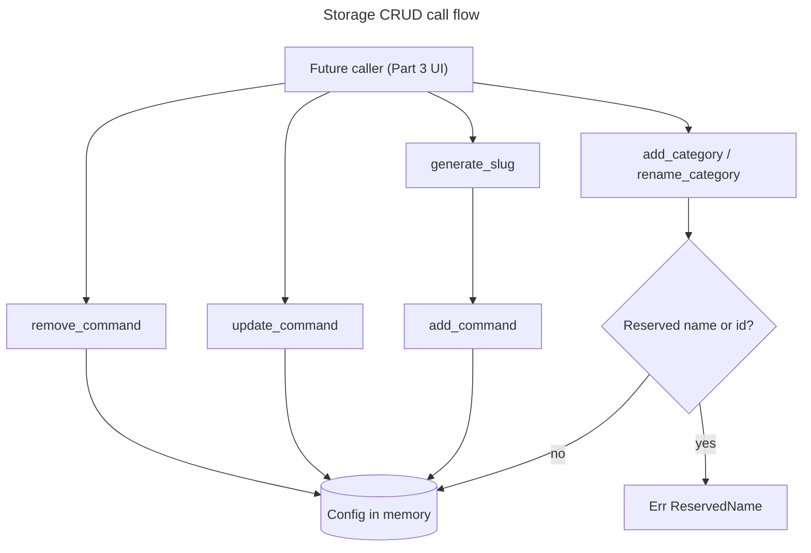

# Instruction: Storage layer & id generation

## Feature

- **Summary**: Give the future action editor a real storage API to call — today `src/storage/commands.rs` only exposes `toggle_favorite`. This phase adds `add_command`, `update_command`, `remove_command` mirroring the existing `add_category`/`rename_category`/`remove_category` shape, reserves the "Sans categorie" pseudo-category's id/name so a user can never create a colliding real category, and adds a from-scratch slug utility (no such thing exists in the codebase or in `Cargo.toml`'s dependencies) to turn an action name into a collision-free id.
- **Stack**: Rust workspace, edition 2021 (unchanged); no new crate — accent-folding is a hand-written table, not a dependency (no cargo network access verified available this session).
- **Branch name**: `feature/preferences-config-editor/part-1-storage`
- **Parent Plan**: `./2026_08_17-preferences-config-editor-master.md`
- **Sequence**: `1 of 3`
- Confidence: 9/10 — purely additive storage functions mirroring an existing, tested pattern (`categories.rs`); the only unknown is the exact French accent-fold table coverage, closed by unit tests on representative inputs.
- Time to implement: Not estimated in wall-clock time (see master plan Estimations).

## Architecture projection

### Files to modify

- `src/storage/commands.rs` - add `add_command`/`update_command`/`remove_command` and extend the error enum with `DuplicateId`/`NotFound` (mirrors `CategoryError`).
- `src/storage/categories.rs` - `add_category`/`rename_category` reject the reserved "Sans categorie" id/name via a new `ReservedName` error variant.
- `src/storage/mod.rs` - re-export the new command functions and the `slug` module in the public storage facade.

### Files to create

- `src/storage/slug.rs` - `generate_slug(name, existing_ids)`: manual ASCII fold of common French diacritics, kebab-case normalization, bounded numeric anti-collision suffix, never returns an empty string.

### Files to delete

- None.

## Applicable rules

| Tool | Name | Path | Why it applies |
| ---- | ---- | ---- | --------------- |
| none | none | none | `list-rules.mjs` returned an empty inventory — no installed AI-tool rules apply to this project. |

## User Journey

## Risk register

| Risk | Impact | Mitigation |
| ---- | ------ | ---------- |
| An existing fixture/test already uses a category literally named "Sans categorie" (or a close variant) | new `ReservedName` guard breaks an existing passing test | grep `src/storage/categories.rs` and `src/storage/commands.rs` test modules plus `config/*.json` for the literal before adding the guard; adjust the fixture if found |
| Manual ASCII-fold table misses an accented character (French name using a char not in the table) | slug generation silently drops or mangles a character, or produces an unexpectedly short/empty slug | after folding, strip any remaining non `[a-z0-9-]` byte; guarantee a non-empty result via the `"commande"` fallback literal plus the anti-collision suffix |
| Anti-collision suffix search has no upper bound | pathological input (many existing ids sharing a prefix) could loop for a very long time | cap the suffix search at a fixed maximum (e.g. 1000) and fall back to appending a short random-looking but deterministic tail (e.g. derived from a counter) past that cap |

## Implementation phases

### Phase 1: Storage CRUD and reserved-name guard

> Give commands the same CRUD surface categories already have, and make the orphan pseudo-category's name unspeakable by user input.

#### Tasks

1. Add `DuplicateId(String)` / `NotFound(String)` variants to a `CommandError` enum in `src/storage/commands.rs`, matching `CategoryError`'s shape.
2. Implement `add_command(config: &mut Config, command: Command) -> Result<(), CommandError>` — rejects a duplicate id, otherwise appends to `config.commands`.
3. Implement `update_command(config: &mut Config, id: &str, updated: Command) -> Result<(), CommandError>` — replaces the command matching `id` in place; `NotFound` if no match.
4. Implement `remove_command(config: &mut Config, id: &str) -> Result<(), CommandError>` — removes the command matching `id`; `NotFound` if no match.
5. Add a `ReservedName(String)` variant to `CategoryError`; `add_category`/`rename_category` reject the reserved id/name pair case- and accent-insensitively (normalize both the candidate and the reserved literal the same way before comparing). Reserved literals — defined as `const` in `src/storage/categories.rs` since the "Sans catégorie" pseudo-category is synthetic and has no persisted `Category` to derive them from: `RESERVED_CATEGORY_ID: &str = "sans-categorie"`, `RESERVED_CATEGORY_NAME: &str = "Sans catégorie"` (compared via the same accent/case fold as the guard itself).
6. Implement `src/storage/slug.rs::generate_slug(name: &str, existing_ids: &[String]) -> String` per the Risk register's fold/fallback rules, with a fallback slug of `"commande"` (not the generic `"action"`) when folding yields an empty string.
7. Re-export `add_command`, `update_command`, `remove_command`, and `slug::generate_slug` from `src/storage/mod.rs`.
8. Note (do not act yet): the module-level `#![allow(dead_code)]` on `commands.rs`/`categories.rs` becomes stale once Part 3 wires these functions to the UI — leave it for Part 3 to remove, since removing it now would fail the build on these still-uncalled functions.

#### Acceptance criteria

- [ ] `cargo test --lib storage::commands::` passes: add rejects a duplicate id, update replaces fields and returns `NotFound` for an unknown id, remove deletes the command and returns `NotFound` for an unknown id.
- [ ] `cargo test --lib storage::categories::` passes: `add_category`/`rename_category` reject "Sans categorie" and at least one case/accent variant with `ReservedName`.
- [ ] `cargo test --lib storage::slug::` passes: an accented French name produces an ASCII slug, a name colliding with an existing id gets a deterministic numeric suffix, the result is never empty.
- [ ] `cargo build` succeeds on Linux with no new warnings.

## Amendments

<!-- AI-initiated changes during implementation. Each entry is prefixed with (AI). -->

## Log

<!-- APPEND ONLY. One entry per step attempt. Never rewrite. -->

## Validation flow demonstration

1. Run `cargo test --lib storage::commands:: storage::categories:: storage::slug::` and confirm all new tests pass.
2. In a scratch test, call `generate_slug("Editeur Etendu", &["editeur-etendu".into()])` and confirm it returns a distinct, deterministic slug (e.g. `"editeur-etendu-2"`).
3. Call `add_category(&mut config, "sans-categorie", "Sans catégorie", "")` and confirm it returns `Err(CategoryError::ReservedName(_))`.
