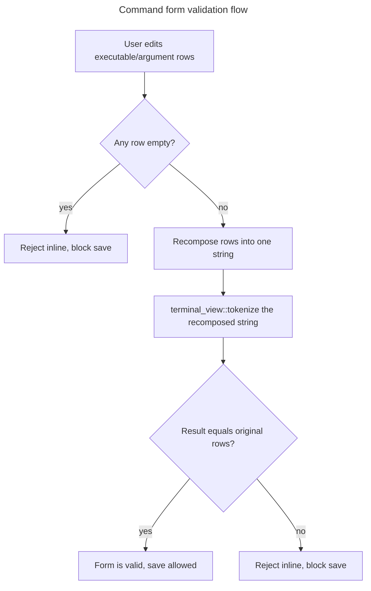

# Instruction: UI building blocks (icon picker + command form)

## Feature

- **Summary**: Build the two UI primitives the unified Préférences view (Part 3) needs but that don't exist yet: a curated icon picker (replacing free-text icon entry for both categories and actions) and an executable+arguments list widget that recomposes into a single tokenizer-compatible string, validated by round-tripping it back through the real cross-platform tokenizer before it's ever considered valid. Building these standalone keeps Part 3 focused purely on wiring, not on inventing widget behavior under screen-integration pressure.
- **Stack**: Rust/`eframe`/`egui` (unchanged); depends on `src/ui/terminal_view.rs::tokenize` (the cross-platform tokenizer — not `src/windows/process.rs::tokenize`, which is `#![cfg(windows)]`-gated and absent on Linux).
- **Branch name**: `feature/preferences-config-editor/part-2-widgets`
- **Parent Plan**: `./2026_08_17-preferences-config-editor-master.md`
- **Sequence**: `2 of 3`
- Confidence: 8/10 — the tokenizer round-trip contract is precisely known (verified this session: quotes are toggled/stripped, empty tokens are silently dropped), so the risk is bounded; the open variable is exactly which icons populate the curated set, which this plan resolves by seeding from real existing usage rather than guessing.
- Time to implement: Not estimated in wall-clock time (see master plan Estimations).

## Architecture projection

### Files to modify

- None — this phase is additive only, no existing file is touched.

### Files to create

- `src/ui/icon_picker.rs` - curated fixed icon set (`const` Rust array) plus a reusable picker widget shared by the category and action icon fields.
- `src/ui/command_form.rs` - repeatable executable+arguments row widget, recomposition into a single string, and round-trip validation via `terminal_view::tokenize`.

### Files to delete

- None.

## Applicable rules

| Tool | Name | Path | Why it applies |
| ---- | ---- | ---- | --------------- |
| none | none | none | `list-rules.mjs` returned an empty inventory — no installed AI-tool rules apply to this project. |

## User Journey

## Risk register

| Risk | Impact | Mitigation |
| ---- | ------ | ---------- |
| Curated icon set is too small or mismatched against icons already in use (`config/builtin-actions.json`, bundled default commands `📝`/`💻`/`🌐` seen in `egui_app.rs` lines 366/379/392) | opening an existing action/category in the new picker shows no matching selection, looking like data loss even though the underlying string is untouched | seed the curated const list from every icon literal already present in `config/builtin-actions.json` plus the bundled defaults, then add a general-purpose set on top |
| Recomposition logic drifts from `terminal_view::tokenize`'s actual quoting/escaping rules if reimplemented independently | a value that should round-trip cleanly gets falsely rejected, or worse, a bad value falsely passes | the round-trip check must call the real `terminal_view::tokenize` function directly — never reimplement parsing, only the quoting/joining half is new code |
| Empty-string argument silently lost on tokenize (confirmed this session: `tokenize()` drops empty tokens via `if !current.is_empty()`) | a user's intentionally empty argument disappears without any visible error | reject an empty-string row at input time, before recomposition — never let it reach the tokenizer to be silently dropped |
| A picked icon that isn't in the curated set (e.g. an existing free-text icon from before this feature) has no widget state to represent "currently selected, not in the list" | opening the picker on such a value could silently reset it to blank/first item | the picker must accept and display an out-of-set current value as-is (e.g. an unselected custom slot) rather than forcing a curated pick |

## Implementation phases

### Phase 1: Icon picker

> A deterministic, curated icon source shared by categories and actions.

#### Tasks

1. Grep `config/builtin-actions.json` and `src/ui/egui_app.rs`'s bundled default commands for every icon literal currently in use.
2. Define a `const CURATED_ICONS: &[&str]` in `src/ui/icon_picker.rs` seeded from that grep plus a general-purpose icon set.
3. Build the picker widget: renders the curated set (grid or list), highlights the current value if present in the set, and preserves an out-of-set current value without discarding it.

#### Acceptance criteria

- [ ] `cargo test --lib ui::icon_picker::` passes.
- [ ] Every icon literal already present in `config/builtin-actions.json` and the bundled default commands is included in `CURATED_ICONS`.
- [ ] Opening the picker on a value not in the curated set does not clear or replace that value.

### Phase 2: Command form (executable + arguments)

> A repeatable row list that recomposes and validates against the real tokenizer before a save is ever allowed.

#### Tasks

1. Build a repeatable executable+arguments row widget (add/remove/reorder rows; the first row is implicitly the executable).
2. Implement recomposition: join the row values into a single string, quoting any value containing whitespace per `terminal_view::tokenize`'s documented quoting rule.
3. Implement round-trip validation: re-tokenize the recomposed string via `terminal_view::tokenize`, compare the result to the original row list; mismatch renders an inline error on the widget and sets a queryable `is_valid() -> bool` (or equivalent public state) so a calling screen (Part 3) can gate its own save action on it — the widget itself has no save button, so it cannot block saving on its own.
4. Reject an empty-string row at input time (before recomposition), per the Risk register.
5. Unit-test recomposition and round-trip validation as pure functions, independent of egui's frame loop where feasible.

#### Acceptance criteria

- [ ] `cargo test --lib ui::command_form::` passes.
- [ ] A row containing a space round-trips correctly through recomposition and `terminal_view::tokenize`.
- [ ] An empty-string row is rejected before recomposition with a visible inline error — never silently dropped.
- [ ] The widget exposes a public `is_valid()` (or equivalent) state a caller can query before invoking storage.
- [ ] `cargo build` succeeds on Linux with no new warnings.

## Amendments

<!-- AI-initiated changes during implementation. Each entry is prefixed with (AI). -->

## Log

<!-- APPEND ONLY. One entry per step attempt. Never rewrite. -->

## Validation flow demonstration

1. Run `cargo test --lib ui::icon_picker:: ui::command_form::` and confirm all new tests pass.
2. In a scratch test, recompose a row list containing a space-containing path, feed it through `terminal_view::tokenize`, and confirm the result equals the original list.
3. In a scratch test, attempt to recompose a row list containing an empty-string row and confirm it is rejected before reaching the tokenizer.
