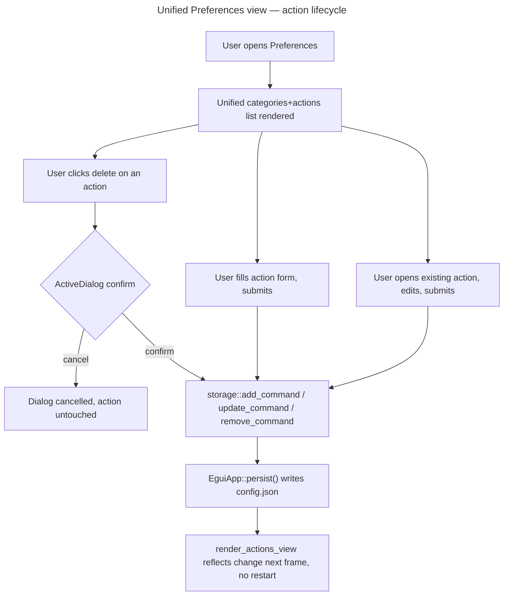

# Instruction: Unified Preferences view integration

## Feature

- **Summary**: Replace `render_preferences_view`'s categories-only rendering with a unified categories+actions view: each category (plus the synthetic "Sans catégorie" bucket) lists its actions inline with edit/delete controls, backed by Part 1's `add_command`/`update_command`/`remove_command`/`generate_slug`/`ReservedName` guard and Part 2's icon picker and command form widgets. Deletion reuses the existing `ActiveDialog`/`PendingAction` blocking-confirmation pattern that already gates category removal. This is the phase where a user stops needing to hand-edit `config.json` to manage an action.
- **Stack**: Rust/`eframe`/`egui` (unchanged); consumes Part 1's storage module and Part 2's `icon_picker`/`command_form` widgets — no new external dependency.
- **Branch name**: `feature/preferences-config-editor/part-3-integration`
- **Parent Plan**: `./2026_08_17-preferences-config-editor-master.md`
- **Sequence**: `3 of 3`
- Confidence: 8/10 — the wiring pattern (form state → storage call → persist → `set_status`) already exists and works for categories; the main unknown is UI polish under real interaction, closed by the manual click-through in the Validation flow demonstration.
- Time to implement: Not estimated in wall-clock time (see master plan Estimations).

## Architecture projection

### Files to modify

- `src/ui/egui_app.rs` - replace `render_preferences_view`'s body with the unified view; add action-form scratch state alongside `CategoryForm`; add `PendingAction::RemoveCommand(String)`; wire `resolve_pending_action` to handle it; call `slug::generate_slug`/`storage::add_command`/`update_command`/`remove_command` from the new form's submit handlers.

### Files to create

- None — this phase consumes Part 1 and Part 2's new files without creating further ones.

### Files to delete

- None.

## Applicable rules

| Tool | Name | Path | Why it applies |
| ---- | ---- | ---- | --------------- |
| none | none | none | `list-rules.mjs` returned an empty inventory — no installed AI-tool rules apply to this project. |

## User Journey

## Risk register

| Risk | Impact | Mitigation |
| ---- | ------ | ---------- |
| Non-atomic disk write (`json.rs::save_to` — confirmed this session: no temp-file+rename) combined with more frequent au-fil-de-l'eau writes | a crash or power loss mid-write could truncate `config.json` | explicitly flagged as an accepted, out-of-scope risk for this plan (the spec's own hors-scope boundary does not include storage durability); not mitigated here |
| Part 1's `ReservedName`/`DuplicateId`/`NotFound` errors surface at save time inside an already-filled-out form | a naive handler could clear the form on error, losing the user's typed input | render storage errors as inline form errors via the existing `self.set_status` pattern; never clear in-progress form state on a storage error |
| A category gets deleted while the unified view has an action-edit form open on an action in that category | the form's selected-category dropdown could point at a now-nonexistent category | recompute the category dropdown's options from `self.config.categories` every frame (egui's immediate-mode default already does this for free); fall back to "Sans catégorie" if the form's selected category becomes invalid |

## Implementation phases

### Phase 1: Unified view rendering and category dropdown

> Show categories and their actions together, with a category dropdown driven by live config state.

#### Tasks

1. Add action-form scratch state alongside the existing `CategoryForm` struct, covering all six editable fields: `name`, the executable+arguments rows (Part 2's `command_form` widget), `category` (dropdown), `icon` (Part 2's `icon_picker` widget), `is_favorite` (checkbox), `shortcut` (text field).
2. Replace `render_preferences_view`'s category-only rendering with the unified view: each category from `group_commands_by_category` (including the `None` / "Sans catégorie" synthetic bucket) lists its actions inline with edit/delete controls.
3. Render the "Sans catégorie" bucket as non-deletable and non-renamable, with no category-level controls (no rename/delete on the bucket itself) — its individual actions still keep their normal per-action edit/delete/reassign controls, same as any other category's actions.
4. Replace the existing `CategoryForm`'s free-text icon input (add/rename category UI) with Part 2's `icon_picker` widget, per the spec's explicit requirement that the icon selector is shared between categories and actions — an existing category's current free-text icon value that isn't in the curated set must display as an out-of-set current value (per Part 2's Phase 1 acceptance criteria), not be silently cleared.

#### Acceptance criteria

- [ ] The unified view renders every category from `self.config.categories` plus the synthetic "Sans catégorie" bucket when orphan commands exist.
- [ ] "Sans catégorie" has no delete/rename controls.
- [ ] The category add/rename form's icon field uses Part 2's `icon_picker` widget instead of free text; an existing category with an out-of-curated-set icon value keeps that value visible and unchanged when the form is opened.

### Phase 2: Action CRUD wiring

> Wire the form to Part 1's storage functions and Part 2's widgets, reusing the existing confirmation-dialog pattern for delete.

#### Tasks

1. Wire action creation: on submit, first check Part 2's `command_form` widget reports a valid round-trip state (per its tokenizer validation) — if invalid, block the call entirely and leave the widget's own inline error visible, do not call storage. Only if valid: call `slug::generate_slug` against existing command ids, build a `Command` from all six form fields (`name`, executable+arguments, `category`, `icon`, `is_favorite`, `shortcut`), call `storage::add_command`, persist, clear the form.
2. Wire action editing: prefill all six form fields from the selected `Command` (id unchanged across edits); on submit, apply the same validity gate as task 1 (block on an invalid `command_form` state) before calling `storage::update_command` with all six fields and persisting.
3. Wire action deletion: introduce `PendingAction::RemoveCommand(String)`, reuse the existing `ActiveDialog` confirm pattern mirroring `apply_category_action`'s `CategoryAction::Remove` branch, then call `storage::remove_command` on confirm.
4. Extend `resolve_pending_action` to handle `PendingAction::RemoveCommand`.
5. Surface storage errors (`ReservedName`, `DuplicateId`, `NotFound`) as inline form errors via `self.set_status`, without discarding in-progress form input.

#### Acceptance criteria

- [ ] Full workspace `cargo test --lib` passes with no regressions in existing `egui_app.rs`/storage tests.
- [ ] `cargo build` succeeds on Linux.
- [ ] Manual: creating a new action with a space-containing path argument appears immediately in the Actions view (no restart) with correct icon and shortcut.
- [ ] Manual: toggling `is_favorite` on an action is reflected immediately wherever favorites are surfaced elsewhere in the app; editing `shortcut` persists and survives reopening the action form.
- [ ] Manual: deleting an action shows the blocking confirmation dialog; cancelling leaves it untouched.
- [ ] Manual: deleting an action's category makes it reappear under "Sans catégorie", reassignable via the dropdown.
- [ ] Manual: naming a category "Sans catégorie" (or a case/accent variant) is rejected with a visible error.
- [ ] Manual: submitting an action form whose executable+arguments fail the tokenizer round-trip (e.g. a value containing a literal `"`) is blocked — no `storage::add_command`/`update_command` call occurs, no disk write happens.

## Amendments

<!-- AI-initiated changes during implementation. Each entry is prefixed with (AI). -->

## Log

<!-- APPEND ONLY. One entry per step attempt. Never rewrite. -->

## Validation flow demonstration

1. Run `cargo build && cargo test --lib` on the full workspace.
2. Launch the app (per the existing X11/libxdo click-driver approach from prior sessions), open Préférences.
3. Create, then edit, then delete one action end-to-end, screenshotting each step, confirming the Actions view updates live and the confirmation dialog gates deletion.
