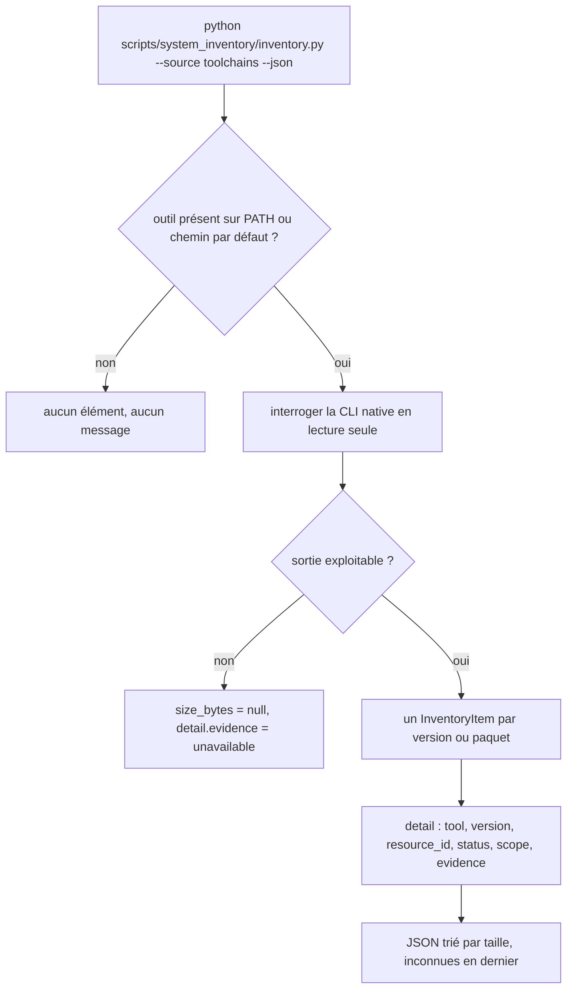

# Instruction: Inventaire lecture seule de l'outillage

## Architecture projection

```txt
.
└── scripts/
    └── system_inventory/
        ├── toolchains.py            ✅ énumération par version, un scanner par famille
        ├── inventory.py             ✏️ enregistrer "toolchains" dans SCANNERS
        ├── registry.py              ✏️ lire DisplayVersion et QuietUninstallString
        ├── appdata.py               ✏️ exclure les racines déjà couvertes par toolchains
        ├── README.md                ✏️ documenter la source "toolchains"
        └── tests/
            ├── test_toolchains.py   ✅ résolution pure, dispatch, contrat lecture seule
            ├── test_registry.py     ✏️ couvrir les deux nouvelles valeurs
            └── test_appdata.py      ✏️ couvrir l'exclusion
```

## User Journey



## Tasks to do

### `1)` Squelette du scanner

> Poser `toolchains.py` avec la structure imposée par les modules voisins.

1. Créer `scan_toolchains(base=None, env=None) -> list[InventoryItem]` qui concatène les scanners de famille.
2. Séparer, pour chaque famille, un `_resolve_*` pur sans IO et un `_read_*` qui fait l'IO, comme `packages.py`.
3. Copier le motif `_run` de `packages_linux.py` : `capture_output`, `text`, timeout 30 s, `CREATE_NO_WINDOW`, retour `None` sur `OSError` / `SubprocessError`.
4. Fixer `source="toolchains"` et `detail` = `{tool, version, resource_id, status, scope, evidence}`, toutes valeurs `str`.
5. Ne jamais lever pour un outil absent : renvoyer une liste vide, sans message.

### `2)` Familles à énumérer

> Une fonction par famille, chacune indépendamment testable.

1. `rustup` : `rustup toolchain list -v`, une entrée par toolchain, taille par `dir_size_on_disk` sur `%USERPROFILE%\.rustup\toolchains\<nom>` (`RUSTUP_HOME` prioritaire), `status="active"` quand la ligne porte `(active, default)`, sinon `"inactive"`, `scope="user"`.
2. `dotnet` : `dotnet --list-sdks` et `--list-runtimes`, `resource_id` = la version, `scope="machine"`. La taille est celle de `<base>\<version>`, jamais du chemin entre crochets : celui-ci annonce le **parent commun** (`…\dotnet\sdk`), donc le mesurer donnerait à chaque entrée la somme de tous les SDK.
3. `node` : `nvm list`, `volta list --format plain`, `fnm list` — chaque manager n'est interrogé que si son exécutable est trouvé ; `scope="machine"` pour nvm, `"user"` pour volta et fnm.
4. `jdk` : croiser les clés de désinstallation (via `registry.scan_uninstall_records`) filtrées sur les éditeurs connus avec les dossiers `Program Files\Java`, `Eclipse Adoptium`, `Amazon Corretto`, `Zulu`, `Microsoft\jdk-*`.
5. `windows-sdk` : entrées de désinstallation dont le `DisplayName` commence par `Windows Software Development Kit`, `scope="machine"`.
6. `choco` : `choco list --limit-output`, une entrée par paquet, `scope="machine"`. `size_bytes=None` par défaut : `lib\<id>` ne porte les fichiers que pour un paquet portable, et ne contient que les scripts d'installation pour un paquet posé par MSI ou EXE — mesurer ce dossier annoncerait comme récupérable une taille qui ne l'est pas. La taille de `lib\<id>` n'est retenue que quand `lib\<id>\tools` existe et pèse plus que les scripts, et `detail.evidence` dit alors qu'elle ne couvre que l'empreinte portable.
7. `winget` : `winget list --disable-interactivity`, `resource_id` = l'identifiant de paquet, `size_bytes=None` (winget n'annonce aucune taille), `scope` selon la colonne. La seule sortie JSON de winget est `winget export -o <fichier>`, écartée ici pour deux raisons : elle exige d'écrire puis de supprimer un fichier, ce que le contrat lecture seule de la tâche 5 interdit au scanner, et elle omet les paquets sans source connue. Le prix est un parser de table : découper sur les positions de colonnes de la ligne d'en-tête, jamais sur les espaces, et abandonner la ligne — sans lever — quand elle ne s'y conforme pas.
8. `scoop` : `scoop list`, taille par dossier d'application, `scope="user"` ou `"global"` selon la racine.

### `3)` Enrichir la lecture du registre

> Les deux valeurs qui manquent pour distinguer et retirer une version.

1. Ajouter `DisplayVersion` et `QuietUninstallString` à `_UNINSTALL_VALUE_NAMES`.
2. Les exposer dans `_read_uninstall_metadata`, chaîne vide quand la valeur est absente ou d'un autre type.
3. Ne rien changer à `scan_registry` : la vue inventaire garde sa forme actuelle.

### `4)` Éviter le double comptage

> Les racines de `toolchains` sont déjà sommées ailleurs.

1. Donner à `scan_dotfolders` un paramètre `exclude_paths` aligné sur celui de `scan_appdata`.
2. Depuis `inventory.py`, quand `toolchains` et `dotfolder` tournent ensemble, passer `.rustup`, `.cargo`, `.dotnet`, `.m2`, `.gradle` en exclusion.
3. Documenter dans le README que la source `toolchains` prime sur `dotfolder` pour ces racines.
4. Corriger le compte figé de sources : `inventory.py` écrit « all seven » / « sept sources » à quatre endroits et le README à un, la huitième source les rend faux.

### `5)` Contrat lecture seule

> Le module doit prouver qu'il n'écrit rien.

1. Copier `RegistrySourceReadOnlyContractTests` en `ToolchainsSourceReadOnlyContractTests` sur le texte source de `toolchains.py`.
2. Étendre la liste interdite aux écritures fichier : `os.remove`, `os.rmdir`, `shutil.rmtree`, `open(` en mode `w`/`a`.
3. Vérifier qu'aucune commande construite ne contient `uninstall`, `remove`, `rm`, `clear` ou `clean`.

## Test acceptance criteria

| Task | Acceptance criteria                                                                                                                                       |
| ---- | ---------------------------------------------------------------------------------------------------------------------------------------------------------- |
| 1    | `inventory.py --source toolchains --json` sort un payload valide sur une machine sans aucun outil de développement, avec `items` vide et exit 0.             |
| 2    | Sur cette machine, l'inventaire liste les deux toolchains rustup, la `stable-x86_64-pc-windows-msvc` marquée `active` et la `-gnu` marquée `inactive`.       |
| 2    | Le SDK .NET 8.0.424 apparaît une seule fois, avec `scope=machine`, et aucune entrée fantôme n'est produite pour les runtimes partagés.                       |
| 2    | Avec deux SDK .NET installés, chacun porte la taille de son propre dossier de version : les deux n'annoncent jamais la même taille, celle du dossier `sdk`.  |
| 2    | Les 38 paquets Chocolatey et les paquets winget sont listés, chacun avec son `resource_id` réutilisable tel quel par la CLI d'origine.                       |
| 2    | Un paquet Chocolatey posé par MSI, dont `lib\<id>` ne contient que des scripts, sort avec `size_bytes` à `null` et non avec le poids de ses scripts.         |
| 2    | Une ligne de `winget list` mal formée n'interrompt pas le relevé : elle est abandonnée, les autres lignes sortent.                                           |
| 2    | Un outil absent du PATH — scoop, nvm, volta, fnm sur cette machine — ne produit ni entrée ni message d'erreur.                                               |
| 3    | Une entrée de désinstallation portant une `DisplayVersion` la restitue dans `scan_uninstall_records`, et une entrée sans la restitue en chaîne vide.         |
| 4    | Lancé sur toutes les sources, le total ne compte `.rustup` qu'une fois : le total avec `toolchains` égale le total sans, à la taille des racines exclues près. |
| 5    | Le test de contrat échoue si l'on introduit un `shutil.rmtree` ou un `winreg.SetValue` dans `toolchains.py`.                                                 |
