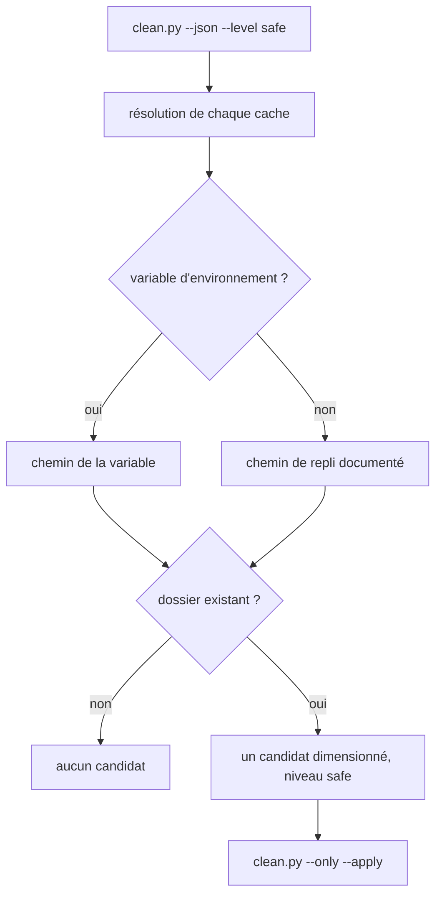

# Instruction: Caches de gestionnaires manquants

## Architecture projection

```txt
.
└── scripts/
    └── winclean/
        ├── mod_dev.py               ✏️ nouvelles CacheSpec + purge déléguée
        ├── registry_mod.py          ✏️ enregistrer les nouveaux modules
        ├── README.md                ✏️ tableau des modules
        └── tests/
            ├── test_mod_dev.py      ✏️ résolution des nouveaux chemins
            └── test_registry_mod.py ✏️ contrat des tables déclaratives
```

## User Journey



## Tasks to do

### `1)` Caches purement fixes

> Une entrée `CacheSpec` et une ligne `_cache_module`, rien d'autre.

1. `gradle-cache` : repli `%USERPROFILE%\.gradle\caches`, variable `GRADLE_USER_HOME`, aucune commande d'outil.
2. `maven-repository` : repli `%USERPROFILE%\.m2\repository`, aucune variable, aucune commande.
3. `nuget-http-cache` : variable `NUGET_HTTP_CACHE_PATH`, repli `%LOCALAPPDATA%\NuGet\v3-cache`, **aucune commande d'outil**. `dotnet nuget locals http-cache --list` sort `http-cache: C:\…`, et `_ask_tool` exige que la dernière ligne soit un chemin absolu nu : le préfixe la ferait rendre `None` à chaque découverte. Déclarer ce `tool=` coûterait un sous-processus pour toujours retomber sur le repli.
4. `nuget-plugins-cache` : variable `NUGET_PLUGINS_CACHE_PATH`, repli `%LOCALAPPDATA%\NuGet\plugins-cache`.
5. `choco-http-cache` : repli `%USERPROFILE%\.chocolatey\http-cache` — la variante système `ProgramData\chocolatey\HttpCache` est laissée à la phase 5.
6. `choco-lib-bad` et `choco-lib-bkp` : replis `%ChocolateyInstall%\lib-bad` et `lib-bkp`, variable `ChocolateyInstall`.
7. `scoop-cache` : variable `SCOOP_CACHE` puis `SCOOP`, repli `%USERPROFILE%\scoop\cache`.
8. Enregistrer les six modules sans purge déléguée par `_cache_module("<clé>")`.
9. `choco-http-cache` et `scoop-cache` ne passent pas par `_cache_module` : cette fabrique pose `clean=None` en dur. Les déclarer en `CleanModule(...)` complet, à la même forme (`Level.SAFE`, `DISCOVERY_FIXED`, `needs_network=True`, `opt_in=False`), avec leur `clean=` et leur `requires=("choco",)` / `("scoop",)`. Le précédent d'un module `fixed` portant son propre `clean()` est `recycle-bin`.
10. Chacun des deux `requires` son binaire : sans lui, `requirements_met` rend zéro candidat et la commande déléguée n'est jamais tentée.

### `2)` Ce que l'on n'ajoute pas

> Consigner les exclusions dans le README pour qu'elles ne reviennent pas.

1. `ProgramData\chocolatey\lib` et `LOCALAPPDATA\Microsoft\WinGet\Packages` sont des arbres d'installation vivants, jamais des caches.
2. `ProgramData\Package Cache` est déjà couvert par le module `package-cache` existant, en `aggressive` avec sa confirmation dédiée.
3. Le cache du VS Installer ne se vide que par `vs_installer.exe --nocache` : hors périmètre d'un module de suppression de fichiers.
4. Gradle purge lui-même après 30 jours ; le module ne fait que rendre visible et rendre le geste immédiat.
5. Aucun module n'est ancré sur un sous-dossier de `%TEMP%`. `discover_user_temp` produit **un candidat par entrée de premier niveau de `%TEMP%`, sans auto-exclusion** : `%TEMP%\WinGet`, `%TEMP%\NuGetScratch` et `%TEMP%\chocolatey` sont déjà des candidats `user-temp`. Un module qui les redéclarerait entrerait en égalité de chemin **exacte** avec lui ; `absorb_nested` trancherait par rang `MODULE_ORDER`, et comme les caches sont déclarés avant `user-temp` ils gagneraient — faisant glisser ce contenu de `moderate` à `safe` sans que personne ne l'ait décidé.
6. `choco-download-cache` est écarté pour cette raison, renforcée par deux constats mesurés. `choco config get cacheLocation` est **interactif** — il sort `Do you want to continue?([Y]es/[N]o):` et ni `--limit-output` ni `--name=` ne le suppriment — donc inutilisable dans `_ask_tool`, qui y perdrait son timeout de 30 s. Et `choco config list -r` rend `cacheLocation||…` : la valeur est vide par défaut, ce que la description de choco explicite — « Cache location if not TEMP folder. Replaces `$env:TEMP` value for choco.exe process. » Sans configuration explicite, ce cache **est** sous `%TEMP%`, donc déjà couvert.

### `3)` Purge déléguée quand l'outil en propose une

> Préférer la commande de l'éditeur à la suppression de fichiers là où elle existe.

1. Donner à `choco-http-cache` un `clean=` qui lance `choco cache remove --yes --limit-output`, sur le modèle de `clean_docker_light`. Le `--yes` est une condition de fonctionnement, pas un confort : choco 2.x demande `Do you want to continue?([Y]es/[N]o):` sur ses commandes modifiantes, et sans lui la purge attendrait une saisie qui ne viendra jamais, puis sortirait en timeout plutôt qu'en échec lisible.
2. Donner à `scoop-cache` un `clean=` qui lance `scoop cache rm *`.
3. Sur code de retour non nul, lever `OSError` avec le code, comme le fait `docker-light`.
4. Ne pas introduire d'import de `remove` dans `mod_dev.py` : le contrat de test l'interdit.
5. Amender le commentaire de `CacheSpec.fallback`, qui annonce ses bases comme LOCALAPPDATA / USERPROFILE / APPDATA : deux modules ancrent sur `%ChocolateyInstall%`. `resolve_cache_path` l'accepte déjà — c'est la documentation qui devient fausse, pas le code.

### `4)` Documentation

> Le tableau des modules du README fait foi pour l'utilisateur.

1. Ajouter une ligne par module, avec niveau, chemin de repli et méthode de reprise.
2. Indiquer que la reprise se fait toujours par re-téléchargement, donc `needs_network=True`.

## Test acceptance criteria

| Task | Acceptance criteria                                                                                                                                     |
| ---- | --------------------------------------------------------------------------------------------------------------------------------------------------------- |
| 1    | Chaque nouveau module apparaît dans `clean.py --json --level safe` dès que son dossier existe, avec une taille **mesurée** — non nulle s'il porte des fichiers, `0` s'il est vide, jamais `null`. |
| 1    | Sur cette machine, `choco-lib-bkp` remonte une taille de zéro octet mesuré, jamais `null`, puisque le dossier existe et est vide.                            |
| 2    | `clean.py --json --level moderate` ne compte jamais deux fois un sous-dossier de `%TEMP%` : `absorbed` nomme le perdant et le total reste celui de `user-temp`. |
| 2    | Aucun module nouveau n'est ancré sous `%TEMP%` : ni `winget-temp`, ni `nuget-temp`, ni `choco-download-cache` n'apparaît dans les tables déclaratives.       |
| 1    | Un module dont le dossier est absent — `scoop-cache`, `gradle-cache`, `maven-repository` ici — ne produit aucun candidat et aucun avertissement.             |
| 1    | Aucun des nouveaux modules ne déclare de `tool=` : la variable d'environnement l'emporte sur le repli, et la découverte ne lance aucun sous-processus.       |
| 3    | `clean.py --only choco-http-cache --apply` laisse le dossier lui-même en place, vide son contenu et renvoie un succès quand `choco cache remove` sort en zéro. |
| 3    | Sur une machine sans `choco` sur le `PATH`, `choco-http-cache` ne produit aucun candidat et ne lance aucune commande — `requires` suffit, aucune garde ajoutée. |
| 3    | Un `choco cache remove` en échec produit un `operation_failures` non vide et un code de sortie 5, sans supprimer quoi que ce soit.                           |
| 3    | La commande de purge de `choco-http-cache` porte `--yes` : lancée sans terminal interactif, elle rend un code de retour, jamais un timeout d'attente de saisie. |
| 4    | Le tableau du README liste les huit nouveaux modules, et aucun d'eux n'est absent des tables déclaratives contrôlées par `test_registry_mod.py`.             |
| 4    | Le README dit pourquoi les caches sous `%TEMP%` n'ont pas de module propre, en nommant `user-temp` comme leur couverture existante.                          |
