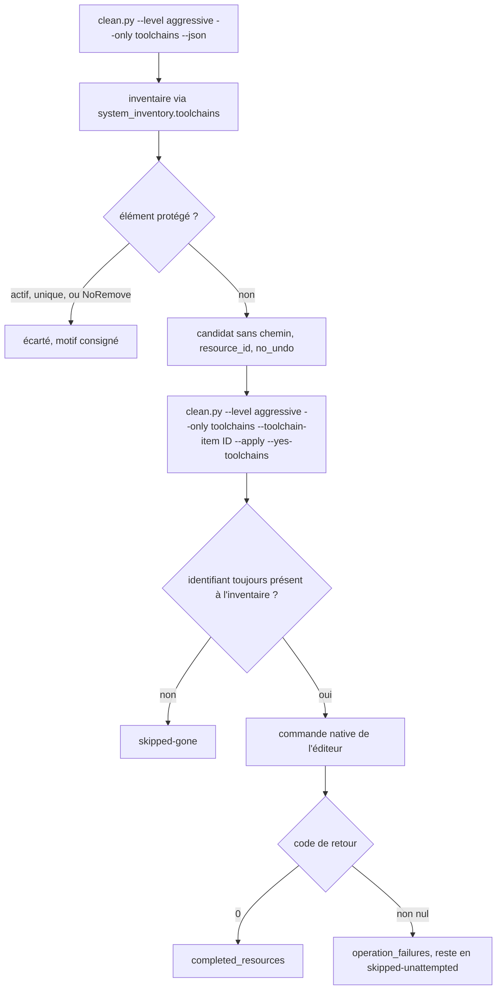

# Instruction: Module winclean de désinstallation déléguée

## Architecture projection

```txt
.
└── scripts/
    └── winclean/
        ├── mod_toolchains.py            ✅ découverte sans chemin + retrait délégué
        ├── registry_mod.py              ✏️ module opt-in, confirmation dédiée
        ├── clean.py                     ✏️ option --toolchain-item et ses règles
        ├── README.md                    ✏️ module, portée, irréversibilité
        └── tests/
            ├── test_mod_toolchains.py   ✅ protections, délégation, comptes
            ├── test_registry_mod.py     ✏️ tables déclaratives
            └── test_clean.py            ✏️ exclusivité de l'option
```

## User Journey



## Tasks to do

### `1)` Découverte

> Traduire l'inventaire en candidats winclean, sans jamais décider seul.

1. Importer `scripts.system_inventory.toolchains` et n'en garder que la lecture.
2. Produire un `CleanCandidate` par élément : `path=None`, `resource_id=<tool>:<id>`, `no_undo=True`, `estimated_bytes` = la taille inventoriée ou `None`.
3. Composer le `label` en français, la `reason` portant l'outil, la portée et la preuve.
4. Ne pas fixer `needs_network` dans la fonction : le registre l'estampille.
5. Accepter `requested_items=` : sans lui, aucun candidat n'est proposé au retrait, seulement à l'inventaire.

### `2)` Protections

> Ce que le module refuse de proposer, quoi qu'il arrive.

1. Écarter la toolchain rustup marquée active ou par défaut.
2. Écarter la dernière version restante d'un **runtime versionné** — rustup, dotnet, node — quand l'inventaire n'en porte qu'une : la retirer casserait la chaîne. La règle ne s'applique jamais aux gestionnaires de paquets : chez choco, winget ou scoop, chaque entrée est un logiciel distinct et non une version d'un même outil, et l'y appliquer rendrait indésinstallable le seul paquet d'une machine qui n'en porte qu'un.
3. Écarter toute entrée de désinstallation portant `SystemComponent`, `NoRemove` ou un `ParentKeyName`.
4. Écarter les SDK .NET quand `dotnet-core-uninstall` est absent, avec un avertissement nommant l'outil manquant et son identifiant winget.
5. Écarter les versions gérées par `volta` : `volta uninstall` prend un outil, jamais une version, donc aucune commande native ne réalise le geste. Le motif le dit plutôt que de laisser l'élément atteindre un retrait sans commande.
6. Consigner chaque écart en `DroppedEntry` avec un motif lisible plutôt que de le taire.

### `3)` Retrait délégué

> Une commande éditeur par famille, jamais une suppression de fichier.

1. `rustup toolchain uninstall <nom>`.
2. `dotnet-core-uninstall remove --sdk <version> --yes`.
3. `choco uninstall <id> --yes --limit-output`.
4. `winget uninstall --id <id> --silent --disable-interactivity`.
5. `scoop uninstall <app>`, `nvm uninstall <version>`, `fnm uninstall <version>`.
6. Réutiliser la mécanique de `mod_ollama.clean_*` : revalider l'identifiant, arrêter à la première erreur, marquer le reste `skipped-unattempted`.
7. Laisser `freed` à `None` : aucun éditeur ne rapporte d'octets libérés de façon fiable.

### `4)` Déclaration et sélection

> Le module doit être impossible à déclencher par inadvertance.

1. `CleanModule(name="toolchains", level=AGGRESSIVE, discovery=PATHLESS, proc_guard=None, needs_network=True, opt_in=True)`.
2. Ajouter `--toolchain-item ID`, répétable, sur le modèle exact de `--ollama-model`.
3. Refuser en sortie 2 un `--toolchain-item` sans `--only toolchains`, et un `--apply` sur ce module sans aucun identifiant.
4. Ajouter une entrée `EXTRA_CONFIRM` et son option `--yes-toolchains`, sur le modèle de `package-cache`.
5. Ne pas importer `remove` : le contrat de test l'interdit à tout `mod_*.py`.
6. Ajouter dans `discover_module()` la branche qui transmet `requested_items=` à ce module, symétrique de celle qui transmet `requested_models` à `ollama-models` : sans elle, `discover()` reçoit un `**kwargs` sans les identifiants.
7. Le module étant `AGGRESSIVE`, toute commande le visant porte `--level aggressive` : `validate_level` refuse en sortie 2 un `--only` au-dessus du niveau actif. C'est le contrat, pas un contournement à ajouter.

### `5)` Portée machine différée

> Ce que la phase ne livre pas encore, et pourquoi.

1. Marquer chaque candidat d'un `requires_elevation` déduit de la portée inventoriée.
2. Ne pas tenter le retrait des éléments `machine` : les écarter avec un motif explicite tant que la phase 5 n'est pas livrée.
3. Documenter cette limite dans le README plutôt que de la laisser se découvrir à l'usage.

## Test acceptance criteria

| Task | Acceptance criteria                                                                                                                                     |
| ---- | --------------------------------------------------------------------------------------------------------------------------------------------------------- |
| 1    | `clean.py --level aggressive --only toolchains --json` liste les éléments retirables sans en supprimer aucun, `apply` à faux.                                |
| 1    | Chaque candidat porte `path` à `null` et un `resource_id` non vide ; aucun n'a de chemin de fichier.                                                         |
| 2    | Sur cette machine, `stable-x86_64-pc-windows-gnu` est proposée et `stable-x86_64-pc-windows-msvc` est écartée avec le motif « toolchain active ».            |
| 2    | Le SDK .NET 8.0.424 n'est pas proposé : il est seul de sa famille, et `dotnet-core-uninstall` est absent — les deux motifs sont consignés.                   |
| 2    | Un inventaire ne portant qu'un seul paquet Chocolatey le propose au retrait : la protection « dernière version » ne s'applique pas aux gestionnaires.        |
| 2    | Une version node gérée par volta est écartée avec un motif nommant l'absence de désinstallation par version, jamais proposée puis échouée à l'exécution.     |
| 3    | `--level aggressive --only toolchains --apply --toolchain-item rustup:stable-x86_64-pc-windows-gnu --yes-toolchains` retire la toolchain et la fait disparaître de `rustup toolchain list`. |
| 3    | Un identifiant disparu entre l'inventaire et le retrait produit `skipped-gone`, pas une erreur.                                                              |
| 3    | Une commande éditeur en échec remplit `operation_failures`, laisse les identifiants suivants en `skipped-unattempted` et sort en code 5.                     |
| 4    | Un balayage `--level aggressive` sans `--only` ne sélectionne jamais le module `toolchains`.                                                                 |
| 4    | `--toolchain-item X` sans `--only toolchains` sort en code 2, et `--only toolchains --apply` sans identifiant sort en code 2.                                |
| 4    | `--only toolchains` sans `--level aggressive` sort en code 2 en nommant le niveau requis, comme tout module `aggressive`.                                    |
| 4    | `--level aggressive --only toolchains --apply` sans `--yes-toolchains` marque tout en `skipped-unconfirmed` et ne lance aucune commande.                     |
| 4    | Les identifiants passés par `--toolchain-item` arrivent jusqu'à `discover()` : un run avec deux identifiants produit deux candidats, jamais zéro.            |
| 5    | Un élément de portée machine est visible à l'inventaire mais refusé au retrait, avec un motif nommant l'élévation manquante.                                 |
