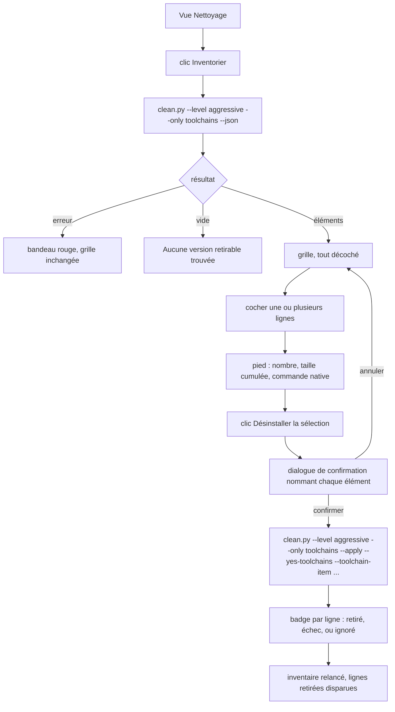

# Instruction: Section « Outillage installé » de la vue

## Architecture projection

```txt
.
└── src/
    ├── toolchains/
    │   ├── mod.rs              ✅ état, actions, dernier résultat par élément
    │   ├── model.rs            ✅ miroir serde des candidats sans chemin
    │   └── spawn.rs            ✅ appels inventaire et retrait, échéances propres
    ├── ui/
    │   ├── toolchains_view.rs  ✅ rendu pur, aides testables
    │   ├── mod.rs              ✏️ déclarer les deux nouveaux modules
    │   └── egui_app.rs         ✏️ insérer la section entre les deux existantes
    └── main.rs                 ✏️ déclarer le module toolchains
```

## User Journey



## Wireframe

```txt
┌──────────────────────────────────────────────────────────────────────┐
│ DevToolBox — Nettoyage                                               │
├──────────────────────────────────────────────────────────────────────┤
│ (1) Bibliothèques                            [Analyser]              │
│     ...grille existante inchangée...                                 │
├──────────────────────────────────────────────────────────────────────┤
│ (2) Outillage installé              [Inventorier]  (spinner)         │
│     (3) Empreinte : X · Y versions inactives · relevé le …           │
│     (4) [x] Inactives seulement   Outil: [Tous ▾]                    │
│     ┌────────────────────────────────────────────────────────────┐   │
│     │ (5) ☐ │ Outil   │ Version      │ Taille │ Statut │ Preuve  │   │
│     │     ☐ │ rustup  │ stable-gnu   │ 1,4 Gio│ inactif│ non déf.│   │
│     │     ☐ │ choco   │ ffmpeg 7.1   │ non m. │ installé│ choco  │   │
│     │     ─ │ rustup  │ stable-msvc  │ 1,4 Gio│ ACTIVE │ protégé │   │
│     └────────────────────────────────────────────────────────────┘   │
│     (6) 1 sélection · 1,4 Gio · outil : rustup toolchain uninstall    │
│         [Désinstaller la sélection]                                  │
│     (7) ⚠ élévation requise pour 0 élément                           │
├──────────────────────────────────────────────────────────────────────┤
│ (8) Applications installées   ...rapport existant inchangé...        │
└──────────────────────────────────────────────────────────────────────┘
```

1. Section existante, non touchée.
2. Nouvelle section : titre et bouton de relevé propre, indépendant d'« Analyser ».
3. Bandeau de synthèse : empreinte totale, nombre d'éléments inactifs, horodatage du relevé.
4. Filtres : masquer les versions en service, restreindre à un outil.
5. Grille une ligne par version ou paquet : case à cocher, outil, identifiant, taille, statut, origine de la preuve. Une ligne protégée remplace sa case par un tiret.
6. Pied d'action : décompte et taille de la sélection, commande native qui sera lancée, bouton unique de déclenchement.
7. Bandeau d'élévation, affiché seulement quand la sélection contient un élément de portée machine.
8. Section existante, non touchée.

## Tasks to do

### `1)` Client Rust

> Un second client autonome, calqué sur `src/applications/`.

1. Définir dans `model.rs` un `ToolchainItem` miroir du candidat sans chemin : `resource_id`, `tool`, `version`, `label`, `estimated_bytes: Option<u64>`, `status`, `scope`, `evidence`, `requires_elevation`.
2. Tous les champs en `#[serde(default)]`, sans `deny_unknown_fields`, pour que le script puisse enrichir sans casser le client.
3. Dans `spawn.rs`, un appel d'inventaire `--level aggressive --only toolchains --json` et un appel de retrait `--level aggressive --only toolchains --apply --json --yes-toolchains` suivi d'un `--toolchain-item` par élément. Le niveau n'est pas décoratif : `validate_level` refuse en sortie 2 un `--only` sur un module `aggressive` au niveau `safe`.
4. Fixer deux échéances distinctes : inventaire court, retrait long, comme `ANALYZE_DEADLINE` et `CLEAN_DEADLINE`.
5. Conserver dans `mod.rs` le dernier résultat par `resource_id`, pas par module.

### `2)` Rendu

> Une fonction pure qui prend un état et rend des actions, comme `cleanup_view`.

1. `ToolchainsViewState { items, error, loading, busy, selection, last_runs, filters }` et `ToolchainsAction::{Inventory, Uninstall(Vec<String>)}`.
2. Colonnes dans l'ordre : sélection, outil, version, taille, statut, preuve.
3. Grille enveloppée dans un `ScrollArea::both()` avec un `id_salt` propre et une hauteur bornée, comme les deux sections voisines.
4. Aides pures testables : `is_selectable(item)`, `selection_summary(items, selection)`, `native_command_label(items, selection)`, `row_badge(run)`.
5. Taille absente rendue « non mesurable », jamais zéro. C'est le cas ordinaire des paquets de gestionnaires, pas l'exception : seuls rustup, .NET et les paquets portables rendent une taille.
6. Le pied de sélection additionne les tailles connues et dit combien d'éléments n'en ont pas, plutôt que de compter une absence pour zéro.

### `3)` Sélection et action

> Le geste destructeur doit rester explicite de bout en bout.

1. Tout décoché à chaque inventaire : aucune présélection, y compris après un retrait.
2. Bouton désactivé tant que la sélection est vide ou qu'une commande tourne.
3. Confirmation obligatoire, nommant chaque élément et rappelant que la reprise passe par un re-téléchargement.
4. Après retour, rafraîchir l'inventaire pour que les lignes retirées disparaissent sans redémarrage.
5. Afficher les échecs par ligne, sans masquer les succès du même lot.

### `4)` Insertion dans la vue

> Trois sections empilées, dans un ordre stable.

1. Insérer la section entre `cleanup_view::render` et `applications_view::render`, séparateur compris.
2. Ne toucher ni à l'état ni au rendu des deux sections existantes.
3. Déclarer les nouveaux modules dans `src/ui/mod.rs` et `src/main.rs`.

## Test acceptance criteria

| Task | Acceptance criteria                                                                                                                                   |
| ---- | ------------------------------------------------------------------------------------------------------------------------------------------------------- |
| 1    | Un payload d'inventaire portant un champ inconnu se désérialise sans erreur.                                                                              |
| 1    | Un élément sans taille se désérialise en `None` et jamais en zéro.                                                                                        |
| 2    | La grille affiche une ligne par version : les deux toolchains rustup apparaissent séparément, jamais fusionnées en une ligne « rustup ».                   |
| 2    | Une ligne protégée n'expose aucune case à cocher et porte son motif de protection.                                                                        |
| 2    | Une taille absente s'affiche « non mesurable ».                                                                                                           |
| 2    | Une sélection mêlant un élément dimensionné et un élément sans taille affiche la somme des tailles connues **et** le nombre d'éléments non mesurables.     |
| 3    | Au premier rendu après inventaire, aucune case n'est cochée et le bouton de désinstallation est désactivé.                                                 |
| 3    | Cocher la toolchain `-gnu` affiche « 1 sélection · 1,4 Gio » et la commande `rustup toolchain uninstall` dans le pied.                                     |
| 3    | Annuler la confirmation ne lance aucun processus et laisse la sélection intacte.                                                                          |
| 3    | Après un retrait réussi, la ligne disparaît de la grille sans redémarrage de l'application.                                                                |
| 4    | La vue Nettoyage affiche les trois sections dans l'ordre, et les tests existants de `cleanup_view` et `applications_view` passent sans modification.       |
