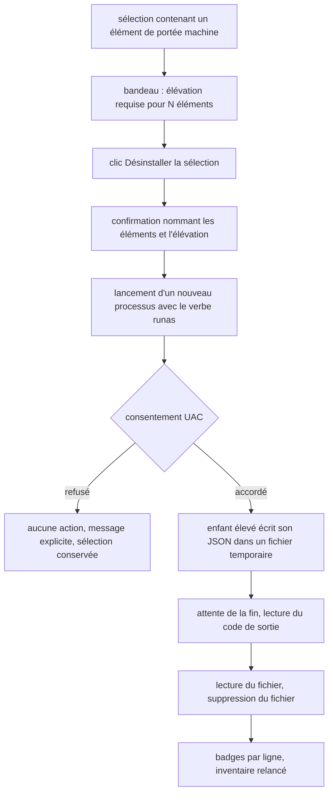

# Instruction: Élévation explicite pour le périmètre machine

## Architecture projection

```txt
.
├── src/
│   ├── windows/
│   │   ├── elevate.rs           ✅ lancement d'un enfant élevé, attente, code de sortie
│   │   └── mod.rs               ✏️ déclarer le module elevate
│   ├── toolchains/
│   │   ├── spawn.rs             ✏️ route élevée avec sortie sur fichier
│   │   └── mod.rs               ✏️ état du bandeau d'élévation
│   └── ui/
│       └── toolchains_view.rs   ✏️ bandeau et libellé du bouton
└── scripts/
    └── winclean/
        ├── clean.py             ✏️ --out déjà présent, vérifier l'écriture atomique
        ├── mod_toolchains.py    ✏️ lever le refus des éléments machine
        ├── mod_dev.py           ✏️ CacheSpec du cache HTTP système de Chocolatey
        ├── registry_mod.py      ✏️ déclarer choco-http-cache-system
        ├── README.md            ✏️ amender le non-objectif « aucune élévation »
        └── tests/
            ├── test_mod_toolchains.py ✏️ portée machine désormais retirable
            └── test_mod_dev.py        ✏️ résolution du chemin système
```

## User Journey



## Tasks to do

### `1)` Lancement élevé

> Un processus déjà lancé ne gagne pas de privilèges : il faut en créer un.

1. Créer `src/windows/elevate.rs` autour de `ShellExecuteExW` avec `lpVerb = "runas"` et `SEE_MASK_NOCLOSEPROCESS`.
2. Attendre la fin sur le handle retourné, lire le code de sortie, refermer le handle.
3. Traduire le refus de consentement en une erreur nommée, distincte d'un échec de commande.
4. Compiler tout le module derrière `#[cfg(windows)]` et fournir un substitut qui refuse proprement ailleurs.
5. Ne jamais tenter d'élever le processus de l'application elle-même.
6. Lancer et attendre hors du thread de rendu, comme les appels de la phase 4 : le dialogue UAC peut rester ouvert longtemps, et attendre sur le handle depuis le thread egui gèlerait la fenêtre.
7. `ShellExecuteExW` ne transporte pas l'environnement du parent : l'enfant reçoit celui du compte élevé. Passer des chemins absolus pour l'interpréteur, le script et le fichier de sortie, et n'y router aucun élément dont la résolution dépend du `PATH` ou d'une variable de profil.
8. Composer `lpParameters` à la main, avec ses propres guillemets : il n'y a pas d'échappement fourni comme avec `Command`.

### `2)` Canal de retour

> `runas` interdit la redirection de stdout : le fichier est le seul canal fiable.

1. Passer `--out <fichier temporaire>` à l'enfant élevé, en plus de `--json`.
2. Créer le fichier dans un dossier temporaire propre à l'application, jamais dans le dépôt.
3. Lire le fichier après la fin du processus, puis le supprimer, y compris en cas d'échec.
4. Traiter un fichier absent ou tronqué comme un échec explicite, jamais comme un succès vide.
5. Vérifier que `clean.py --out` écrit bien le payload complet, y compris quand le run est interrompu.

### `3)` Un seul appel élevé par lot

> Chaque élévation coûte un dialogue système à l'utilisateur.

1. Partitionner la sélection en deux lots : portée utilisateur et portée machine. La partition n'est pas un confort d'ergonomie — l'enfant élevé ne voit pas le profil de l'utilisateur, donc un élément du profil traité en élévation viserait le mauvais dossier.
2. Lancer le lot utilisateur sans élévation, comme en phase 4.
3. Ne lancer qu'un seul enfant élevé pour tout le lot machine, avec un `--toolchain-item` par élément.
4. Fusionner les deux résultats avant d'afficher les badges.

### `4)` Surface visible

> L'utilisateur doit savoir avant de cliquer qu'il déclenche une élévation.

1. Afficher le bandeau d'élévation avec le nombre exact d'éléments concernés, et le masquer quand il vaut zéro.
2. Rappeler l'élévation dans le texte de confirmation, pas seulement dans le bandeau.
3. Rendre le refus de consentement lisible : quels éléments n'ont pas été traités, et lesquels l'ont été.

### `5)` Lever les restrictions de la phase 3

> Ce que la phase 3 refusait devient possible, sous condition.

1. Retirer le refus systématique des éléments de portée machine dans `mod_toolchains.py`.
2. Ajouter le module `choco-http-cache-system` : `CacheSpec` ancrée sur la base `PROGRAMDATA` avec le relatif `chocolatey\HttpCache`, `requires=("choco",)`, `Level.SAFE`, découverte toujours faite mais retrait routé exclusivement par le lot élevé. Sans élévation, le candidat sort en `skipped` avec le motif, jamais en échec de suppression. Étendre le commentaire de `CacheSpec.fallback` à cette base, comme la phase 2 l'a fait pour `%ChocolateyInstall%`.
3. Le déclarer en `CleanModule(...)` complet, **jamais** par `_cache_module` : cette fabrique pose `clean=None` en dur, ce qui ferait supprimer à la main un arbre appartenant à choco. Son `clean=` lance `choco cache remove --yes --limit-output` depuis l'enfant élevé — c'est la seule voie supportée, et choco le dit lui-même en refusant la variante système à un processus non élevé. Même forme que `choco-http-cache` en phase 2, dont il est le jumeau.
4. Amender le README winclean : le non-objectif devient « winclean n'élève jamais son propre processus ; l'application peut en lancer un séparé, sur action explicite ».
5. Conserver le refus quand l'outil natif est absent : l'élévation ne remplace jamais l'outil de l'éditeur.

## Test acceptance criteria

| Task | Acceptance criteria                                                                                                                              |
| ---- | -------------------------------------------------------------------------------------------------------------------------------------------------- |
| 1    | Refuser le dialogue UAC laisse l'application vivante, affiche un message nommant le refus, et ne retire aucun élément.                                |
| 1    | Le code de sortie de l'enfant élevé est récupéré et distingue un succès d'un échec de commande.                                                       |
| 2    | Le fichier temporaire est supprimé après lecture, y compris lorsque l'enfant échoue ou que l'utilisateur refuse.                                      |
| 2    | Un fichier de sortie absent produit une erreur affichée, jamais un rapport vide présenté comme un succès.                                             |
| 2    | Le fichier écrit par l'enfant élevé reste lisible **et** supprimable par le processus non élevé, y compris quand l'élévation passe par un autre compte administrateur. |
| 1    | La fenêtre reste redessinée pendant que le dialogue UAC est ouvert : aucun gel du thread de rendu.                                                    |
| 3    | Une sélection mêlant portée utilisateur et portée machine ne déclenche qu'un seul dialogue UAC.                                                       |
| 3    | Une sélection purement utilisateur ne déclenche aucun dialogue UAC.                                                                                  |
| 4    | Le bandeau disparaît quand la sélection ne contient aucun élément de portée machine.                                                                  |
| 5    | Un élément de portée machine sélectionné est réellement retiré et disparaît de l'inventaire suivant.                                                  |
| 5    | Un SDK .NET reste refusé quand `dotnet-core-uninstall` est absent, même avec l'élévation accordée.                                                    |
| 5    | Le README winclean ne contient plus l'affirmation que tout ce qui exige une élévation est hors de portée.                                             |
| 5    | `choco-http-cache-system` apparaît dans les tables déclaratives et, sans élévation, sort en `skipped` avec son motif plutôt qu'en échec d'accès.      |
| 5    | `choco-http-cache-system` porte un `clean=` non nul : sa purge passe par `choco cache remove`, et aucun fichier de `ProgramData\chocolatey` n'est supprimé directement. |
| 5    | Aucun élément de portée utilisateur n'est routé vers l'enfant élevé, quelle que soit la composition de la sélection.                                  |
