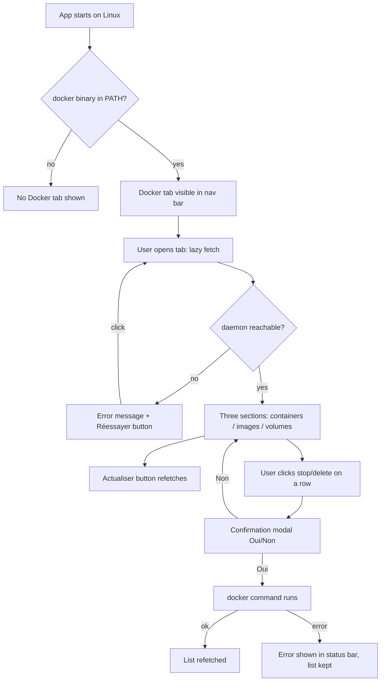

# Instruction: Docker tab — minimal local dashboard

## Feature

- **Summary**: New "Docker" tab in the egui navigation bar, Linux-only for now, acting as a minimal local dashboard: list all containers (running + stopped), images (with a "used" badge), and volumes (with orphan indication). Targeted, confirmed destructive actions only: stop a running container, remove a stopped container, remove an unused image, remove an orphan volume. No registry access, no global prune, no `--force`, ever. Tab hidden only when the `docker` binary is absent; a non-responding daemon shows an in-tab error with a "Réessayer" button. Approved brainstorm: `aidd_docs/tasks/2026_08/2026_08_19-docker-tab-brainstorm.md`.
- **Stack**: `Rust (edition 2021), eframe/egui 0.35, serde/serde_json (already in Cargo.toml — no new dependency), docker CLI ≥ 20.x via std::process::Command (NDJSON via the universal --format '{{json .}}' syntax, not the newer --format json shorthand)`
- **Branch name**: `feature/docker-tab`
- **Parent Plan**: `none`
- **Sequence**: `standalone`
- Confidence: 9/10
- Time to implement: ~1 day

## Architecture projection

### Files to modify

- `src/linux/mod.rs` - declare `pub mod docker;` (no extra cfg needed, module-level `#![cfg(target_os = "linux")]` already applies)
- `src/ui/mod.rs` - declare `pub mod docker_view;`
- `src/ui/egui_app.rs` - `ActiveView::Docker` variant, `docker_available: bool` startup detection, conditional nav button, docker state fields, `PendingAction` variants for the four destructive actions, dispatch arm `render_docker_view`, `resolve_pending_action` arms, egui_kittest tests

### Files to create

- `src/linux/docker.rs` - docker CLI layer: binary detection, NDJSON parsing of `docker ps -a / images / volume ls --format '{{json .}}'` (wire-format serde structs stay private here), daemon-error classification, stop/remove commands, mapping to the façade's OS-neutral types; inline tests on captured fixtures + real-machine tests
- `src/ui/docker_view.rs` - OS-neutral façade (`fetch_impl` cfg-gated like `automations_view.rs`) owning the shared types `DockerSnapshot`/`ContainerEntry`/`ImageEntry`/`VolumeEntry` (the `AutomationRow` precedent: view types live OS-neutral, the Linux module returns them) + pure view "data in, actions out" (`DockerViewState` → `Vec<DockerAction>`) like `cleanup_view.rs`

### Files to delete

- none

## Applicable rules

| Tool | Name | Path | Why it applies |
| ---- | ---- | ---- | -------------- |
| none | -    | -    | rules inventory (`list-rules.mjs`) returned an empty array |

## User Journey

## Risk register

| Risk | Impact | Mitigation |
| ---- | ------ | ---------- |
| `docker images` field `Containers` is `"N/A"` on some daemon configurations (non-containerd image store) | "used" badge wrong → user could be offered deletion of an in-use image | Treat `Containers` as a hint only; authoritative source is cross-referencing `docker ps -a` image references (ID and repo:tag) against the image list. `"N/A"`/unparsable ⇒ fall back to the cross-reference result |
| Synchronous `Command::output()` on a hung daemon can freeze the UI for many seconds | Whole app unresponsive | Follow the Automatisations precedent (synchronous fetch is the accepted house pattern) BUT guard every docker call with a hard timeout by polling `try_wait()` and killing the child. Timeouts are per operation class: listings ~5s (a healthy daemon answers instantly), actions ~30s (`docker stop` alone waits up to 10s of SIGTERM grace before SIGKILL). A listing timeout classifies as daemon-unreachable; an action timeout is reported as a plain command failure, never as daemon-unreachable |
| Deleting an image referenced only by tag of a stopped container still fails daemon-side | Confusing raw error | Delete buttons for used images are rendered disabled with an explanatory tooltip (see Phase 2 gating); any residual daemon refusal is surfaced verbatim in the status bar without retry |
| Container→image matching is fuzzy (`docker ps` `Image` may be a repo:tag, a short/full ID, or a digest ref) | An in-use image wrongly marked unused → deletable | Match on both image ID prefix and normalized repo:tag; any container image reference that cannot be resolved to a listed image marks nothing unused — on doubt an image is treated as **used** (deletion never offered on uncertainty), with the `Containers` hint as corroboration |
| NDJSON shape varies across docker CLI versions | Parse failure → empty tab | All row fields `#[serde(default)]`/`Option<_>` (same tolerance as `TimerEntry` in `src/linux/automations.rs:53-63`); unparsable lines are skipped, not fatal; captured real-machine fixtures in tests |
| Windows/macOS builds must stay green while only Linux is implemented | CI/build breakage on the Windows machine | OS-neutral façade with cfg-gated `fetch_impl` (exact `automations_view.rs` layout); tab button rendered only when `docker_available`, which is hardcoded `false` on non-Linux for now |

## Implementation phases

### Phase 1: Linux docker CLI layer (`src/linux/docker.rs`)

> All docker interaction behind one testable module; no UI knowledge.

#### Tasks

1. `binary_available() -> bool` — resolve `docker` in PATH (env-parameterized helper for tests, like `src/platform/linux.rs` `*_with_env`).
2. Wire types `ContainerWire`, `ImageWire`, `VolumeWire` — **private serde structs local to this module** with `#[serde(default)]`-tolerant fields (containers: id, names, image, state, status, created; images: id, repository, tag, size, created, containers-hint; volumes: name, driver, mountpoint). The OS-neutral entry types returned to callers (`DockerSnapshot`, `ContainerEntry`, `ImageEntry`, `VolumeEntry`) are **defined in `src/ui/docker_view.rs`** and produced here by mapping — the `AutomationRow` precedent (`crate::linux::automations::fetch()` returns the `src/ui/automations_view.rs` type), mandatory so non-Linux builds keep compiling while `src/linux/` compiles to nothing.
3. `run_docker(args, timeout) -> Result<String, DockerError>` — spawn with a caller-chosen timeout via `try_wait()` polling + kill: listings ~5s, actions ~30s (`docker stop` waits up to 10s of SIGTERM grace). Classify failures: `BinaryMissing`, `DaemonUnreachable` (non-zero exit with "Cannot connect"/"permission denied" stderr, or a *listing* timeout), `CommandFailed(String)` (daemon refusals and *action* timeouts — an action timeout must never present as daemon-unreachable).
4. NDJSON parser: `lines().filter(|l| !l.trim().is_empty())`, per-line `serde_json::from_str`, invalid lines skipped (mirror `scripts/system_inventory/docker_native.py:110-143` tolerance).
5. `list_containers()` (`ps -a --format '{{json .}}'`), `list_images()` (`images --format '{{json .}}'`), `list_volumes()` + `list_orphan_volumes()` (`volume ls --format '{{json .}}'`, `-f dangling=true`) — the `{{json .}}` syntax works on every docker CLI ≥ 20.x, unlike the newer `--format json` shorthand.
6. Snapshot assembly `fetch() -> Result<DockerSnapshot, DockerError>`: computes per-image `used` (cross-reference `ps -a` image refs by ID prefix and normalized repo:tag; unresolvable references leave every image conservatively marked used-on-doubt as per the risk register; `Containers` hint as corroboration) and per-volume `orphan` (membership in dangling set).
7. Actions: `stop_container(id)`, `remove_container(id)`, `remove_image(reference)`, `remove_volume(name)` — plain `docker stop/rm/rmi/volume rm`, never `--force`. `remove_image` takes the row's **repo:tag** when the row is tagged (`docker rmi <id>` refuses multi-tagged images without `--force`; removing by tag untags cleanly and deletes the image with its last tag) and the **ID** only for untagged `<none>:<none>` rows.
8. Container-state model: explicit mapping of the `State` string — `running`/`paused`/`restarting` ⇒ stoppable, `exited`/`created`/`dead` ⇒ removable, anything unknown ⇒ **no action offered** (conservative default).
9. Inline tests: NDJSON parsing on captured fixtures from this machine (ps/images/volumes real output), tolerance tests (empty, garbage lines, missing fields), used/orphan computation on synthetic snapshots (including an unresolvable image reference ⇒ used-on-doubt), state-mapping table, `remove_image` reference selection (tagged row ⇒ repo:tag, `<none>:<none>` row ⇒ ID), error classification on canned stderr; plus real-machine tests gated on `binary_available()` that **tolerate empty lists** (a machine with docker but zero containers must stay green) and skip cleanly where docker is absent.

#### Acceptance criteria

- [x] `cargo test` green with docker running, and with `PATH` stripped (binary-missing paths covered by env-parameterized tests); real-machine tests assert row well-formedness, not list non-emptiness
- [x] Manual check (not a unit test): `fetch()` on this machine returns non-empty containers and images, each image's `used` flag consistent with `docker ps -a`
- [x] No call path can ever produce a `--force` or prune argument (asserted by a unit test on the command builders)
- [x] Unit test proves an action timeout is classified `CommandFailed`, not `DaemonUnreachable`

### Phase 2: OS-neutral façade and pure view (`src/ui/docker_view.rs`)

> Compile-safe on every OS; view renders data and emits intents, zero `EguiApp` access.

#### Tasks

1. Shared types: `DockerSnapshot`, `ContainerEntry` (id, name, image ref, state enum, status text), `ImageEntry` (id, repo:tag or `<none>` identity, size, created, `used: bool`, rmi reference), `VolumeEntry` (name, driver, `orphan: bool`) — defined **here**, OS-neutral, so every build compiles them.
2. Façade: `available() -> bool`, `fetch() -> Result<DockerSnapshot, String>`, and the four action wrappers — each delegating to `fetch_impl`-style cfg-gated internals (Linux → `crate::linux::docker`; non-Linux → `available()` = `false`, others unreachable/`Err`), exact layout of `src/ui/automations_view.rs:66-160`.
3. `DockerViewState<'a>` (snapshot or error + busy flag) and `enum DockerAction { Refresh, Retry, StopContainer(String), RemoveContainer(String), RemoveImage(String), RemoveVolume(String) }`.
4. `render(ui, &state) -> Vec<DockerAction>`: three sections (Conteneurs / Images / Volumes) as striped `egui::Grid`s inside the existing `ScrollArea` pattern; daemon error state renders the message + « Réessayer » button.
5. Gating in the view — **disabled button + tooltip, per the approved brainstorm ("bouton grisé"), deliberately diverging from cleanup_view's no-button pattern**: render every delete/stop button, but via `ui.add_enabled(allowed, ...)` with `.on_disabled_hover_text(...)` explaining the block (« utilisée par N conteneur(s) », « volume rattaché à un conteneur », « conteneur non arrêté »). Allowed states: stop on stoppable containers (`running`/`paused`/`restarting`); remove on removable containers (`exited`/`created`/`dead`); remove on images with `used == false`; remove on orphan volumes. Unknown container state ⇒ both buttons disabled.
6. Untagged images: a `<none>:<none>` row displays its short ID as the row identity; the delete intent carries the reference actually passed to `rmi` (repo:tag or ID) so the confirmation message can say precisely what will be removed (untag vs definitive image deletion).
7. French labels/placeholders consistent with existing views (« Actualiser », « Réessayer », « Aucun conteneur », …).

#### Acceptance criteria

- [x] `cargo check` passes conceptually for non-Linux paths (cfg parity reviewed against `automations_view.rs`; actual Windows compile deferred to the Windows machine per repo convention)
- [x] View emits no destructive `DockerAction` for a used image, a non-orphan volume, a running container's removal, or an unknown container state — the corresponding buttons exist but are disabled with a tooltip (unit tests on `render` output via egui_kittest or direct state tests)

### Phase 3: Wiring into `EguiApp` (`src/ui/egui_app.rs`)

> Tab visibility, lazy fetch, confirmations through the existing modal pipeline.

#### Tasks

1. Add `ActiveView::Docker` variant (`:579-587`) and dispatch arm (`:2079-2085`) → `render_docker_view`.
2. Startup detection: `docker_available: bool` field set once in `EguiApp::new` via `docker_view::available()`; nav `selectable_value` for Docker rendered only when `true` (`:2053-2076`).
3. State: `docker: Option<Result<DockerSnapshot, String>>`, lazy first fetch on tab activation (Automatisations pattern `:2313-2315`); `Refresh`/`Retry` intents refetch.
4. Confirmations: four new `PendingAction` variants; on destructive `DockerAction`, open `dialogs::confirm` with a detailed French message (name + what will happen); `resolve_pending_action` arms execute the façade call, surface errors via `set_status(err, true)`, and refetch on success. Actions run synchronously — an accepted v1 trade-off: `rm`/`rmi`/`volume rm` are sub-second, only `docker stop` can hold the UI up to its ~10s daemon-side grace (30s client cap). Because a blocking call inside the current frame would paint nothing until it returns, « Oui » does NOT execute directly: it stores the action in a `deferred_docker_action` field, calls `set_status("Arrêt de <name>…")` and `request_repaint()`; the action executes at the start of the NEXT `update`, so the status message is genuinely painted before the freeze. The cleanup `spawn.rs` threaded pattern is the designated follow-up if the freeze proves annoying.
5. `render_docker_view` consumes `Vec<DockerAction>` (cleanup pattern `:2366-2401`).
6. egui_kittest tests: tab visible only when `docker_available` (use `new_for_test`/`from_parts` to force the flag both ways); destructive click opens the modal; « Non » does nothing; « Oui » path guarded exactly like `clean_opens_dialog_and_spawns_only_on_oui` (`:4720-4763`), with real docker execution neutralized behind a `docker_actions_enabled` test flag mirroring `cleanup_spawning_enabled` (`:673`). The « Oui » assertion accounts for the one-frame deferral: one extra `harness.step()` after accepting before asserting the single façade call.

#### Acceptance criteria

- [x] `cargo fmt --check && cargo clippy --all-targets -- -D warnings && cargo test` all green
- [x] With the flag forced off in tests, no Docker tab label is found by the harness; forced on, it is
- [x] Confirmation modal test proves « Non » executes nothing and « Oui » triggers exactly one façade call

## Amendments

<!-- AI-initiated changes during implementation. Each entry is prefixed with 🤖. -->

- 🤖 2026-08-19 challenge iteration 1: (a) gating switched from "no button" to disabled-button-with-tooltip to match the approved brainstorm's « bouton grisé »; (b) per-operation-class timeouts (listings ~5s, actions ~30s) so `docker stop`'s 10s grace is never killed or misclassified as daemon-unreachable; (c) `--format '{{json .}}'` everywhere instead of the newer `--format json` shorthand, consistent with the stated CLI ≥ 20.x support; (d) real-machine tests tolerate empty lists; (e) explicit container-state mapping with conservative default; (f) conservative used-on-doubt rule for container→image matching.
- 🤖 2026-08-19 challenge iteration 2: `remove_image` targets the row's repo:tag for tagged rows (plain `rmi <id>` refuses multi-tagged images and `--force` is banned) and the ID only for `<none>:<none>` rows; untagged rows display their short ID and the confirmation message states exactly what will be removed (untag vs definitive deletion).
- 🤖 2026-08-19 challenge iteration 3: shared entry types (`DockerSnapshot`/`ContainerEntry`/`ImageEntry`/`VolumeEntry`) moved to the OS-neutral `src/ui/docker_view.rs` (the `AutomationRow` precedent) — leaving them in `src/linux/docker.rs` would break every non-Linux build since that module compiles to nothing off-Linux; wire serde structs stay private to the Linux module. Also aligned the stale `--format json` wording in the projection and documented the synchronous-action trade-off (`docker stop` may hold the UI ~10s; threaded `spawn.rs` pattern is the designated follow-up).
- 🤖 2026-08-19 challenge iteration 4: replaced the false "status visible on the next frame" mitigation — a blocking call inside the frame paints nothing until it returns — with a one-frame deferred execution (`deferred_docker_action` + `set_status` + `request_repaint`, execute at the start of the next `update`), and adjusted the kittest « Oui » assertion for the extra step.

- 🤖 2026-08-19 implementation Phase 1: (a) `run_docker` takes an `OperationClass` enum (Listing/Action) instead of a raw timeout, with the spawn/poll/kill logic in a generic `run_command_with_timeout` — lets timeout-classification tests spawn `sleep` with a 100ms cap instead of real 5s/30s waits, behavior unchanged; (b) used-on-doubt implemented as a **global** fallback (one unresolvable container image reference marks every image used, since the matching logic itself is untrustworthy for that snapshot); (c) module-level `#![allow(dead_code)]` on both new files until Phase 2/3 wires callers (house pattern for not-yet-wired modules).

## Log

<!-- APPEND ONLY. One entry per step attempt. Never rewrite. -->

- 2026-08-19 Phase 1 done (implementer agent, completion 100): `src/linux/docker.rs` + shared types in `src/ui/docker_view.rs`, 50 new tests, fmt/clippy/test green (357 passed). Real-machine `fetch()`: 25 containers, 23 images (1 unused: php:8.4-apache), 31 volumes (17 orphans).
- 2026-08-19 Phase 2 done (implementer agent, completion 100): façade + pure view in `src/ui/docker_view.rs`, 24 new tests, fmt/clippy/test green (383 passed). Notable choices: distinct button labels per resource type (« Arrêter »/« Supprimer »/« Supprimer l'image »/« Supprimer le volume ») for unambiguous kittest label queries; `ImageEntry::is_untagged()` accessor so Phase 3 composes untag-vs-delete confirmation wording; busy state renders a spinner (kittest harness uses `run_steps(2)` there — `Harness::run()` never settles on continuous repaint).
- 2026-08-19 Phase 3 done (implementer agent, completion 100): `ActiveView::Docker`, startup `docker_available` via `docker_view::available()` (nav button conditional; `from_parts` gained the flag as 8th param), lazy fetch, 4 `PendingAction` variants + `DeferredDockerAction` with the one-frame deferral (`ui_content`'s Accepted early-return now conditional on `deferred_docker_action.is_none()` so the in-progress status paints before the blocking call), `docker_actions_enabled` test gate + invocation counter, 2 kittest tests (tab visibility off/on; « Non » = 0 exécution, « Oui » = exactly 1 with the extra deferral step). `#![allow(dead_code)]` removed from both docker files (3 targeted field-level allows kept on wire-fidelity fields). fmt/clippy/test green (385 passed).
- 2026-08-19 end-to-end validation (orchestrator): success_condition re-run green (fmt clean, clippy 0 warnings, 385 tests passed). `cargo run` launched, « Docker » tab present in the nav bar, tab opened via a synthetic XTEST click: real container list rendered with French states (« en cours »/« arrêté »/« redémarrage »), lazy fetch confirmed on live data. All 9 acceptance criteria checked off. Nothing committed (house rule: no commit without an explicit ask).
- 2026-08-19 post-plan fix (user report): the Docker view had no vertical overflow — sections are now wrapped in `egui::ScrollArea::vertical()` in `docker_view::render`; verified visually (volumes section reachable by wheel). 385 tests still green.
- 2026-08-19 post-plan feature (user ask « combien de place ça libère ? », implementer agent, completion 100): reclaimable space in every removal confirmation — container writable layer via `ps -a --size` (37 ms, free), image size with shared-layers caveat (untag case: no space freed while other tags remain), volume size when known. Volume sizes are on-demand only (« Calculer les tailles » button → `docker system df -v`, Action class 30 s, one-frame deferral, merged into the snapshot by name without refetch — `docker volume ls` always reports `N/A`). New « Taille » column in the Volumes section. fmt/clippy green, 402 tests passed. Real-machine `volume_sizes()`: 30 volumes, e.g. buildx_buildkit_mybuilder0_state = 43.55GB. Visual check on the running app: « Taille » column filled after clicking « Calculer les tailles » (green status), gating intact.
- 2026-08-19 refinement (orchestrator): the sole-tag image case (the common one) wrongly got the untag wording with no size — `docker rmi repo:tag` on a single-tag image really deletes it. The confirm now counts snapshot entries sharing the image id: >1 → untag wording (no space freed), otherwise → definitive-removal wording with « Libérera jusqu'à {size} ». fmt/clippy green, 402 tests passed.

## Validation flow demonstration

1. Run `cargo run` on this Linux machine (docker installed, daemon up): the « Docker » tab is present; open it — containers, images and volumes of this machine are listed, images used by the SmartLockers compose stacks carry the « utilisée » badge.
2. `sudo systemctl stop docker` then click « Actualiser »: the tab stays, shows « daemon Docker inaccessible » + « Réessayer »; `sudo systemctl start docker`, click « Réessayer »: lists come back without restarting the app.
3. Pick a stopped throwaway container: click supprimer → modal → « Non » (nothing happens) → supprimer → « Oui » → row disappears after refetch; verify with `docker ps -a`.
4. Verify a used image and a non-orphan volume show a greyed-out delete button whose tooltip explains why it is blocked.
5. `PATH` without docker (e.g. `env PATH=/usr/bin-stripped cargo run` variant or the test flag): no Docker tab in the nav bar.
