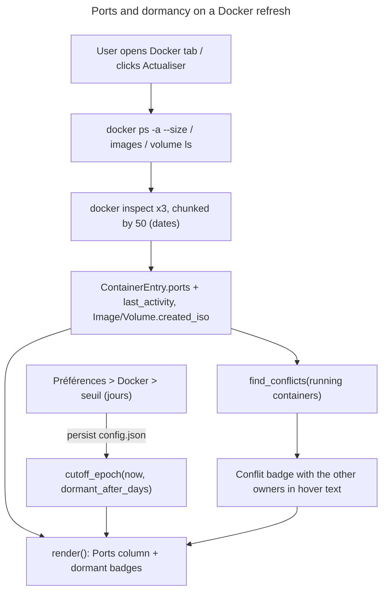

# Instruction: Ports, dates and dormancy on the existing lists

## Feature

- **Summary**: Two primitives and their immediate payoff. (1) A pure port model — parse `docker ps -a`'s `Ports` field into typed bindings, render them in a new column, and compute conflicts between distinct owners. (2) Dormancy — three grouped `docker inspect` calls bring back RFC3339 dates (container `.State.FinishedAt`, image `.Created`, volume `.CreatedAt`), and each row is badged `dormant` when its date is older than `now - dormant_after_days`. The threshold is a new `Settings` field, edited in Préférences, persisted in `config.json`, defaulting to 60 days.
- **Stack**: unchanged — no new dependency. `ContainerWire` gains a single already-emitted field (`Ports`); the compose labels Part 2 needs are read from the grouped `docker inspect`'s structured `.Config.Labels`, not from `docker ps`, so no `Labels` field is added to the wire struct here.
- **Branch name**: `feature/docker-stacks-ports/part-1-ports-dormancy`
- **Parent Plan**: `./2026_08_21-docker-compose-ports-cleanup-master.md`
- **Sequence**: `1 of 3`
- Confidence: 8/10 — the `Ports` string format is captured verbatim in the existing `REAL_PS_FIXTURE` (`"0.0.0.0:5656->5656/tcp, [::]:5656->5656/tcp"`), so parsing is fixture-driven. The one unmeasured item is the wall-clock cost of the three grouped inspects, closed at Checkpoint 1.

## Architecture projection

### Files to create

- `src/ui/ports.rs` — OS-neutral, dependency-free, fully unit-tested:
  - `PortBinding { host_ip: String, host_port: u16, container_port: u16, protocol: String }`.
  - `parse_ps_ports(raw: &str) -> Vec<PortBinding>` — splits on `", "`, keeps only entries containing `->` (a bare `5656/tcp` is `expose`-only, never published, and per the Décisions section is **not** shown and **never** feeds conflict detection), handles the bracketed IPv6 host form `[::]:5656->5656/tcp` and the port-range form `0.0.0.0:8000-8002->8000-8002/tcp` (expanded into one binding per port; a range whose two ends disagree in width is dropped rather than guessed). Unparsable entries are skipped, never panic.
  - `PortOwner::new(key, label, kind, bindings)` — the **only** way to build an owner, because it applies the de-duplication below; a free `dedupe_owner_bindings` function would be one forgotten call away from every row flagging itself. Docker publishes the same binding twice, once on `0.0.0.0` and once on `[::]`; collapsing them inside the constructor is what stops a container from conflicting with itself.
  - `interfaces_overlap(a: &str, b: &str) -> bool` — `true` when either side is a wildcard (`0.0.0.0`, `::`, `[::]`, or empty), otherwise `a == b`. `127.0.0.1:8080` and `192.168.1.10:8080` therefore do **not** conflict.
  - `PortOwner { key: String, label: String, kind: OwnerKind, bindings: Vec<PortBinding> }` with `OwnerKind { RunningContainer, DeclaredStack }` — Part 2 supplies `DeclaredStack` owners; Part 1 only ever builds `RunningContainer` ones.
  - `find_conflicts(owners: &[PortOwner]) -> Vec<PortConflict>` where `PortConflict { host_port: u16, protocol: String, owners: Vec<String>, active: bool }`. A conflict requires: same `host_port`, same `protocol`, overlapping interfaces, and **two distinct owner keys**. `active` is `true` only when every owner in the pair is a `RunningContainer` (used by Part 2 to separate a live collision from a would-be one).
  - `format_bindings(&[PortBinding]) -> String` — the column's display form, `0.0.0.0:5656→5656/tcp`, joined by `", "`, empty string when nothing is published.

### Files to modify

- `src/linux/docker.rs`
  - `ContainerWire` gains a single field, `#[serde(default, rename = "Ports")] ports: String` (already emitted — see `REAL_PS_FIXTURE`). `Labels` is deliberately **not** deserialized: `docker ps` joins labels with `,` while the `config_files` label is itself a `,`-separated list, so Part 2 reads the compose labels from the structured `.Config.Labels` of the grouped inspect instead. Adding a field no one consumes would be dead weight.
  - Two new helpers, both chunking `ids` by 50 and running `docker inspect --type <container|image|volume> --format '<tmpl>' <ids…>`:
    - `fn inspect_containers(ids: &[String]) -> HashMap<String, ContainerFacts>` where `struct ContainerFacts { finished_at: Option<String>, created: Option<String> }` — Part 2 adds a `labels: HashMap<String, String>` field to this same struct, which is why containers get their own helper instead of sharing the date-only one.
    - `fn inspect_dates(kind: InspectKind, ids: &[String]) -> HashMap<String, String>` with `enum InspectKind { Image, Volume }` — **containers are not a variant**, they go through `inspect_containers`; the two helpers are disjoint, not overlapping.
  - **The template emits NDJSON, not tab-separated fields** (measured on this machine, and a silent-failure trap): `docker inspect --format` does **not** expand `\t` — that expansion is a `docker ps --format 'table …'` behaviour; `docker inspect` prints the two literal characters `\` and `t`, so a `split('\t')` finds exactly one field and every date ends up `None`. Each helper therefore emits one JSON object per line, built with `{{json …}}` so every value is escaped by docker itself: containers `{"id":{{json .Id}},"finished":{{json .State.FinishedAt}},"created":{{json .Created}}}`, images `{"id":{{json .Id}},"created":{{json .Created}}}`, volumes `{"name":{{json .Name}},"created":{{json .CreatedAt}}}`. This reuses the NDJSON parsing already in this module and is what lets Part 2 append `,"labels":{{json .Config.Labels}}` — a map whose values contain commas and paths — without inventing a separator. Measured: `{{json .Config.Labels}}` yields `null` on a container with no labels, so no `{{if}}` guard and no Go `<no value>` case exists.
  - **Join keys must be normalized** (measured on this machine, and the reason a naive implementation ships an empty date column): `docker inspect` returns the full 64-character container id and the `sha256:`-prefixed 71-character image id, while `docker ps`/`docker images --format '{{json .}}'` return the 12-character short forms. `fn normalize_id(raw: &str) -> String` strips a `sha256:` prefix and truncates to 12 characters; both sides of the join go through it. Volumes are keyed by `Name`, which is identical on both sides.
  - **Stdout is parsed regardless of exit status**: `docker inspect` exits non-zero when *any* id is unknown (a resource removed between the listing and the inspect) while still printing every id it did resolve — treating that as a hard failure would blank the whole column on a benign race. A chunk that times out contributes nothing and leaves those rows date-less (badge simply absent) instead of failing the snapshot.
  - Container date selection: `FinishedAt` when it is not the zero value `0001-01-01T00:00:00Z`, otherwise `Created` (a `Created`-state container has never run).
  - `fetch()` calls the three inspect passes after the three listings and fills the new date fields. Classified `OperationClass::Listing` (5 s per chunk), so a hung daemon still surfaces as `DaemonUnreachable` through the existing path.
- `src/ui/docker_view.rs`
  - `ContainerEntry` gains `pub ports: Vec<PortBinding>` and `pub last_activity: Option<String>`; `ImageEntry` and `VolumeEntry` each gain `pub created_iso: Option<String>`. No compose field is added here — Part 2 owns the stack linkage and adds `compose_project` / `compose_files` then, filled from the grouped inspect's `.Config.Labels`.
  - `pub fn parse_rfc3339(text: &str) -> Option<i64>` — RFC3339 to epoch seconds, pure, no `chrono`. **A real parser is required, not a lexicographic comparison**: measured on this machine, `docker volume inspect` returns `2026-08-17T11:07:18+02:00` (local offset) while container/image inspect return `…Z` — comparing those two shapes as strings gives wrong answers around the offset. Handles the `Z` and `±HH:MM` forms, an optional fractional-seconds part, and returns `None` on anything else (including the `0001-01-01T00:00:00Z` zero value, which is filtered before parsing). Uses the standard days-from-civil algorithm (~25 lines both directions, fully unit-tested).
  - `pub fn cutoff_epoch(now_epoch_secs: i64, days: u32) -> i64` and `pub fn is_dormant(date: Option<&str>, cutoff: i64) -> bool` — `None`, or an unparsable date, yields `false` (never badge what we could not date).
  - `pub fn days_since(date: &str, now_epoch_secs: i64) -> Option<i64>` — free once the parser exists, and what makes the badge read `dormant · 64 j` instead of an opaque flag.
  - Dormancy predicates, so the rule lives in one place: a container is dormant when it is **not running** and its `last_activity` predates the cutoff; an image when `!used` and `created_iso` predates it; a volume when `orphan` and `created_iso` predates it. Dormancy never stands alone — it refines the existing unused/orphan signals (Docker stores no "last used" date for images or volumes, which is exactly why the user's "2 months" criterion cannot be a standalone filter).
  - `ImageEntry` gains `pub used_by: Vec<String>` — the container ids `compute_used` already walks to decide `used`, merely kept instead of collapsed into a bool. `used` stays as-is (`!used_by.is_empty()`), so nothing downstream changes today; Part 3 needs the mapping to let an image be selected once every container holding it is selected too.
  - `DockerViewState` gains `pub dormant_after_days: u32` and `pub now_epoch_secs: i64` so the cutoff is computed at render time via `cutoff_epoch` — changing the threshold in Préférences updates the badges without a refetch, and tests inject a fixed clock.
  - **Scope note**: `docker ps -a` reports `Ports` only for *running* containers — a stopped one publishes nothing — so Part 1 detects collisions between **running containers only**. Catching a collision *before* starting a stopped stack is Part 2's job (`OwnerKind::DeclaredStack`), which is why `find_conflicts` takes owners of both kinds from day one.
  - `render()` gains a **Ports** column on the containers table (`format_bindings`, `—` when empty), a `⚠ conflit` badge on any container involved in a conflict with the other owners' names in its hover text, and a `dormant · N j` badge (`days_since`) whose hover text is the raw date. The conflict set is computed inside `render()` from the running containers only, via `PortOwner`s of kind `RunningContainer` — Part 2 appends its declared-stack owners to the same call.
- `src/ui/egui_app.rs`
  - Passes `dormant_after_days` (from `self.config.default_settings`) and a `SystemTime::now()`-derived epoch into `DockerViewState`.
  - `render_preferences_view` gains a `Docker` block: a labelled `egui::DragValue` on `dormant_after_days`, clamped `1..=3650`, persisting **only** on `response.drag_stopped() || response.lost_focus()` — a `DragValue` reports `changed()` on every frame of a drag, and calling `self.persist()` there would rewrite `config.json` dozens of times per second — and reusing the existing status-line feedback. Added as a self-contained block at the end of the view to minimise conflict surface with the in-flight card-badge work.
- `src/storage/models.rs`
  - `Settings` gains `#[serde(default = "default_dormant_after_days")] pub dormant_after_days: u32` with `fn default_dormant_after_days() -> u32 { 60 }`. A field-level default is **required**: `Settings` has no `#[serde(default)]` at struct level today, so a pre-existing `config.json` (which has no such key) would otherwise fail to deserialize and drop the user into `fallback_config()`.
- `config/default.json` — `default_settings` gains `"dormant_after_days": 60`; the existing round-trip test compares against this literal.
- `src/ui/mod.rs` — declare `pub mod ports;`, matching the ten `pub mod` declarations already there. It cannot be a private `mod`: `PortBinding` appears in `ContainerEntry`'s public fields and in `compose_view`'s API (Part 2), so a private module would fail `private_interfaces`.
- `src/ui/egui_app.rs` (`fallback_config`, and the second `Settings` literal around line 3004) — both existing struct literals need the new field or they stop compiling.
- `aidd_docs/memory/architecture.md`, `aidd_docs/memory/database.md` — document the new module and the new setting.

### Files to delete

- None.

## Applicable rules

| Tool | Name | Path | Why it applies |
| ---- | ---- | ---- | --------------- |
| none | none | none | `list-rules.mjs` returns `[]` — no installed AI-tool rules apply to this project. |

## User Journey

## Risk register

| Risk | Impact | Mitigation |
| ---- | ------ | ---------- |
| `docker inspect` exits non-zero when one id vanished between listing and inspect | whole date column blanks out on a benign race | stdout parsed regardless of exit status; only the missing ids lose their date |
| A container publishes on both `0.0.0.0` and `[::]` | it conflicts with itself, every row permanently flagged | de-duplication inside `PortOwner::new` + conflict requires two **distinct** owner keys; fixture test uses the real double-binding line |
| Three date shapes in play: `…Z`, `…+02:00` (volumes, measured), and the `0001-01-01T00:00:00Z` zero value | wrong or missing dormancy badges | a real `parse_rfc3339` handling both offset forms; the zero value filtered upstream; anything unparsable ⇒ `None` ⇒ no badge, never a wrong badge |
| Short vs full/`sha256:`-prefixed ids across `ps`/`images` and `inspect` (measured) | the join silently matches nothing, date column permanently empty | `normalize_id` applied on **both** sides, with a test pairing a real 12-char id against its real 64-char and `sha256:`-prefixed forms |
| New `Settings` field without a field-level default | every existing `config.json` fails to load, user silently dropped into `fallback_config()` | `#[serde(default = "…")]` plus a test deserializing a `Settings` JSON that omits the key |
| Three extra inspect passes slow the refresh | tab feels sluggish | chunked; measured at Checkpoint 1; documented fallback is the explicit-trigger pattern already used by `ComputeVolumeSizes` |
| `docker inspect --format` does not expand `\t` (measured) | a tab-separated template yields one field per line, every date silently `None`, no error anywhere | the template emits NDJSON via `{{json …}}` and is parsed by the module's existing NDJSON path; a fixture test uses a real captured `inspect` line |
| Port ranges (`8000-8002->8000-8002/tcp`) | mis-parsed as a single huge port, or a panic on `parse::<u16>` | explicit range branch with equal-width validation; malformed entries skipped, covered by a test |

## Validation

- `cargo fmt --check && cargo clippy -- -D warnings && cargo test` green.
- New tests: `parse_ps_ports` on the real double-binding fixture, on an `expose`-only entry, on a range, on garbage; `interfaces_overlap` truth table including wildcard/loopback/LAN pairs; `find_conflicts` on same-port/different-protocol, same-port/disjoint-interfaces, same owner twice, and a genuine two-container collision; `parse_rfc3339` on `…Z`, `…+02:00`, `…-05:30`, fractional seconds, the zero value and garbage; `cutoff_epoch`/`days_since` on fixed epochs spanning a leap year and a month boundary; `is_dormant` on `None`, the zero value, and a date either side of the cutoff; `normalize_id` on the short, full and `sha256:`-prefixed forms; container/image/volume dormancy predicates including "running is never dormant" and "used image is never dormant"; `inspect_containers` / `inspect_dates` NDJSON line parsing, with a missing id, a truncated line and a container whose `labels` is `null`; `Config` round-trip with and without `dormant_after_days`, and equality against `config/default.json`.
- Checkpoint 1 (manual, this machine): real bindings visible; two **running** containers deliberately bound to the same host port flag each other (a stopped container publishes no `Ports`, so stack-level detection lands in Part 2); threshold edited in Préférences survives a restart; refresh duration noted before/after the inspect pass.
