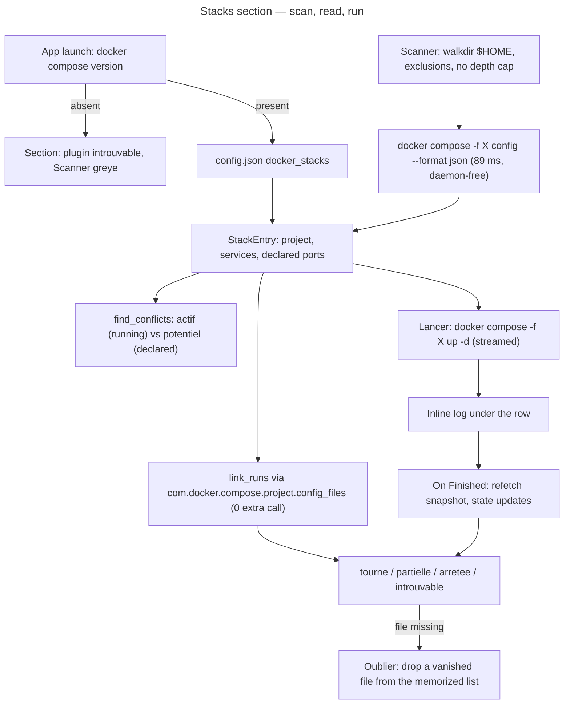

# Instruction: Compose stacks — discovery, ports, detached run

## Feature

- **Summary**: A new **Stacks** section on top of the Docker tab. A background scan walks `$HOME` (no depth cap, name-based exclusions, symlinks not followed) collecting `docker-compose.y{a,}ml` / `compose.y{a,}ml`; each file is then read with `docker compose -f <file> config --format json` — measured at 89 ms and working with the daemon down, which is why DevToolBox parses **no YAML itself**. The resulting list is memorized in `config.json` so a relaunch does not rescan. Each row shows the project name, its services, its declared published ports, and a state derived from the running containers' compose labels: **tourne** (≥1 running, none failing), **partielle** (≥1 running **and** ≥1 genuinely failing — `Exited` with a non-zero code, or `Restarting`), **arrêtée** (none running). `Exited (0)` is a normally-finished one-shot task and is never a failure — without that rule the `lab-db-init` / `mjson-db-init` init containers would pin healthy stacks to `partielle` forever. Actions: **Lancer** (`up -d`), **Arrêter** (`stop`), **Détruire** (`down`, never `-v`), streamed through the existing non-blocking pipeline into a log shown inline under the row.
- **Flag note**: `compose config --format json` is the correct and only JSON form for this subcommand — it is **not** the `--format json` shorthand banned for the listings in `docker.rs`, where `{{json .}}` is required for docker CLI ≥ 20.x compatibility. Different subcommand, different flag family; measured working here at 89 ms.
- **Stack**: adds `walkdir` (2.5) — the first crate added since the multi-OS transformation. Everything else reuses in-repo machinery: `run_command_with_timeout` from `docker.rs`, the `TerminalEvent` streaming pipeline from `terminal_view.rs`, the `ports.rs` model from Part 1.
- **Branch name**: `feature/docker-stacks-ports/part-2-compose-stacks`
- **Parent Plan**: `./2026_08_21-docker-compose-ports-cleanup-master.md`
- **Sequence**: `2 of 3`
- Confidence: 7/10 — the two external contracts are measured (`compose config --format json` shape and cost; `com.docker.compose.project.config_files` present on every composed container in `REAL_PS_FIXTURE`). The uncertainty is UI-shaped: inline-log placement inside a scrolled list, and scan wall-clock on a large `$HOME`.

## Architecture projection

### Files to create

- `src/linux/compose.rs` — `#![cfg(target_os = "linux")]` at module level, mirroring `linux/docker.rs`:
  - `pub fn plugin_available() -> bool` — `docker compose version` at launch. The v2/v5 **plugin** form only; the legacy `docker-compose` binary is out of scope. Absent ⇒ the Docker tab is untouched and the Stacks section renders `plugin « docker compose » introuvable` with **Scanner** greyed out.
  - `pub fn discover(root: &Path) -> ScanOutcome` — `walkdir::WalkDir::new(root).follow_links(false).filter_entry(keep)`, where `keep` is evaluated on **every** entry, files included — it must therefore return `true` for any non-directory, otherwise the walk yields nothing — and rejects directories by **name**: `node_modules`, `.git`, `target`, `.cache`, `.venv`, `vendor`, and trash dirs (`.local/share/Trash`, `.Trash`). No depth cap — a measured scan showed a depth-6 cap would have missed 3 of the 13 real compose files, which is why the brainstorm's depth hypothesis is annulled. `ScanOutcome { files: Vec<PathBuf>, visited_dirs: usize, elapsed_ms: u128, denied_dirs: usize, warning: Option<String> }` — declared in `ui/compose_view.rs` with `StackConfig` / `StackService`, since the façade there names it in its signature; the scan is **never silently truncated** — exceeding `SCAN_WARN_MS` (20 s) sets `warning` and the UI says so. Unreadable directories are counted, not fatal.
  - `pub fn read_config(file: &Path) -> Result<StackConfig, DockerError>` — `docker compose -f <file> config --format json`, working directory = the file's parent so a sibling `.env` resolves the way the CLI would (this is what makes in-process `.env` handling unnecessary, annulling the second brainstorm hypothesis). Runs through `docker::run_command_with_timeout`, which needs **three** changes, not just its own visibility: (a) the function becomes `pub(crate)`; (b) `enum OperationClass` becomes `pub(crate)` too — it is private to `linux/docker.rs` today (verified), so a sibling module cannot even name the argument; (c) a new `cwd: Option<&Path>` parameter is added (its current signature is `(program: &str, args: &[&str], timeout: Duration, class: OperationClass)` and it never sets a working directory). Its `args: &[&str]` stays as-is, so `read_config` borrows its argv (`&[&str]`) while the `up_args` / `stop_args` / `down_args` triple returns `Vec<String>` for the streaming path, which spawns through `launch_captured_program(&[String])` — two different consumers, no unification needed. Existing call sites pass `None`, so behaviour is unchanged. Dedicated `COMPOSE_TIMEOUT` of 15 s — well above the 89 ms measured, with headroom for `include:`-heavy stacks. Non-zero exit ⇒ `CommandFailed` carrying the stderr tail, rendered on the row itself (an invalid compose file must not break the whole list).
  - A private `ConfigWire` deserialization struct, converted before it leaves the module into the OS-neutral `StackConfig` / `StackService` **owned by `src/ui/compose_view.rs`** — exactly the direction `linux/docker.rs` already follows by importing `ContainerEntry` from `ui::docker_view`. Putting those two types in the Linux-only module would break the Windows build the moment `compose_view.rs` (which is OS-neutral and compiled everywhere) names them in `StackEntry`. `StackConfig { name: String, services: Vec<StackService> }`, `StackService { name: String, ports: Vec<PortBinding>, host_network: bool }` — filled from the config JSON's normalized `ports` objects (`target`; `published` — **a string in the measured output (`"3000"`), a number in other schema versions**; `protocol` defaulting to `tcp`; `host_ip` **absent in the measured output** and defaulting to the `0.0.0.0` wildcard). The whole `ports` key is **`null` for a service that publishes nothing** (measured: the `cert-provider` service), so it deserializes as `Option<Vec<_>>` with `#[serde(default)]`, never a bare `Vec<_>` — which fails on `null` and would blank an otherwise valid stack. `network_mode: host` sets `host_network`: no published ports exist to compare, so the row carries a "ports non comparables (network_mode: host)" warning instead of a false all-clear.
  - `pub fn up_args / stop_args / down_args(file: &Path, project: Option<&str>) -> Vec<String>` — `["compose", "-f", <file>, "up", "-d"]`, with `["-p", <project>]` inserted **before** the subcommand when the row targets a named run. Without it, `Arrêter` on a stack started under an explicit `-p` would address the default project name (the file's parent directory) and silently stop nothing: compose resolves a project by name, not by file. `Up` from a never-started row passes `None` and lets compose derive the default name; `Stop` / `Down` always carry the `project` of the `StackRun` whose row was clicked. `down` never gets `-v`: volumes are only ever deleted through the explicit volume flow (Part 3).
- `src/ui/compose_view.rs` — OS-neutral types, facade and rendering, testable without Docker. It owns **every** type the UI names, including `StackConfig` / `StackService`, and reaches the Linux producer only through the façade pattern this repo already uses in `docker_view.rs` — a `pub fn x()` delegating to an `x_impl()` duplicated under `#[cfg(target_os = "linux")]` and `#[cfg(not(target_os = "linux"))]`, the non-Linux arm returning a neutral value. `src/ui/` is compiled on Windows too, where `crate::linux` does not exist:
  - `StackEntry { file: String, project: String, services: Vec<StackService>, runs: Vec<StackRun>, state: StackState, error: Option<String> }` — **no `missing: bool`**: `StackState::Missing` already carries that fact, and two fields encoding the same thing are two fields that can disagree; `StackRun { project: String, running: usize, failing: usize, total: usize }`; `StackState { Running, Partial, Stopped, Missing, Unknown }` — `Unknown` is produced when the daemon is unreachable: the compose files still list and their declared ports still show (`config` needs no daemon), but no run state can be asserted, and rendering `arrêtée` there would be a lie.
  - `pub fn link_runs(stacks: &[StackEntry], containers: &[ContainerEntry]) -> Vec<StackEntry>` — pure, returns a **new** list rather than mutating in place, because one file running under several `-p` names produces more rows than it received. The stack↔container link reads `com.docker.compose.project.config_files` and `com.docker.compose.project` from the **grouped `docker inspect` already run by Part 1** (`.Config.Labels`), not from `docker ps`'s flat `Labels` string: that string joins labels with `,` while `config_files` is itself a `,`-separated list, so a multi-file project (`-f a.yml -f b.yml`) is genuinely ambiguous there. Extending Part 1's existing template costs **zero** extra docker calls and removes the hazard instead of heuristically working around it. The same file running under several `-p` names yields **one row per running project**. A container with no compose label never appears in Stacks.
  - `pub fn classify(run: &StackRun) -> StackState` — the tourne/partielle/arrêtée rule above, `Exited (0)` explicitly non-failing.
  - `pub fn declared_owners(stacks: &[StackEntry]) -> Vec<PortOwner>` — feeds Part 1's `find_conflicts` with `OwnerKind::DeclaredStack`, so a stopped stack whose port is already taken is flagged **before** it is started (`conflit potentiel`, versus the `conflit actif` between two running containers).
  - Façades mirroring `docker_view::available` / `docker_view::fetch`, one per Linux entry point: `pub fn plugin_available() -> bool` (non-Linux: `false`), `pub fn discover(root: &Path) -> ScanOutcome` (non-Linux: an empty outcome), `pub fn read_config(file: &Path) -> Result<StackConfig, String>` (non-Linux: `Err`). `egui_app` calls **these**, never `crate::linux::compose::…` directly, and the error type is flattened to `String` at the boundary exactly as `docker_view::fetch` already does with `DockerError`.
  - `pub enum StackAction { Scan, Up(StackTarget), Stop(StackTarget), Down(StackTarget), Forget(String) }` with `StackTarget { file: String, project: Option<String> }` — the action carries the project name of the row it came from, which is what makes a per-run `Arrêter` address the right instance; `Forget` needs the file alone. and `pub fn render(ui, state: &ComposeViewState<'_>) -> Vec<StackAction>` — same "data in, actions out" contract as `docker_view::render`. `ComposeViewState { stacks: &[StackEntry], conflicts: &[PortConflict], plugin_available: bool, scanning: bool, busy: bool, log: &[String], log_target: Option<&str>, scan_warning: Option<&str> }`: everything borrowed, nothing owned, so the module stays testable without an app instance.

### Files to modify

- `Cargo.toml` — `walkdir = "2.5"`.
- `src/linux/mod.rs` — declare `pub mod compose;`.
- `src/ui/mod.rs` — declare `pub mod compose_view;`, matching the existing declarations. Private is impossible for the same reason as `ports` in Part 1: `linux/compose.rs` names `StackConfig` / `StackService` / `ScanOutcome` from this module.
- `src/linux/docker.rs` — `run_command_with_timeout` and `enum OperationClass` both become `pub(crate)`, and the function gains a `cwd: Option<&Path>` parameter (existing call sites pass `None`); `inspect_containers`' template (Part 1) gains `,"labels":{{json .Config.Labels}}` and `ContainerFacts` gains the matching `labels: HashMap<String, String>` field. No `{{if}}` guard is needed: measured on this machine, `{{json .Config.Labels}}` emits `null` for a label-less container, which `#[serde(default)]` turns into an empty map — Go's `<no value>` never appears, and label values containing commas or paths stay escaped by docker itself.
- `src/ui/docker_view.rs` — `ContainerEntry` gains `pub compose_project: Option<String>` and `pub compose_files: Vec<String>` (filled from the grouped inspect's `.Config.Labels`, **not** from `docker ps`'s flat `Labels` string), plus `pub exit_code: Option<i32>` parsed from the `Status` free text (`Exited (0) 3 hours ago`), which is what makes the `Exited (0)`-is-not-a-failure rule computable.
- `src/ui/terminal_view.rs` — new `pub fn launch_captured_program(program: &str, args: &[String], working_dir: Option<&Path>, sender: Sender<TerminalEvent>) -> Result<u32, String>` carrying the existing body (pipes, two reader threads, join-before-`Finished`); `launch_captured` becomes a thin wrapper that resolves the action string and delegates. Compose must pass an **argv**, never a command string: compose paths contain spaces and would be re-tokenized wrongly.
- `src/ui/egui_app.rs`
  - New state: `compose_rx/compose_tx`, `compose_running: bool`, `compose_log: Vec<String>`, `compose_log_target: Option<String>`, `scan_rx/scan_running`, `stacks: Vec<StackEntry>`, `compose_plugin: bool` (probed once at launch, alongside `docker_available`).
  - `drain_compose_events()` appends `Output` lines to `compose_log` (capped with the same `MAX_LINES`/`TRIMMED_LINES` trimming as the terminal view) and, on `Finished`/`Failed`, clears `compose_running` and triggers a docker snapshot refetch so the row's state updates by itself. The compose slot is **separate** from both `terminal_rx` and `action_rx`, for the same reason `action_rx` was separated: a stack launch must never interfere with a command running in the Terminal view.
  - `drain_scan_events()` replaces `self.stacks` and persists the memorized file list; **`Forget` persists too** — dropping a vanished file from `self.stacks` without writing `config.json` would resurrect the dead row on the next launch.
  - The Stacks section is rendered above the existing three sections, with a **Scanner** button, a per-row action set, the inline log under the row it belongs to, and a "fichier introuvable" state carrying an **Oublier** button when a memorized file has disappeared from disk.
  - One in-flight compose command at a time (`compose_running` guards every action button), so the inline log always has exactly one owner.
  - A potential port conflict **never disables Lancer**: the row shows the warning and names the colliding owner, the user decides. Blocking would be wrong — the conflicting container may be exactly what they intend to replace — and `up -d` fails loudly and harmlessly anyway when the port really is taken.
- `src/storage/models.rs` — `Config` gains `#[serde(default, skip_serializing_if = "Vec::is_empty")] pub docker_stacks: Vec<String>` (memorized compose-file paths). `skip_serializing_if` keeps an unused config byte-identical to today's. Every `Config` struct literal must then gain the field or the crate stops compiling — `Config` derives neither `Default` nor `#[non_exhaustive]`: `egui_app::fallback_config()` plus the literals in the `storage` and `egui_app` test modules (the same chore Part 1 does for `Settings`). Cheap, but a compile error, not a warning.
- `config/default.json` — unchanged on purpose: the key is absent by default and only appears once the user scans. The round-trip test asserts that absence.
- `aidd_docs/memory/architecture.md`, `aidd_docs/memory/codebase-map.md`, `aidd_docs/memory/database.md` — new modules, new dependency, new persisted key.

### Files to delete

- None.

## Applicable rules

| Tool | Name | Path | Why it applies |
| ---- | ---- | ---- | --------------- |
| none | none | none | `list-rules.mjs` returns `[]` — no installed AI-tool rules apply to this project. |

## User Journey

## Risk register

| Risk | Impact | Mitigation |
| ---- | ------ | ---------- |
| A home-wide walk is slow or hits an unreadable/looping tree | UI appears hung, or the scan never ends | scan runs on a background thread with its own channel; symlinks not followed (`follow_links(false)`); name-based exclusions; over `SCAN_WARN_MS` the outcome carries a warning **instead of** truncating silently |
| `docker compose up -d` blocks past the 30 s action timeout (image pull, build) | frozen UI, or a killed half-started stack | not routed through the timeout-bounded docker path at all — streamed through `launch_captured_program`, no cap, output visible live |
| `published` is a string in some compose schema versions, a number in others | serde fails, the row shows an error for a valid file | deserialize into an untagged string-or-number helper, tested on both shapes; a service that still fails to parse degrades that service only, not the stack |
| `network_mode: host` services have no published ports | silent "no conflict" on a stack that in fact takes every port | `host_network` flag with an explicit "ports non comparables" warning on the row |
| One compose file run under several `-p` project names | ambiguous state, wrong Arrêter target | one row per running project (`StackRun` per project), each with its own actions, and every action's argv carries that row's `-p <project>` so it addresses the instance the user clicked |
| Memorized path list grows stale (project moved/deleted) | dead rows | `StackState::Missing` + "fichier introuvable" + **Oublier**; a rescan reconciles the list |
| A project run with several `-f` files puts a `,` inside the `config_files` label value | wrong or missing stack↔container link | label read from `.Config.Labels` via the grouped inspect (structured), never from `ps`'s flat `Labels` string |
| A data type defined in the `#![cfg(target_os = "linux")]` module and named from `src/ui/`, or a Linux path called from `egui_app` without a `cfg` arm | the Windows build breaks — and nothing on this machine catches it, since only Linux is built here | `StackConfig` / `StackService` live in `ui/compose_view.rs` and `linux/compose.rs` only converts its private `ConfigWire` into them; every crossing goes through the `x()` / `x_impl()` + `#[cfg(not(target_os = "linux"))]` fallback pair already used by `docker_view::available` / `fetch`, which is the reviewable invariant for this part |
| `walkdir` unavailable (offline/vendored) | build fails | fallback documented in the master risk register: a ~40-line `std::fs` walk implementing the same `keep` predicate |
| Inline log grows unbounded during a long `up -d` | memory and frame time | same trimming constants as `terminal_view` (`MAX_LINES` 5 000 → `TRIMMED_LINES` 3 500) |

## Validation

- `cargo fmt --check && cargo clippy -- -D warnings && cargo test` green.
- New tests: `keep` predicate (excluded names, hidden dirs, symlink entries, and a plain file returning `true`); compose-config deserialization on the real captured payload of the `proxy` stack (string `published`, absent `host_ip`, `ports: null` on `cert-provider`) plus a synthetic numeric `published` and a `network_mode: host` service; `link_runs` on the real `ps -a` fixture (labelled container matched to its file, unlabelled container ignored, same file under two projects yielding two runs); `classify` covering tourne / partielle / arrêtée and the `Exited (0)` one-shot; `exit_code` parsing from `Status` strings (`Up 4 hours`, `Exited (0) 3 hours ago`, `Exited (137) 2 days ago`, `Restarting (1) 5 seconds ago`); `declared_owners` + `find_conflicts` producing `conflit potentiel` for a stopped stack colliding with a running container; argv builders asserting `down` never carries `-v`, and that `-p <project>` sits before the subcommand when a project is given and is absent when it is `None`.
- Checkpoint 2 (manual, this machine): the scan finds the 13 known compose files; a stack starts detached with the log streaming and the window still responsive; the state settles on `tourne` and the `lab` stack with its `Exited (0)` init container does **not** read `partielle`.

## Amendments (🤖 2026-08-21, implementation)

Deviations from the projection above, each with the measurement or the
constraint that forced it:

1. **`run_command_with_timeout` gained no `cwd` parameter.** Measured on this
   machine: `docker compose -f <absolute path> config --format json` run with
   the process' cwd at `/` still resolves the compose file's sibling `.env`
   (a `${HOSTPORT}` in a temp stack expanded to its `.env` value). Compose
   derives the project directory from the file's own location, so the planned
   three-part change to `run_command_with_timeout` shrank to two: `pub(crate)`
   on the function and on `OperationClass`. `up -d` / `stop` / `down` still
   run with the file's parent as working directory — they resolve relative
   build contexts, which `config` does not.
2. **`docker compose down` is confirmed by a modal** (`PendingAction::ComposeDown`).
   The plan specified no dialog for it. Added for consistency with the
   `docker rm` / `docker rmi` confirmations already in the tab — `down` is the
   only compose action that destroys something. `up -d` and `stop` stay
   unconfirmed.
3. **`read_config` is classified `OperationClass::Action`, not `Listing`,**
   even though it is a read: `config` never touches the daemon, so a timeout
   there says nothing about the daemon's health and must not be reported as
   `DaemonUnreachable`. Its own `COMPOSE_TIMEOUT` is 15 s.
4. **`exit_code` is parsed from the listing's status text, not from the
   inspect's `.State.ExitCode`.** The listing is what built the row, so a
   status is always present; the inspect pass is explicitly allowed to come
   back empty on a race (Part 1's contract), which would blank the field and
   silently turn a crash-looping stack into a healthy one.
5. **`link_runs` appends a `Missing` row for a running project whose
   `config_files` path was never scanned** — the real `suddenly` case on this
   machine. Without it a stack that is genuinely up would simply not appear.
6. **`DockerViewState` gained `extra_port_owners: &'a [PortOwner]`** so the
   container/image/volume sections badge a collision with a *declared* stack
   port too, instead of each section computing its own half of the conflict
   set.
7. **Scan and compose commands are gated on the existing
   `docker_actions_enabled` seam**, with a `compose_invocations` counter —
   the same pattern Part 1 uses for `docker_action_invocations`, so a kittest
   asserts the wiring without ever spawning a process.

8. **A real-machine `#[ignore]`d scan test** was added
   (`linux::compose::tests::real_home_scan_reports_its_files_and_wall_clock`),
   mirroring the `autostart.rs` manual-test convention, so the Checkpoint 2
   numbers can be read without the GUI. Measured on this machine:
   **13 files, 46 886 directories visited, 0 denied, 714 ms**, and all 13
   `config` reads succeed — the exact count the plan predicted.

Validation: `cargo fmt --check`, `cargo clippy --all-targets -- -D warnings`
and `cargo test` all green — 522 tests, 46 of them new for this part.
The GUI half of Checkpoint 2 (a stack starting detached with the log
streaming, the window staying responsive, and the `lab` stack with its
`Exited (0)` init container not reading `partielle`) is still the user's to
do.
