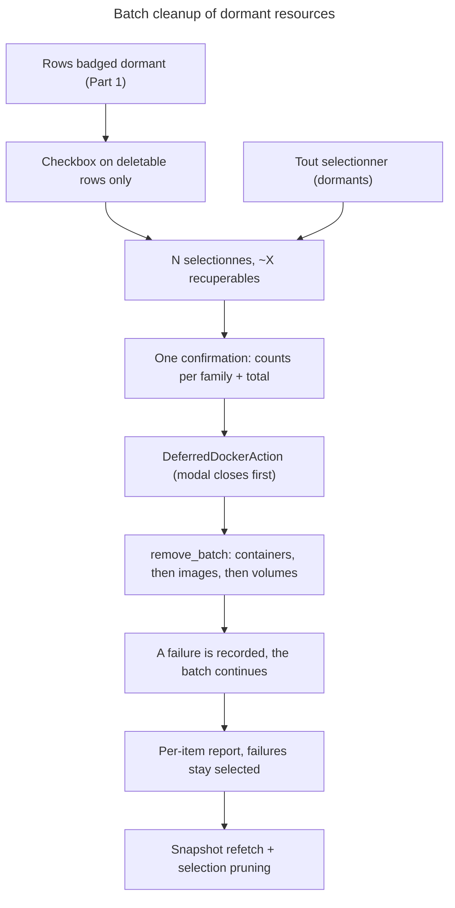

# Instruction: Grouped deletion of dormant resources

## Feature

- **Summary**: The reason the user wants dormancy in the first place — reclaiming disk from finished or sleeping projects. Every row that is **already individually deletable** (a stopped container, an unused image, an orphan volume) gets a checkbox; rows that are not deletable keep their greyed button and get no checkbox, so the existing safety rules survive untouched (never `--force`, an image in use is deleted only after its containers). A summary bar shows the count and the reclaimable total; one confirmation dialog states exactly what will be destroyed; execution then runs **containers → images → volumes**, which is the only order in which the dependencies resolve themselves. A failure on one item is recorded and the batch continues; a final report lists each success and each failure with its docker error.
- **Stack**: unchanged — no new dependency. Reuses the existing confirmation modal and the `DeferredDockerAction` one-frame deferral so the dialog closes before the blocking docker calls start.
- **Branch name**: `feature/docker-stacks-ports/part-3-batch-cleanup`
- **Parent Plan**: `./2026_08_21-docker-compose-ports-cleanup-master.md`
- **Sequence**: `3 of 3`
- Confidence: 8/10 — every primitive already exists (`remove_container`, `remove_image`, `remove_volume`, the confirm modal, the deferred runner). The work is selection state, ordering, and honest reporting. The one genuine unknown is size arithmetic on docker's human-readable strings, isolated in a pure tested function.

## Architecture projection

### Files to create

- None — this part is deliberately additive to modules Part 1 already touched.

### Files to modify

- `src/ui/docker_view.rs`
  - `pub fn parse_human_size(text: &str) -> Option<u64>` / `pub fn format_human_size(bytes: u64) -> String` — docker prints **SI** units (`kB` = 1000, not 1024): `767kB`, `192MB`, `0B`, `N/A`, and the container form `767kB (virtual 148MB)` where only the part before ` (` is what `docker rm` actually frees (the existing `extract_rw_size` already isolates it). `None` on anything unparsable, and a batch total containing at least one `None` is displayed as `≥ X` rather than a number that silently under-reports.
  - `DockerViewState` gains `pub selection: &'a HashSet<SelectionKey>` (borrowed, so the view stays pure and the app owns the state) where `SelectionKey { kind: ResourceKind, id: String }`. `ResourceKind { Container, Image, Volume }` lives in `docker_view.rs` alongside the existing `ContainerState`, and stays there — nothing in `src/linux/` needs to name it; `render()` emits `DockerAction::ToggleSelection(SelectionKey)` and draws a checkbox on rows satisfying the existing per-row deletability rule (`ContainerState::is_removable()`, `!ImageEntry.used`, `VolumeEntry.orphan`) — **plus** one selection-aware case: an image whose every dependent container is itself already selected becomes selectable, because the ordered batch deletes those containers first and the image is genuinely free by the time its turn comes. Without that rule the headline use case (« projet fini : conteneur + image en un lot ») is impossible — the image is `used` in the pre-batch snapshot and stays uncheckable until a manual delete-then-refresh cycle. This costs no new docker call and no new field either: `ImageEntry.used_by: Vec<String>` is already exposed by Part 1. Deselecting a container immediately unchecks any image that depended on it, so the invariant « no checkbox without a legal deletion » holds at every instant. Volumes get **no** equivalent rule: `orphan` comes from `dangling=true`, which says nothing about *which* container holds a non-orphan volume, so a volume freed by this batch is deletable only after the refresh — stated on the row rather than guessed.
  - A selection bar above the sections: `N sélectionné(s) · ≈ X récupérables`, a **Tout sélectionner (dormants)** shortcut restricted to rows currently badged dormant, an **Effacer la sélection** button, and a **Supprimer la sélection** button emitting `DockerAction::DeleteSelection(Vec<SelectionKey>)` (destructive, therefore routed to the confirmation path).
  - A report block rendered under the bar when a batch has just run: one line per item, `✓` or `✗` with the docker error text. It is cleared on the next selection change or the next manual refresh — never silently on a timer, so a failure stays readable until the user acts on it.
  - `BatchTarget { key: SelectionKey, label: String }` — reusing `SelectionKey` rather than re-declaring `kind` + `id`, so a target and the selection it came from cannot drift apart — and `BatchOutcome { label: String, result: Result<(), String> }` live **here**, not in `linux/docker.rs`: `egui_app.rs` holds a `Vec<BatchOutcome>` on the app and is compiled on Windows too, so the outcome type cannot name `DockerError`. The error is flattened to `String` at the boundary, exactly as `docker_view::remove_container` already does.
  - Two pure helpers, so ordering and continue-on-failure are testable on any OS without a daemon — a single monolithic `remove_batch` has no injection point and those two central guarantees could then only be checked by hand:
    - `pub fn order_targets(targets: &[BatchTarget]) -> Vec<BatchTarget>` — sorts into containers → images → volumes with a **stable** sort, so the user's order survives inside each family.
    - `pub fn remove_batch_with<F>(targets: &[BatchTarget], remove: F) -> Vec<BatchOutcome> where F: FnMut(&BatchTarget) -> Result<(), String>` — orders, then calls `remove` once per item, **never** stops on error, returns one outcome per input in execution order. Tests pass a closure that records its calls and fails on a chosen item; no docker involved.
    - `pub fn remove_batch(targets: &[BatchTarget]) -> Vec<BatchOutcome>` — the façade, delegating to a `remove_batch_impl` split by `#[cfg(target_os = "linux")]` like `fetch`/`available` above it; the Linux arm calls `remove_batch_with` with a closure dispatching on `target.key.kind` to the existing `remove_container` / `remove_image` / `remove_volume` façades, the non-Linux arm returns one `Err` per target. Each item keeps the existing 30 s `OperationClass::Action` timeout, so one hung deletion cannot stall the whole batch.
  - Deliberately **not** implemented with `docker rm a b c`: per-item calls are what make per-item reporting and continue-on-failure possible, and the count here is small (tens, not thousands).
- `src/linux/docker.rs` — unchanged by this part. The deletion primitives it already exposes are enough; the batch lives entirely in the OS-neutral module, which is what keeps its guarantees unit-testable.
- `src/ui/egui_app.rs`
  - `docker_selection: HashSet<SelectionKey>` and `docker_batch_report: Vec<BatchOutcome>` on the app.
  - `DeleteSelection` opens the existing confirmation modal with a body stating the counts per family and the reclaimable total, then goes through `DeferredDockerAction` exactly like the current single deletions — the modal closes on frame N, the blocking calls run on frame N+1.
  - After the batch: the report is stored, the selection is cleared **of the items that succeeded only** (a failed item stays selected so a retry is one click), and the snapshot is refetched.
  - Selection is pruned on every refetch: an id that no longer exists in the new snapshot is dropped, so a stale selection can never target a resource that vanished.
- `aidd_docs/memory/architecture.md` — document the batch path and its ordering guarantee.

### Files to delete

- None.

## Applicable rules

| Tool | Name | Path | Why it applies |
| ---- | ---- | ---- | --------------- |
| none | none | none | `list-rules.mjs` returns `[]` — no installed AI-tool rules apply to this project. |

## User Journey

## Risk register

| Risk | Impact | Mitigation |
| ---- | ------ | ---------- |
| A batch deletes something still in use | data loss | checkboxes appear **only** on rows the existing single-delete rules already allow; no `--force` anywhere; the deletion functions themselves are unchanged |
| An image is deleted before the container that depends on it | avoidable failure, confusing report | `order_targets` imposes containers → images → volumes regardless of input order, asserted by a unit test on a shuffled input; it is a pure function in the OS-neutral module, so the test needs no daemon |
| One failure aborts the batch | partial cleanup with no explanation | per-item `Result`, never `?`; a `remove_batch_with` test whose injected closure fails on a middle item asserts the remaining items still ran |
| `BatchOutcome` carrying a Linux-only `DockerError` into `egui_app` | the Windows build breaks, invisibly from this machine | the batch types live in `docker_view.rs` and carry `Result<(), String>`; the crossing goes through the same `x()` / `x_impl()` + non-Linux fallback pattern as `fetch` |
| Human-size arithmetic wrong (kB read as 1024, `N/A` read as 0) | the dialog lies about reclaimed space before a destructive action | pure `parse_human_size` with SI semantics, tested on the real strings in the existing fixtures; unparsable entries force a `≥` prefix instead of a false exact total |
| An image is selected because its containers were, then a container is deselected | the batch attempts an illegal `rmi` and fails | the selectable set is recomputed on every selection change; deselecting a container drops any image that depended on it, asserted by a dedicated test |
| Stale selection after a refresh | a click targets a resource that no longer exists | selection pruned against every new snapshot; a vanished id simply disappears from the bar |
| The confirmation dialog understates what `docker rm` frees for a container | user expects more space than they get | the container figure is the writable-layer size only (`extract_rw_size`), and the dialog labels it as such — image layers are freed by the image row, not the container row |

## Validation

- `cargo fmt --check && cargo clippy -- -D warnings && cargo test` green.
- New tests: `parse_human_size` on `767kB`, `192MB`, `1.5GB`, `0B`, `N/A`, `""`, `767kB (virtual 148MB)`; `format_human_size` round-trip and rounding; batch total with one unparsable entry producing the `≥` form; `order_targets` on a shuffled input (and stability inside a family); `remove_batch_with` continue-on-failure with an injected closure failing on a middle item, asserting the recorded call order and one outcome per input; the selection-aware image rule (image selectable once all its `used_by` containers are selected, unselected again when one of them is dropped); selection pruning against a snapshot that lost an id; the invariant that no checkbox is emitted for a running container, a used image, or a non-orphan volume.
- Final checkpoint (manual, this machine): select a dormant container, its image and an orphan volume, confirm once, and read a report where a deliberately re-attached volume fails while the rest succeed.
