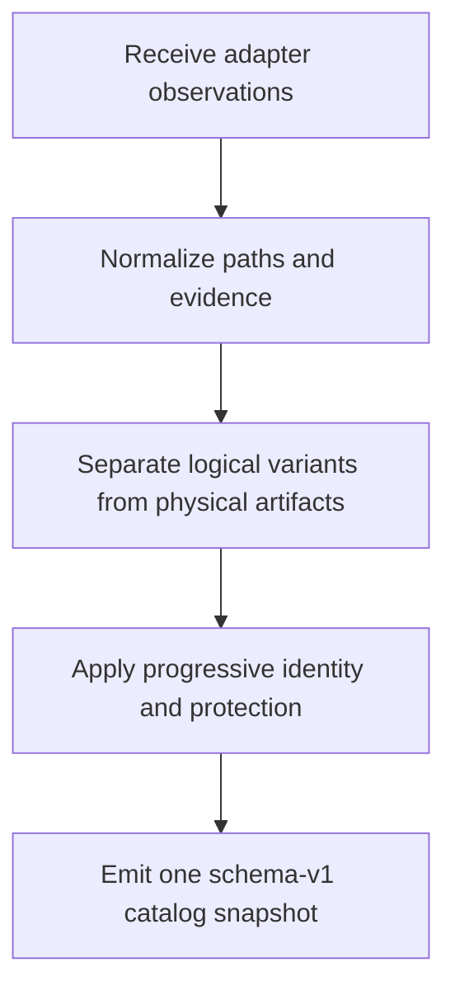
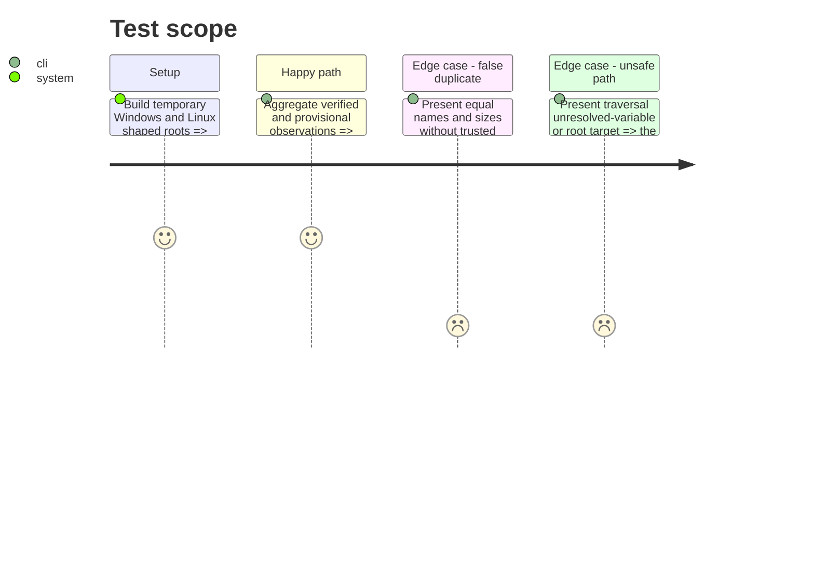

# Instruction: Establish catalog contracts and path safety

## Architecture projection

> Tree of the final files. ✅ create · ✏️ modify · ❌ delete

```txt
scripts/model_orchestrator/
├── __init__.py                     ✅ schema version and exports
├── __main__.py                     ✅ schema and fixture CLI
├── models.py                       ✅ artifacts references capabilities evidence and errors
├── catalog.py                      ✅ aggregation identity duplication and protection rules
├── paths.py                        ✅ bounded Windows/Linux path primitives
└── tests/                          ✅ model identity path and serialization coverage
aidd_docs/memory/codebase-map.md    ✏️ record the new package ownership
```

Deleted files: none.

## User Journey



## Test Scope



## Tasks to do

### `1)` Define schema-v1 catalog records

> Give every later adapter and UI one stable vocabulary.

1. Define `ToolInstallation`, `Artifact`, `ArtifactIdentity`, `ToolReference`, `Protection`, `AdapterCapabilities`, `SourceError`, and `CatalogSnapshot`.
2. Record absolute path, family, format, optional revision/quantization/category, logical and allocated sizes, ownership, reference state, and evidence confidence.
3. Distinguish logical variant, physical file, shared allocation, copy, hard link, symbolic link, owner blob, and unknown relationship.
4. Accept verified identity only from local SHA-256, Ollama layer SHA-256, Hugging Face LFS/Xet SHA-256 at an immutable commit, or a user checksum matched during transfer.
5. Keep provisional artifacts usable but ineligible for exact deduplication or retirement.
6. Protect loaded, referenced, workflow-used, explicitly kept, incompletely migrated, and weakly identified artifacts; only a later immutable retirement plan may designate one exact owner reference as the target rather than a blocker, while every other reference remains protective.

### `2)` Build bounded cross-platform path primitives

> Prevent every later operation from guessing or escaping an owned root.

1. Implement Windows and Linux default roots with injectable environment lookup and explicit custom-root evidence.
2. Normalize absolute paths while preserving spaces and non-ASCII names; never expand an unresolved variable.
3. Detect same-file, same-filesystem, hard-link, symbolic-link, reparse-point, and allocated-size evidence without following links outside declared roots.
4. Add exact-target guards for staging and owned paths; reject filesystem roots, profile roots, traversal, and ambiguous ownership.

### `3)` Freeze serialization and failure semantics

> Make partial results useful and schema drift observable.

1. Emit stable English codes with French user messages and redact credentials or URL queries.
2. Preserve successful observations when another source fails and attach one typed `SourceError` per failed source.
3. Produce deterministic schema fixtures for later Rust contract tests.
4. Document the package boundary and leave `winclean` unchanged.

## Test acceptance criteria

| Task | Acceptance criteria |
| ---- | ------------------- |
| 1 | Logical identity, physical allocation, reference, protection, and confidence are separately observable and weak evidence never becomes an exact duplicate. |
| 2 | Path helpers support Windows/Linux custom roots and refuse root, escape, unresolved, and unsafe-link targets. |
| 3 | Schema-v1 output is deterministic, partial-tolerant, redacted, and independent from `winclean`. |
