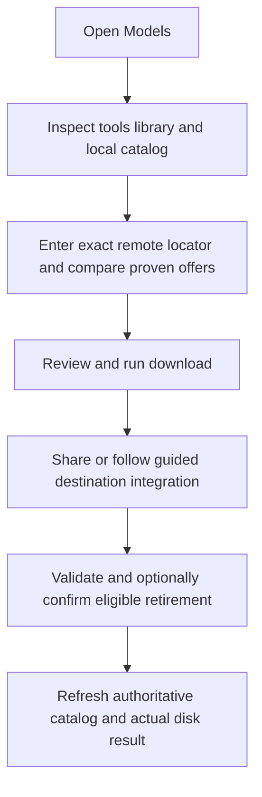
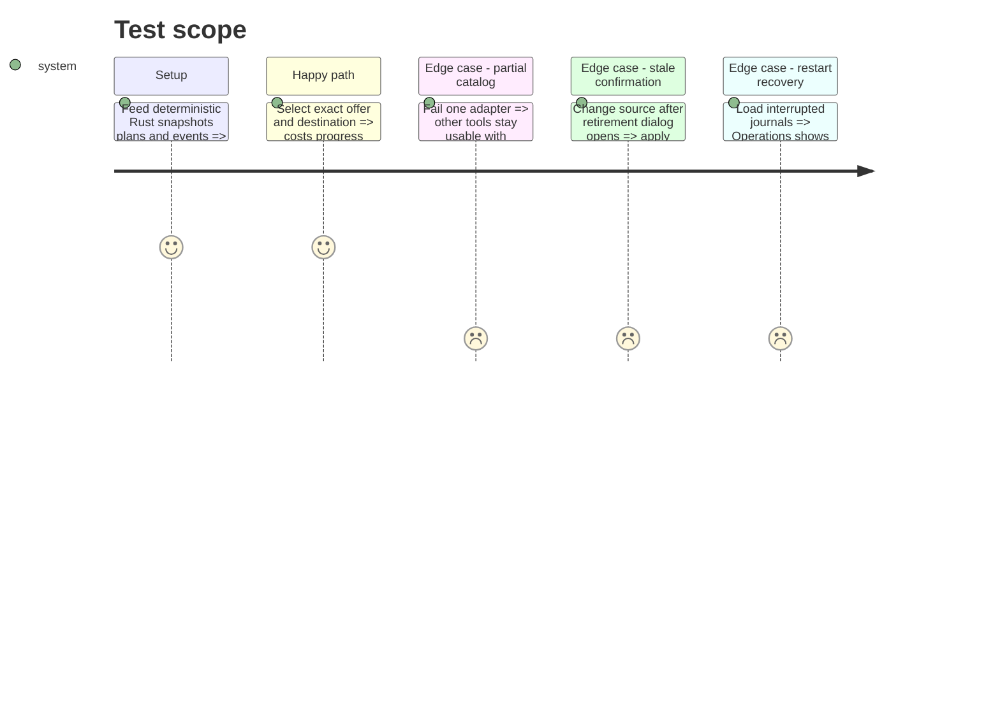

# Instruction: Deliver the native Models view and delivery gates

## Architecture projection

> Tree of the final files. ✅ create · ✏️ modify · ❌ delete

```txt
src/ui/
├── models_view.rs                  ✅ pure view state rendering and intents
├── egui_app.rs                     ✏️ Models tab state jobs events and dialogs
└── mod.rs                          ✏️ export Models view
scripts/model_orchestrator/README.md ✅ operational documentation
aidd_docs/memory/
├── architecture.md                ✏️ record implemented boundary and safety contract
├── codebase-map.md                ✏️ update module map
└── testing.md                     ✏️ add Python Rust UI and Windows gates
```

Deleted files: none.

## User Journey



## Test Scope



## Wireframe

```txt
┌────────────────────────────────────────────────────────────────────────────┐
│ (1) Application navigation · Models                                       │
├────────────────────────────────────────────────────────────────────────────┤
│ (2) Tool status · neutral library · refresh                               │
├────────────────────────────────────────────────────────────────────────────┤
│ (3) Catalog │ Download │ Operations │ Settings                            │
├────────────────────────┬───────────────────────────────────────────────────┤
│ (4) Locator and filters│ (5) Primary list or operation workspace          │
│ family · tool · format │ artifact · provider · disk · time · state        │
│ variant · protection   │                                                   │
├────────────────────────┴───────────────────────────────────────────────────┤
│ (6) Evidence · references · reviewed plan · validation · explicit action  │
└────────────────────────────────────────────────────────────────────────────┘
```

1. Application navigation: makes Models reachable even without installed providers.
2. Status: exposes integrations and active neutral library.
3. Sections: separates inventory, acquisition, recovery, and settings.
4. Locator and filters: accepts exact remote identifiers and filters the local catalog.
5. Workspace: carries comparable offers, catalog rows, or operation progress.
6. Details: keeps evidence, consequences, validation, and next action together.

## Tasks to do

### `1)` Render one pure Models view

> Keep provider and filesystem decisions outside egui.

1. Add a permanent Models tab with Catalog, Download, Operations, and Settings subviews driven by immutable state and intent enums.
2. Catalog filters family, tool, format, variant, protection, and duplication and separates logical from allocated size.
3. Download accepts exact primary/alternative locators and shows only proven same-byte offers, recommendation confidence, disk costs, time range, disabled conversion, and destination method.
4. Operations shows progress, validation strength, terminal summaries, and supported recovery; Settings configures library, provider order/enablement, Xet mode, and keep protection without credentials.

### `2)` Gate consequential actions

> Apply only the exact plan the user reviewed.

1. Require review before download/migration and preserve its digest through execution.
2. Use blocking dialogs for stranded-library changes, discard/rollback, and retirement.
3. Retirement names model, owner, exact source, remaining references, allocation semantics, estimated gain, and stale-token behavior.
4. Disable insufficient identity, space, capability, validation, or recovery actions with an adjacent reason.
5. Refresh the authoritative catalog after every terminal operation; never synthesize success from progress.

### `3)` Close tests and documentation

> Make the supported boundary reproducible on both target systems.

1. Add egui tests for empty, partial, filtered, recommended, overridden, busy, interrupted, guided, validated, protected, and stale states.
2. Run Python suites, cross-language fixtures, `cargo fmt --check`, `cargo check`, `cargo clippy -- -D warnings`, `cargo test`, and release build.
3. Add a Windows delivery gate for `%LOCALAPPDATA%`, custom volumes, reparse points, native CLIs, Jan/LM settings, hidden-console UTF-8, and cancellation; keep Linux fixtures executable locally/CI.
4. Document prerequisites, exact locators, supported formats/categories, library layout, ranking, recovery, validation, guided Jan flow, and all non-implicit conversion/install/delete rules.
5. Update project memory only with implemented durable facts.

## Test acceptance criteria

| Task | Acceptance criteria |
| ---- | ------------------- |
| 1 | Developers can inventory, compare, download, migrate or follow guided integration, recover, and configure LLM/image artifacts from one responsive view. |
| 2 | Every mutation uses a reviewed plan and uncertain, changed, provisional, protected, or stale state prevents destructive completion. |
| 3 | Python, Rust, UI, release, Linux, and explicit Windows gates cover the documented end-to-end contract. |
