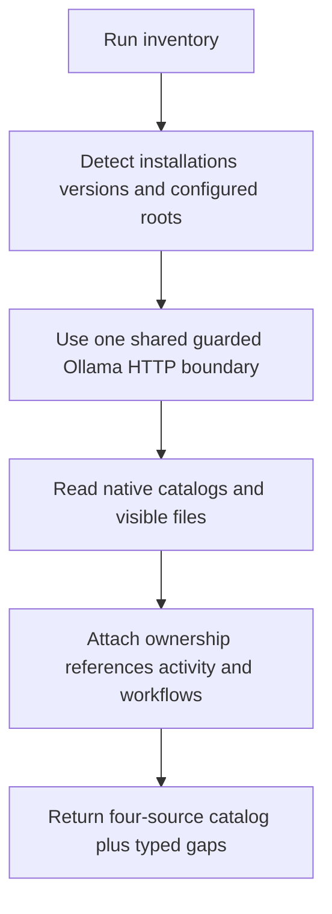
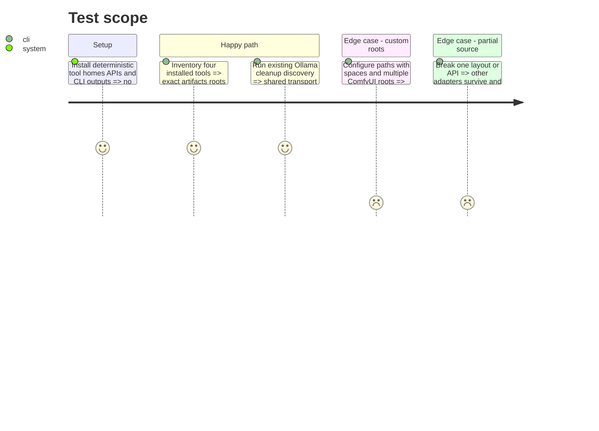

# Instruction: Inventory Ollama, Jan, LM Studio, and ComfyUI

## Architecture projection

> Tree of the final files. ✅ create · ✏️ modify · ❌ delete

```txt
scripts/local_ai/
├── __init__.py                     ✅ shared local-AI primitives package
├── ollama_http.py                  ✅ caller-neutral loopback endpoint and JSON transport
└── tests/
    └── test_ollama_http.py         ✅ endpoint proxy redirect timeout HTTP and JSON coverage
scripts/model_orchestrator/
├── adapters/
│   ├── __init__.py                 ✅ adapter protocol and registry
│   ├── ollama.py                   ✅ API and guarded manifest observations
│   ├── jan.py                      ✅ settings CLI and data-folder observations
│   ├── lm_studio.py                ✅ CLI and configured-root observations
│   └── comfyui.py                  ✅ model roots categories API and workflow observations
├── catalog.py                      ✏️ aggregate four adapters
├── __main__.py                     ✏️ inventory command
└── tests/                          ✏️ fake tool homes APIs CLIs and workflows
scripts/winclean/
├── mod_ollama.py                   ✏️ consume shared transport and retain cleanup translation
└── tests/
    └── test_mod_ollama.py          ✏️ retain domain behavior after transport tests move
```

Deleted files: none.

## User Journey



## Test Scope



## Tasks to do

### `1)` Extract the shared Ollama HTTP boundary

> Introduce the second Ollama caller without copying transport or coupling inventory to cleanup types.

1. Create `scripts/local_ai/ollama_http.py` with caller-neutral endpoint normalization, proxy-free opener, redirect rejection, bounded JSON requests, and stable technical exception codes.
2. Keep the shared module free of catalog, cleanup, candidate, protection, and user-message types; timeout and error translation remain caller parameters or caller responsibilities.
3. Move endpoint, proxy, redirect, HTTP, transport, and malformed-JSON tests to the shared package.
4. Migrate `winclean.mod_ollama` in the same phase, translating shared failures back to its existing `ModuleDiscoveryError` codes and French messages without changing CLI or deletion behavior.
5. Make the new model-orchestrator Ollama adapter depend on this primitive rather than on private `winclean` functions.

### `2)` Detect installations and roots

> Prefer documented settings and native commands over hardcoded guesses.

1. Detect executables, versions, settings, environment overrides, loopback APIs, and documented Windows/Linux defaults.
2. Record source and confidence for every root; an unknown version/layout degrades to catalog-only.
3. Bound traversal to configured model roots and skip inaccessible entries with typed errors.

### `3)` Translate four native inventories

> Preserve tool ownership while producing shared artifact observations.

1. Ollama: use `/api/tags` and `/api/ps`, locate `OLLAMA_MODELS`, and map recognized manifests to blobs read-only.
2. Jan: prefer CLI/settings, tolerate both documented Linux data-path generations, and distinguish linked from duplicated GGUF imports.
3. LM Studio: prefer `lms ls --json`, supplement with the configured model root only when required, and separate loaded state.
4. ComfyUI: combine model roots, `extra_model_paths.yaml`, live `/models` categories, and saved workflow references for checkpoints, diffusion models, VAE, LoRA, ControlNet, text encoders, CLIP Vision, and upscale models.
5. Never deserialize model payloads or infer exact equality from filenames.

### `4)` Prove partial and cross-platform behavior

> Make missing tools normal and unknown ownership non-destructive.

1. Cover default/custom paths, absent tools, malformed responses, shared blobs, links, workflows, and mixed variants.
2. Assert APIs remain loopback-only with bounded timeouts and off-origin redirects refused.
3. Assert one adapter failure cannot erase other results or enable a mutation.
4. Run both the shared-transport tests and complete `winclean` suite so the extraction cannot regress existing cleanup safety.

## Test acceptance criteria

| Task | Acceptance criteria |
| ---- | ------------------- |
| 1 | One caller-neutral Ollama transport owns loopback, proxy, redirect, timeout, HTTP, and JSON behavior; both callers translate it without duplicated logic and the existing `winclean` suite stays green. |
| 2 | Installations, versions, defaults, overrides, and confidence resolve deterministically on Windows and Linux fixtures. |
| 3 | All four tools contribute artifacts and references without private mutation or unsafe model deserialization. |
| 4 | Missing, malformed, unknown, or remote sources fail partially and cannot expose destructive capabilities. |
