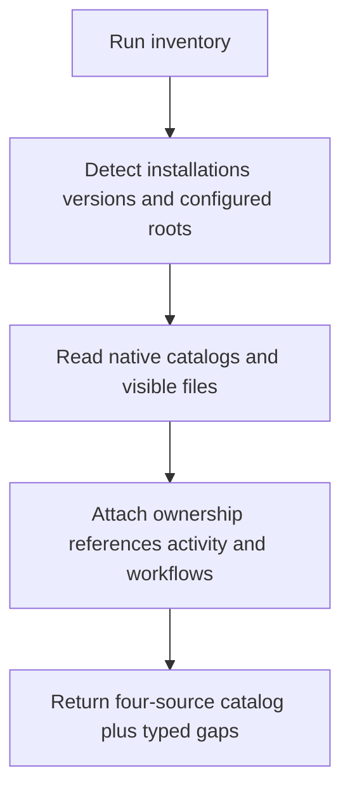
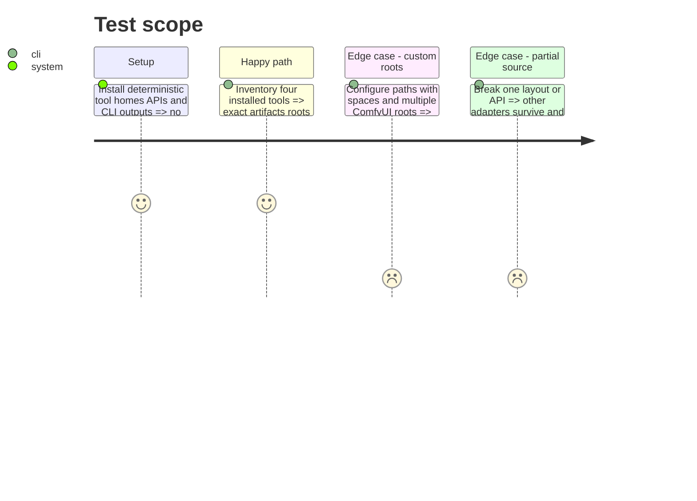

# Instruction: Inventory Ollama, Jan, LM Studio, and ComfyUI

## Architecture projection

> Tree of the final files. ✅ create · ✏️ modify · ❌ delete

```txt
scripts/model_orchestrator/
├── adapters/
│   ├── __init__.py                 ✅ adapter protocol and registry
│   ├── ollama.py                   ✅ API and guarded manifest observations
│   ├── jan.py                      ✅ settings CLI and data-folder observations
│   ├── lm_studio.py                ✅ CLI and configured-root observations
│   └── comfyui.py                  ✅ model roots categories API and workflow observations
├── catalog.py                      ✏️ aggregate four adapters
├── __main__.py                     ✏️ inventory command
└── tests/                          ✏️ fake tool homes APIs CLIs and workflows
```

Deleted files: none.

## User Journey



## Test Scope



## Tasks to do

### `1)` Detect installations and roots

> Prefer documented settings and native commands over hardcoded guesses.

1. Detect executables, versions, settings, environment overrides, loopback APIs, and documented Windows/Linux defaults.
2. Record source and confidence for every root; an unknown version/layout degrades to catalog-only.
3. Bound traversal to configured model roots and skip inaccessible entries with typed errors.

### `2)` Translate four native inventories

> Preserve tool ownership while producing shared artifact observations.

1. Ollama: use `/api/tags` and `/api/ps`, locate `OLLAMA_MODELS`, and map recognized manifests to blobs read-only.
2. Jan: prefer CLI/settings, tolerate both documented Linux data-path generations, and distinguish linked from duplicated GGUF imports.
3. LM Studio: prefer `lms ls --json`, supplement with the configured model root only when required, and separate loaded state.
4. ComfyUI: combine model roots, `extra_model_paths.yaml`, live `/models` categories, and saved workflow references for checkpoints, diffusion models, VAE, LoRA, ControlNet, text encoders, CLIP Vision, and upscale models.
5. Never deserialize model payloads or infer exact equality from filenames.

### `3)` Prove partial and cross-platform behavior

> Make missing tools normal and unknown ownership non-destructive.

1. Cover default/custom paths, absent tools, malformed responses, shared blobs, links, workflows, and mixed variants.
2. Assert APIs remain loopback-only with bounded timeouts and off-origin redirects refused.
3. Assert one adapter failure cannot erase other results or enable a mutation.

## Test acceptance criteria

| Task | Acceptance criteria |
| ---- | ------------------- |
| 1 | Installations, versions, defaults, overrides, and confidence resolve deterministically on Windows and Linux fixtures. |
| 2 | All four tools contribute artifacts and references without private mutation or unsafe model deserialization. |
| 3 | Missing, malformed, unknown, or remote sources fail partially and cannot expose destructive capabilities. |
