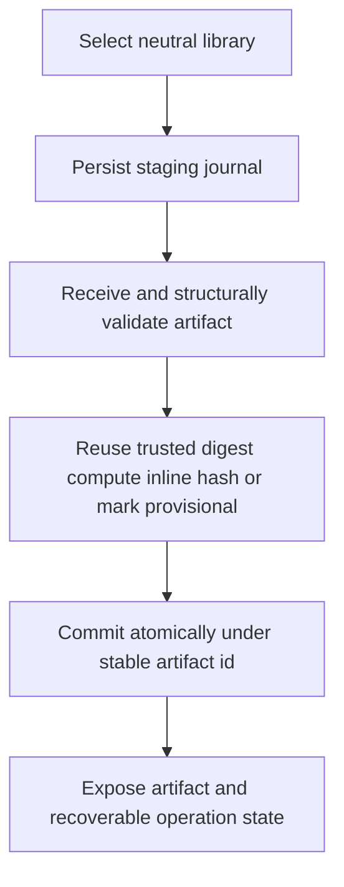
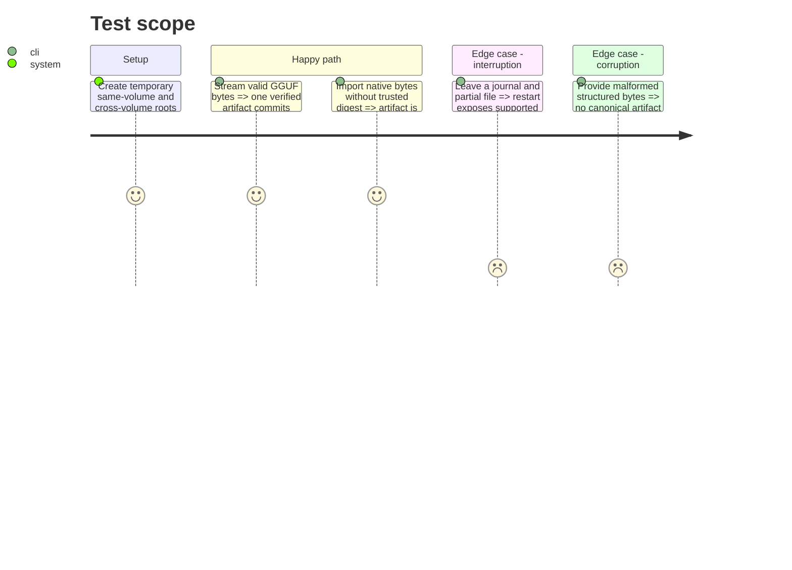

# Instruction: Build the transactional neutral library

## Architecture projection

> Tree of the final files. ✅ create · ✏️ modify · ❌ delete

```txt
scripts/model_orchestrator/
├── library.py                      ✅ staging allocation commit and reconciliation
├── formats.py                      ✅ non-executing GGUF SafeTensors and opaque validation
├── settings.py                     ✅ machine-local library configuration
├── models.py                       ✏️ library journal and validation records
├── catalog.py                      ✏️ canonical artifact observations
├── __main__.py                     ✏️ settings library and recovery inspection commands
└── tests/                          ✏️ filesystem format and interruption coverage
```

Deleted files: none.

## User Journey



## Test Scope



## Tasks to do

### `1)` Persist non-roaming settings

> Keep machine paths outside synchronized project configuration.

1. Store schema-versioned model settings below the local DevToolBox state root.
2. Default to `%LOCALAPPDATA%\DevToolBox\models` and `$XDG_DATA_HOME/devtoolbox/models` or `~/.local/share/devtoolbox/models`.
3. Validate absolute override, writability, and space; changing it never silently relocates existing data.

### `2)` Commit artifacts transactionally

> Avoid both duplicate allocation and avoidable post-download processing.

1. Journal before writing under `.staging/<operation-id>` and commit by same-filesystem atomic rename to `artifacts/<artifact-id>/<filename>`.
2. Reuse accepted provider digests or compute SHA-256 inline; otherwise commit provisionally and queue optional low-priority hashing after first availability.
3. Never block first use on a second read, move an already referenced file after identity promotion, or deduplicate provisional content.
4. Record origin without credentials, sizes, allocation, format, revision, identity source, and timestamps.
5. Reconcile journals as resumable, discardable, completed, or manual-attention and require an exact id for recovery mutation.

### `3)` Validate without executing model content

> Detect truncation and structural corruption without conversion or tensor loading.

1. Validate GGUF magic/version/bounds and SafeTensors header/index bounds.
2. Treat CKPT, BIN, and unknown formats as nonzero opaque files without deserialization.
3. Return strong, structural, opaque, or failed evidence separately from tool usability.
4. Test hash mismatch, malformed bounds, hard links, symbolic links, cross-volume copies, and allocated-size accounting.

## Test acceptance criteria

| Task | Acceptance criteria |
| ---- | ------------------- |
| 1 | Defaults are non-roaming and path changes never imply hidden relocation. |
| 2 | Complete artifacts commit atomically, interruption remains recoverable, and no provider path incurs an avoidable second blocking read. |
| 3 | Validation never executes model data and honestly separates content identity, structure, and destination usability. |
