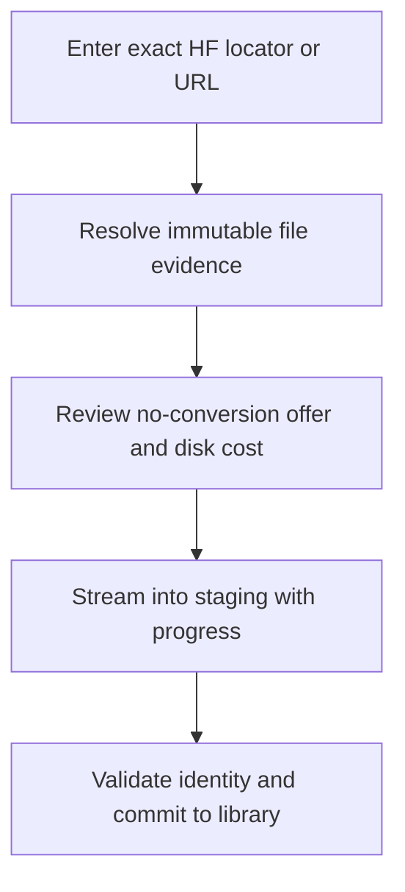
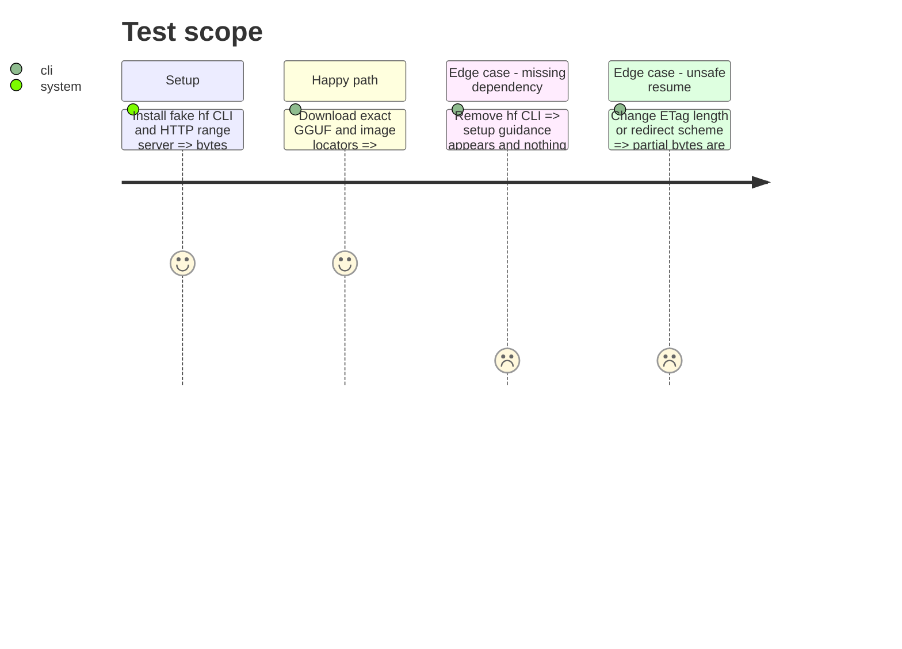

# Instruction: Download through Hugging Face/Xet and direct HTTPS

## Architecture projection

> Tree of the final files. ✅ create · ✏️ modify · ❌ delete

```txt
scripts/model_orchestrator/
├── providers/
│   ├── __init__.py                 ✅ provider protocol and registry
│   ├── huggingface.py              ✅ exact HF resolver and Xet download
│   └── direct.py                   ✅ exact HTTPS download and guarded resume
├── download.py                     ✅ request offer plan and execution core
├── events.py                       ✅ versioned NDJSON progress protocol
├── models.py                       ✏️ acquisition and event records
├── __main__.py                     ✏️ provider resolve and download commands
└── tests/                          ✏️ fake hf and HTTP coverage
```

Deleted files: none.

## User Journey



## Test Scope



## Tasks to do

### `1)` Define exact acquisition and progress contracts

> Make transport comparable without promising remote federated search.

1. Define request, provider status, offer, immutable plan, progress, and result records.
2. Accept one primary exact locator plus optional user alternatives; group offers only with equal immutable revision, file path, format, and trusted digest.
3. Mark conversion-required offers visible but non-executable in v1 and expose network, local-copy, temporary-space, resume, and identity evidence.
4. Emit one NDJSON schema header, monotonic progress, and exactly one redacted terminal event.

### `2)` Implement Hugging Face/Xet

> Download directly to staging with provider-owned authentication.

1. Detect `hf`, version, and auth state without reading tokens; never install it automatically.
2. Require exact repository, immutable revision, and filename; invoke `hf download --local-dir` with `HF_XET_HIGH_PERFORMANCE=1` unless disabled.
3. Capture immutable LFS/Xet SHA-256 when available and avoid a second local hash pass.
4. Preserve resumable metadata without duplicating the canonical allocation.

### `3)` Implement direct HTTPS

> Support arbitrary exact files without weakening network safety.

1. Allow HTTPS plus explicit loopback HTTP, reject URL credentials, redact queries, cap redirects, and reject unsafe scheme/origin changes.
2. Resume only when ETag or Last-Modified plus length remains stable; otherwise restart the partial file.
3. Compute SHA-256 inline when no trusted user checksum exists.
4. Translate timeout, cancellation, disk exhaustion, checksum mismatch, malformed output, and nonzero exits into stable errors.

## Test acceptance criteria

| Task | Acceptance criteria |
| ---- | ------------------- |
| 1 | Exact same-byte offers are comparable and every transfer has parseable monotonic redacted progress. |
| 2 | HF/Xet uses immutable exact locators, existing auth, optional high-performance mode, and no avoidable second read. |
| 3 | Direct transfers resume only with stable evidence and unsafe URLs or changed content never commit. |
