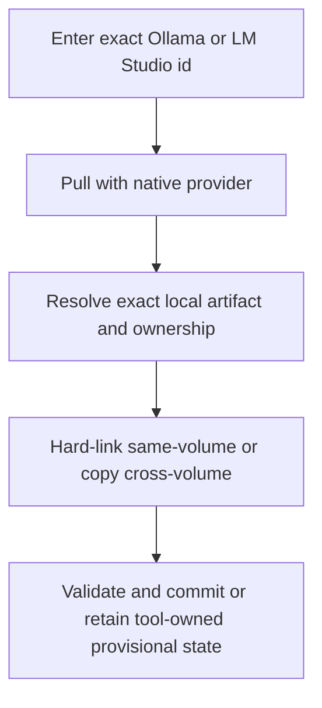
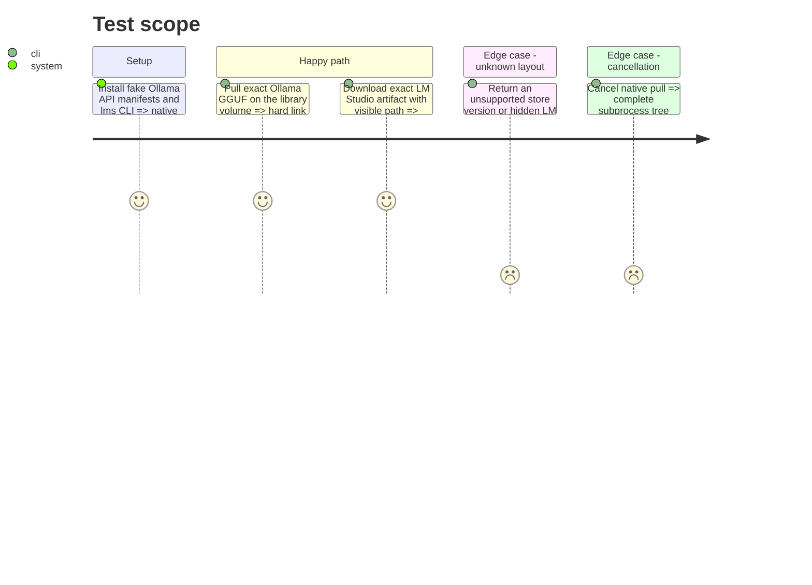

# Instruction: Download through Ollama and LM Studio

## Architecture projection

> Tree of the final files. ✅ create · ✏️ modify · ❌ delete

```txt
scripts/model_orchestrator/
├── providers/
│   ├── ollama.py                   ✅ streaming pull and guarded GGUF export
│   └── lm_studio.py                ✅ lms or local-API download and artifact resolution
├── download.py                     ✏️ tool-owned download and export steps
├── events.py                       ✏️ child-process cancellation states
├── models.py                       ✏️ ownership and export-cost evidence
├── __main__.py                     ✏️ expose both providers
└── tests/                          ✏️ fake loopback API CLI manifest and volume coverage
```

Deleted files: none.

## User Journey



## Test Scope



## Tasks to do

### `1)` Implement the Ollama provider

> Preserve fast native pull while preventing fragile links to owner blobs.

1. Stream `/api/pull` on loopback, resolve the exact recognized manifest model layer, and accept its SHA-256 identity.
2. Validate GGUF structure, hard-link the blob into staging on the same filesystem, or copy across filesystems.
3. Never symlink the library to an Ollama blob; distinguish duplicate allocation avoided from bytes freed.
4. Unknown layout, digest, ownership, redirect, or remote endpoint disables export without modifying the store.

### `2)` Implement the LM Studio provider

> Use native download surfaces and admit when the physical artifact is not safely resolvable.

1. Detect `lms`, use exact `lms get` or the loopback download API, and consume structured progress/status.
2. Resolve artifacts through supported listing/configuration evidence and link/copy into staging only with an owned exact path.
3. If path or identity is unavailable, retain tool-owned provisional inventory and disable central export and retirement.
4. Never fabricate a native deletion operation absent a documented interface.

### `3)` Own native child lifecycles

> Ensure cancellation does not leave background pulls running.

1. Start provider CLIs in a process group on Linux and a job/process-group abstraction on Windows.
2. On cancel or timeout, terminate descendants, wait for exit, flush one terminal event, and preserve resumable evidence when supported.
3. Test failures before pull, during transfer, during export, and after native success but before library commit.

## Test acceptance criteria

| Task | Acceptance criteria |
| ---- | ------------------- |
| 1 | Ollama retains native pull speed and exports only a verified recognized GGUF without fragile symlinks or false freed-byte claims. |
| 2 | LM Studio exports only from reliable native evidence and remains safely tool-owned otherwise. |
| 3 | Cancellation and timeout terminate provider descendants and preserve an accurate operation journal. |
