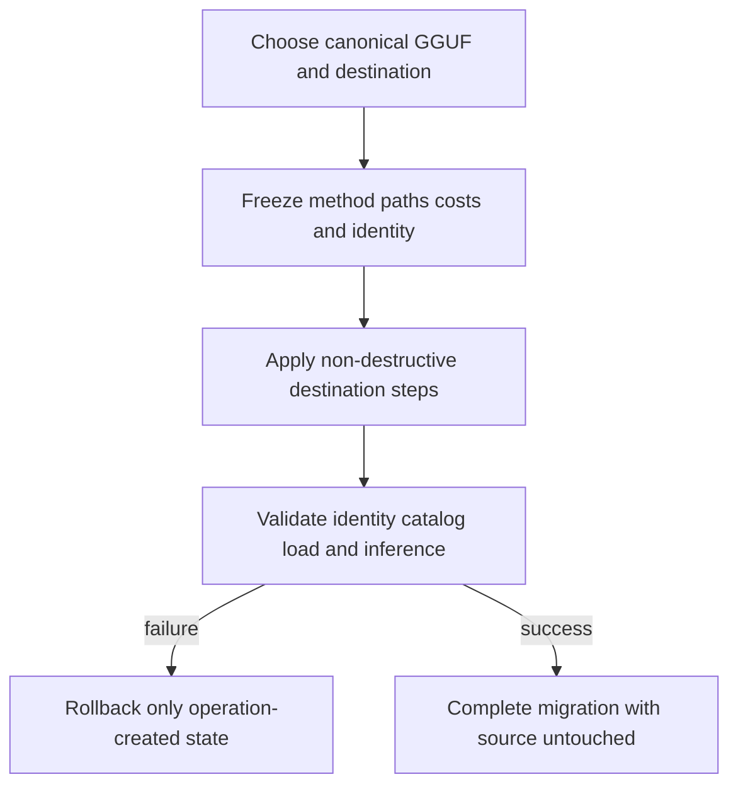
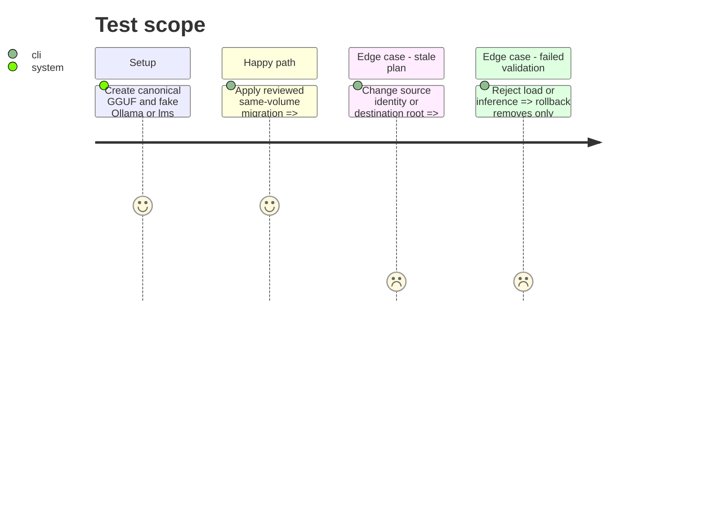

# Instruction: Plan migrations and automate supported LLM destinations

## Architecture projection

> Tree of the final files. ✅ create · ✏️ modify · ❌ delete

```txt
scripts/model_orchestrator/
├── migration.py                    ✅ immutable plan execution rollback and validation
├── adapters/
│   ├── ollama.py                   ✏️ documented GGUF import and inference validation
│   └── lm_studio.py                ✏️ dry-run import link modes and load validation
├── models.py                       ✏️ migration step rollback and validation records
├── __main__.py                     ✏️ plan apply and validate commands
└── tests/                          ✏️ stale plan link copy rollback and collision coverage
```

Deleted files: none.

## User Journey



## Test Scope



## Tasks to do

### `1)` Freeze and revalidate migration plans

> Make every consequence reviewable before mutation.

1. Snapshot exact source identity, destination version/root, method, paths, free space, temporary/allocated bytes, and validation level.
2. Prefer supported shared path, hard link, symbolic link only when documented, native import, then copy; use reflink only after a successful capability probe.
3. Reject overlap, collision, path escape, insufficient space, provisional identity, and unknown ownership.
4. Revalidate the complete snapshot immediately before the first step.

### `2)` Automate Ollama and LM Studio destinations

> Use their documented non-interactive lifecycle surfaces.

1. Ollama: import verified GGUF through documented create/blob operations and validate exact digest plus minimal inference.
2. LM Studio: run `lms import --dry-run`, apply selected link/copy mode, verify `lms ls`, then load and perform minimal inference.
3. Persist every created path/native id before execution and rollback only resources created by the operation.

### `3)` Separate migration success from retirement

> Never turn validation into deletion authority.

1. Represent identity, catalog, load, and inference results separately.
2. Require exact identity plus successful load or inference for later retirement eligibility.
3. Finish every successful migration with all source artifacts intact and no confirmation token issued.

## Test acceptance criteria

| Task | Acceptance criteria |
| ---- | ------------------- |
| 1 | Immutable plans include identity, paths, method, disk costs, capabilities, and validation and reject stale state. |
| 2 | Ollama and LM Studio destinations use native supported operations and rollback cannot touch pre-existing resources. |
| 3 | Migration success never deletes a source or bypasses the later retirement contract. |
