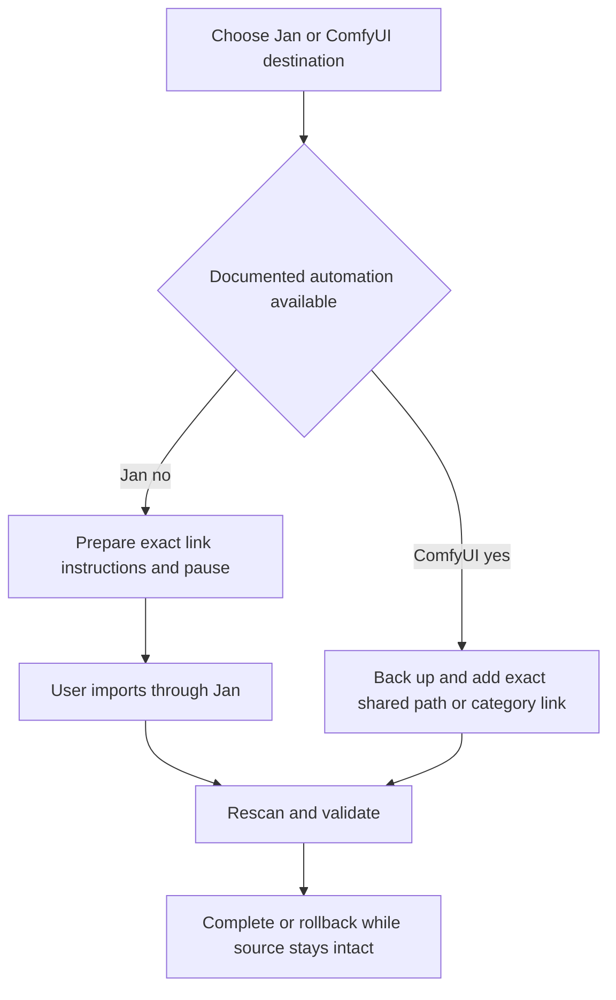
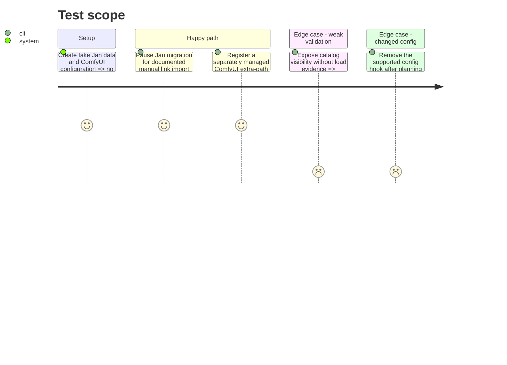

# Instruction: Integrate Jan and ComfyUI without private unsafe mutation

## Architecture projection

> Tree of the final files. ✅ create · ✏️ modify · ❌ delete

```txt
scripts/model_orchestrator/
├── adapters/
│   ├── jan.py                      ✏️ guided link import and post-action validation
│   └── comfyui.py                  ✏️ managed extra-path or guided integration and validation
├── migration.py                    ✏️ guided-step and settings-change execution
├── models.py                       ✏️ manual-step and weak-validation states
├── __main__.py                     ✏️ continue and validate guided migrations
└── tests/                          ✏️ Jan manual checkpoint and ComfyUI config fixtures
```

Deleted files: none.

## User Journey



## Test Scope



## Tasks to do

### `1)` Make guided steps first-class

> Remain useful when a tool exposes only an interactive supported import.

1. Add a persisted `manual_step` containing exact source, destination tool, documented action, expected resulting reference, and resume condition.
2. For Jan versions without documented non-interactive local import, pause with Link Files guidance and never edit private Jan metadata.
3. Resume only after a fresh adapter scan observes the exact artifact/reference; otherwise remain pending or fail without source mutation.

### `2)` Integrate ComfyUI shared model paths

> Share neutral image artifacts through supported configuration rather than duplication.

1. Prefer an already configured extra model root, which needs no configuration mutation.
2. Otherwise generate a separate DevToolBox-owned YAML file containing only its exact category mappings and register it only through a documented Desktop setting or `--extra-model-paths-config` launch hook supported by the detected installation.
3. Never parse, rewrite, append to, or replace arbitrary user YAML with a hand-rolled parser; when no supported hook exists, persist a guided manual step describing how the user can add the generated file.
4. Rollback removes only the DevToolBox-owned file or registration it created; category links/copies are allowed only when shared roots cannot express the destination and all path guards pass.

### `3)` Validate honestly

> Distinguish visibility from real execution when public APIs cannot map loaded bytes to a file.

1. Jan: validate exact reference, then load/inference only when supported by the detected version.
2. ComfyUI: validate live category visibility and workflow references; report load/inference unavailable unless a stable exact-file execution check exists.
3. Catalog-only or guided completion never creates retirement eligibility.

## Test acceptance criteria

| Task | Acceptance criteria |
| ---- | ------------------- |
| 1 | Jan integration uses documented interactive import when required and resumes only from observed exact state. |
| 2 | ComfyUI sharing uses an existing root, a separately managed officially loaded file, or a guided step; it never rewrites arbitrary user YAML and rolls back only owned state. |
| 3 | Weak visibility is never represented as load/inference proof or deletion authority. |
