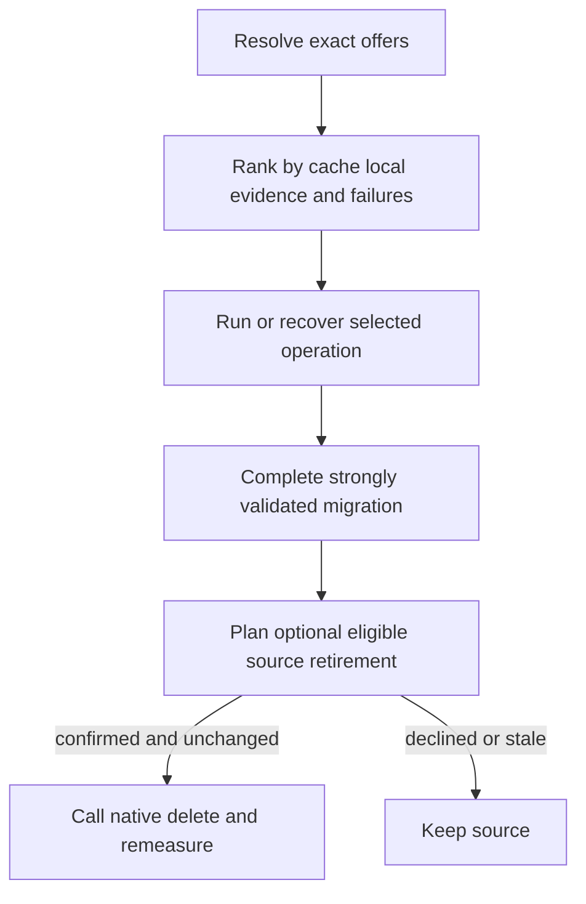
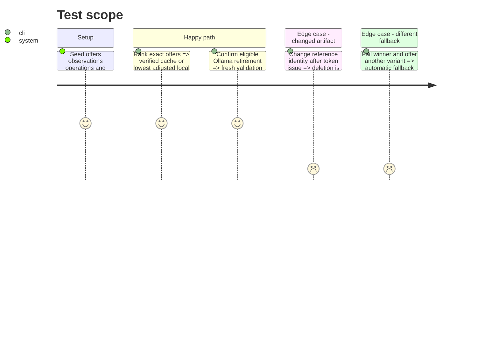

# Instruction: Rank, recover, and retire eligible sources

## Architecture projection

> Tree of the final files. ✅ create · ✏️ modify · ❌ delete

```txt
scripts/model_orchestrator/
├── ranking.py                      ✅ deterministic local recommendation policy
├── history.py                      ✅ bounded machine-local observations
├── operations.py                   ✅ startup reconciliation and exact recovery actions
├── retirement.py                   ✅ protected Ollama source retirement
├── providers/                      ✏️ fallback and performance evidence
├── adapters/ollama.py              ✏️ native delete capability
├── models.py                       ✏️ ranking recovery retirement and token records
├── __main__.py                     ✏️ recommend recover and retirement commands
└── tests/                          ✏️ formula fallback recovery token and accounting coverage
```

Deleted files: none.

## User Journey



## Test Scope



## Tasks to do

### `1)` Rank from local evidence

> Adapt to each developer without claiming a universal fastest provider.

1. Keep the ten latest terminal observations per provider/kind with network/copy bytes and time, startup, success, and stable failure code.
2. Verified complete cache wins; conversion offers remain non-executable.
3. With at least three relevant successes, compute `predicted = startup_median + remaining_network/network_median + local_copy/copy_median`, omitting zero-byte terms, then `adjusted = predicted / max(success_rate, 0.25)`; any positive term without three usable samples makes the estimate unknown.
4. Unknown estimates follow known ones using configurable cold order Ollama, Hugging Face, LM Studio, direct; manual choice always wins.
5. Return sample count, range, confidence, and reasons.

### `2)` Restrict fallback and recover operations

> Retry transport without substituting another model.

1. Auto-fallback only with equal trusted digest, immutable revision, file, format, and quantization/category.
2. Reconcile journals into resume, rollback, discard-partial, or manual-attention only when capability evidence proves the action.
3. Require exact operation ids and owned-path revalidation for every recovery mutation.

### `3)` Retire only eligible Ollama sources in v1

> Keep deletion narrower than migration.

1. Require verified identity, successful destination load/inference, and a fresh scan with no loaded, workflow, keep, provisional, in-progress, or third-party tool reference; the exact Ollama owner reference named by the immutable plan is the retirement target and every other reference remains a blocker.
2. Compute shared allocation/reachability and distinguish logical, avoided, estimated reclaimable, and measured freed bytes.
3. Issue a short-lived token bound to owner, source id/path, identity, references, and plan digest; reject stale state.
4. Call only Ollama's documented loopback delete API in v1, then re-inventory and measure; Jan, LM Studio, ComfyUI, and unknown stores remain report-only.

## Test acceptance criteria

| Task | Acceptance criteria |
| ---- | ------------------- |
| 1 | Ranking is formula-driven, locally adaptive, confidence-labelled, configurable, and overridable. |
| 2 | Fallback cannot change content and recovery cannot mutate an unowned or stale target. |
| 3 | Only strongly validated, verified, unprotected Ollama sources can be confirmed and deleted, with actual freed space measured afterward. |
