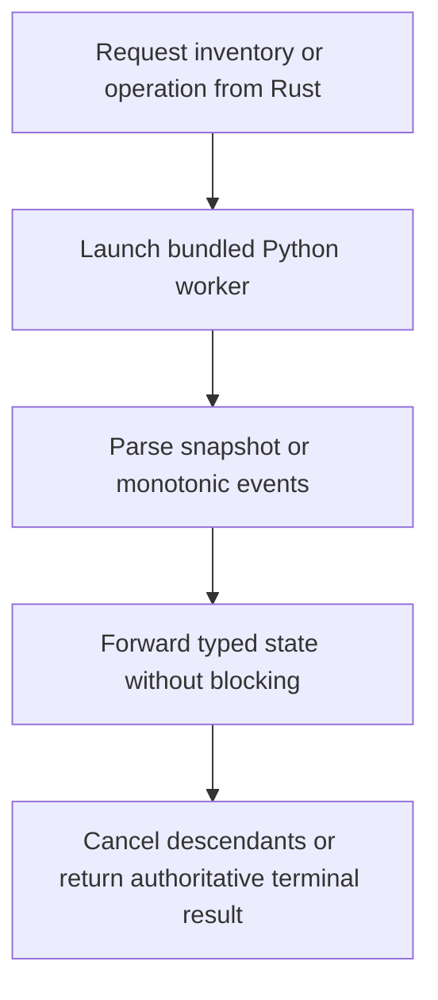
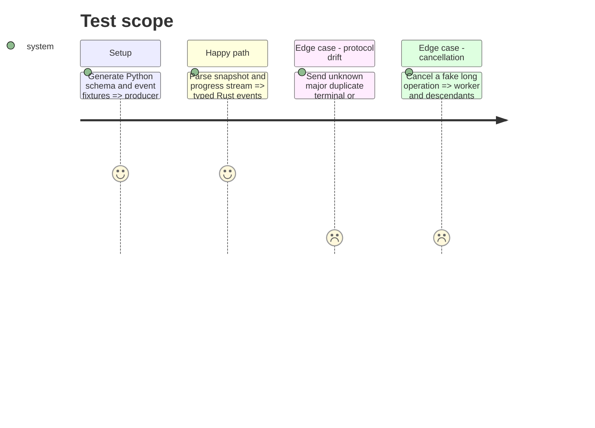

# Instruction: Add the asynchronous Rust protocol bridge

## Architecture projection

> Tree of the final files. ✅ create · ✏️ modify · ❌ delete

```txt
src/models/
├── mod.rs                          ✅ public bridge exports
├── model.rs                        ✅ tolerant schema-v1 serde mirror
├── parse.rs                        ✅ JSON and NDJSON validation
└── spawn.rs                        ✅ inventory and operation workers
src/python_runtime.rs              ✏️ construct model-orchestrator commands
src/main.rs                        ✏️ register models module
scripts/model_orchestrator/tests/  ✏️ cross-language fixture producer
```

Deleted files: none.

## User Journey



## Test Scope



## Tasks to do

### `1)` Mirror and validate the protocol

> Detect producer/consumer drift before UI code depends on it.

1. Add tolerant serde mirrors for catalog, offers, plans, progress, validation, recovery, retirement, settings, and terminal results.
2. Reject unknown schema major, mismatched operation id, regressing counters, duplicate terminal events, and malformed NDJSON.
3. Deserialize Python-generated fixtures in Rust tests.

### `2)` Run work asynchronously

> Preserve egui responsiveness and truthful process ownership.

1. Construct commands through `python_runtime`, set UTF-8 pipes, hide the Windows console, and bound stderr tails.
2. Run inventory and operations on background threads with typed channels and repaint-friendly polling.
3. Route cancellation to Python, wait for provider descendants to stop, and report only the worker's terminal state.
4. Permit one model mutation at a time; read-only refresh cannot invalidate an active immutable plan.

## Test acceptance criteria

| Task | Acceptance criteria |
| ---- | ------------------- |
| 1 | Python schema-v1 snapshots and events deserialize in Rust while malformed or drifting streams fail explicitly. |
| 2 | Inventory, progress, completion, failure, and cancellation remain asynchronous and cannot orphan provider processes. |
