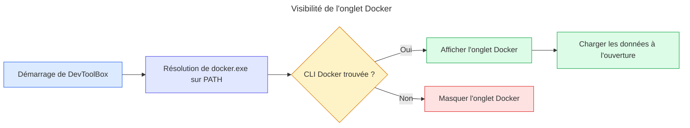

# Diagnostic — onglet Docker absent sous Windows

## Symptôme

DevToolBox est lancé en version release sous Windows, Docker Desktop est lancé, mais
l'onglet Docker n'apparaît pas dans la navigation.

## Chemin d'action

## Pourquoi

1. L'onglet n'apparaît pas parce que le binaire lancé ne contient pas le support Docker Windows actuel.
2. Il ne le contient pas parce que `target/release/devtoolbox.exe` a été construit à 16:43 le 21 août 2026.
3. Le port Windows de l'onglet Docker n'a été ajouté que par le commit `d1320dd` à 18:41.
4. La release `v0.8.0` intégrant ce commit a ensuite été créée à 19:26, sans reconstruction locale du binaire présent dans `target/release`.

## Hypothèses validées

| Hypothèse | Confiance | Statut | Preuve |
| --- | ---: | --- | --- |
| Le binaire release lancé est obsolète | 10/10 | Validée | Exécutable daté de 16:43, support Docker Windows commité à 18:41 le même jour |
| La CLI Docker est absente du `PATH` | 1/10 | Invalidée | `where docker` résout `C:\Program Files\Docker\Docker\resources\bin\docker.exe` et `docker --version` répond |
| Le daemon Docker contrôle la visibilité de l'onglet | 1/10 | Invalidée | `docker_available` dépend de `binary_available()`, qui teste uniquement la présence de `docker.exe` |
| Le code actuel masque volontairement Docker sous Windows | 1/10 | Invalidée | Le commit `d1320dd` retire le garde Linux et ajoute `DOCKER_BINARY = "docker.exe"` sous Windows |

## Cause racine

Le processus lancé utilise un ancien `target/release/devtoolbox.exe`, construit avant l'ajout du support Docker sous Windows.

## Prochaine étape

- [x] Reconstruire la release courante (`cargo build --release`, succès le 1er septembre 2026).
- [x] Fermer l'ancien processus et lancer le nouveau binaire (PID 22444).
- [ ] Confirmer visuellement que l'onglet Docker apparaît, puis vérifier séparément l'accès au daemon.
