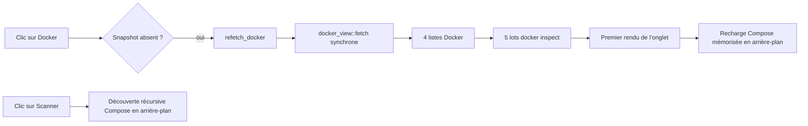

# Diagnostic et correction — ouverture lente de l’onglet Docker

Date : 2026-09-01

## Symptôme

Au premier clic sur l’onglet Docker, l’onglet met plusieurs secondes à s’afficher. L’hypothèse initiale est qu’un scan automatique bloque l’interface.

## Flux observé

## Hypothèses vérifiées

| Hypothèse | Résultat | Preuve |
|---|---|---|
| Le scan récursif Compose bloque l’ouverture | Écartée | `compose_view::discover` n’est appelé que par l’action explicite `StackAction::Scan` et tourne dans un worker. |
| La recharge des stacks mémorisées bloque l’ouverture | Écartée comme cause principale | Elle est démarrée dans un thread par `start_compose_job(None)`. |
| La collecte Docker automatique bloque le thread UI | Confirmée | `render_docker_view` appelle `refetch_docker`, qui exécute directement `docker_view::fetch`. |
| L’inspection des images domine la latence | Confirmée | Mesure locale : 4 341 ms pour 69 images, en deux lots de 50 maximum. |

## Mesures locales

| Opération | Durée |
|---|---:|
| `docker ps -a --size` | 226 ms |
| `docker images` | 947 ms |
| Deux listes de volumes | 92 ms |
| Inspection de 17 conteneurs | 99 ms |
| Inspection de 69 images | 4 341 ms |
| Inspection de 52 volumes | 166 ms |
| Total approximatif | 5 871 ms |

Les durées incluent les appels successifs au client Docker. Le total explique directement le délai perçu avant le premier rendu.

## Cause racine

Le premier clic charge automatiquement un snapshot Docker complet sur le thread de l’interface. Les commandes sont séquentielles et l’inspection des images est particulièrement lente ; l’onglet ne peut donc pas se peindre pendant cette collecte.

## Correction retenue

Déplacer `docker_view::fetch()` dans un worker, afficher immédiatement l’onglet avec un état « Chargement… », puis intégrer le snapshot à sa réception. Conserver le snapshot en cache lors des changements d’onglet et ne relancer la collecte que via « Actualiser » ou lors du premier accès.

## Phase d’implémentation

- [x] Chargement initial et actualisation dans un worker, avec rendu immédiat d’un état de chargement.
- [x] Réception du snapshot, nettoyage de la sélection et tests de non-régression.

Phase : done

## Vérification

- `cargo fmt -- --check` : réussi.
- Trois tests ciblés du chargement asynchrone : réussis.
- Suite complète : 603 réussis, 8 échecs préexistants liés à l’absence sous Windows des exécutables de test Unix `echo` et `timeout`, 2 ignorés.
- `cargo build --release` : réussi.
- Binaire Release lancé le 2026-09-01.
