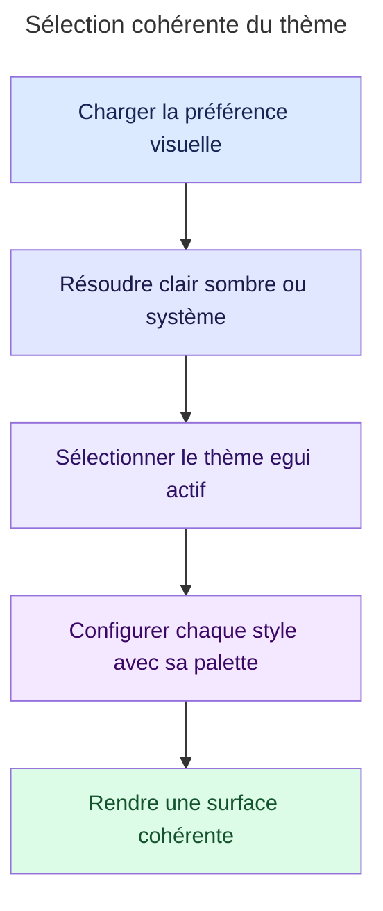
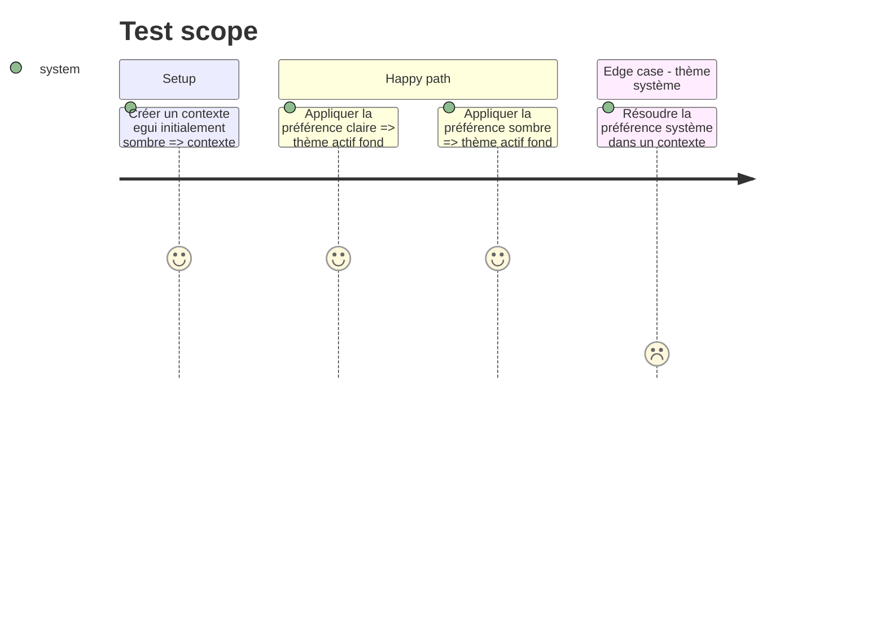

# Instruction: Rétablir l'invariant thème-palette dans egui

## Architecture projection

> Tree of the final files. ✅ create · ✏️ modify · ❌ delete

```txt
.
├── docs
│   └── visual-contract.md            ✏️ préciser l'invariant entre préférence, thème actif et palette
└── src
    └── ui
        └── theme.rs                  ✏️ sélectionner et configurer chaque thème sans contamination croisée
```

## User Journey



## Test Scope



## Wireframe

```txt
┌─────────────────────────────────────────────────────────────────┐
│ (1) Chrome de fenêtre                                           │
├─────────────────────────────────────────────────────────────────┤
│ (2) Navigation horizontale                                     │
├─────────────────────────────────────────────────────────────────┤
│ (3) En-tête de la vue                                          │
│ (4) Rangée d'actions                                           │
├─────────────────────────────────────────────────────────────────┤
│ (5) Tableau                                                    │
│     en-tête · lignes alternées · colonnes                       │
│                                                                 │
└─────────────────────────────────────────────────────────────────┘
```

1. Chrome : conserve le titre et les contrôles natifs de la fenêtre.
2. Navigation : garde les espaces principaux dans la coque compacte existante.
3. En-tête : maintient le titre et le contexte de la vue active.
4. Actions : regroupe les commandes propres à la vue.
5. Tableau : conserve la structure actuelle des données et de leurs colonnes.

## Tasks to do

### `1)` Reproduire l'incohérence par test

> Verrouiller le défaut observé avant de modifier l'application du thème.

1. Initialiser un contexte dont le thème actif contredit la préférence demandée.
2. Appliquer `ThemeMode::Light`, puis constater par assertions le thème actif, `dark_mode`, le fond, le texte et la couleur de rayure attendus.
3. Ajouter le scénario symétrique pour `ThemeMode::Dark` et couvrir la préférence système.

### `2)` Corriger l'application du thème

> Garantir que la préférence, le style actif et la palette décrivent toujours le même mode.

1. Remplacer la mutation du style actif par la sélection explicite du thème egui.
2. Configurer les styles clair et sombre séparément à partir de `palette(false)` et `palette(true)`.
3. Faire de `ThemeMode::System` une sélection explicite de `ThemePreference::System`, afin qu'elle annule aussi une préférence forcée antérieure.
4. Conserver les espacements, rayons, sélection et ratios de contraste existants.

### `3)` Formaliser l'invariant visuel

> Empêcher une future régression lors d'une évolution des matériaux natifs.

1. Documenter l'alignement obligatoire entre préférence, `Context::theme`, `Visuals::dark_mode` et palette.
2. Exécuter les tests ciblés de thème puis les assertions Rust avant commit.

## Test acceptance criteria

| Task | Acceptance criteria |
| ---- | ------------------- |
| 1 | Le test échoue avec l'implémentation actuelle en reproduisant un fond clair combiné à des tokens sombres, puis couvre les trois préférences. |
| 2 | Une préférence claire sélectionne un style entièrement clair et une préférence sombre un style entièrement sombre, indépendamment de l'état initial du contexte. |
| 3 | Le contrat documenté correspond aux assertions exécutables et les ratios AA existants restent verts. |
