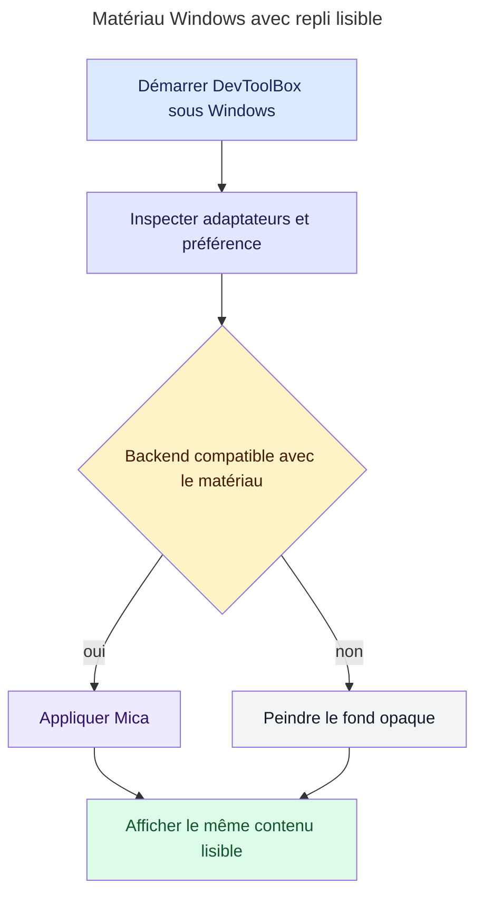
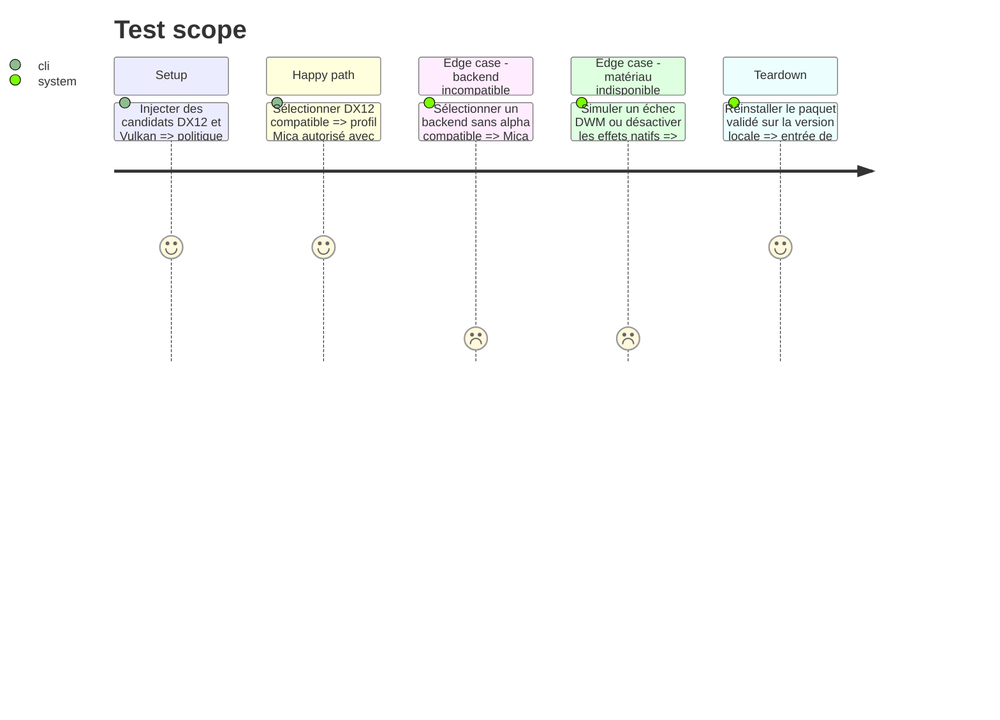

# Instruction: Sécuriser Mica et son repli Windows

## Architecture projection

> Tree of the final files. ✅ create · ✏️ modify · ❌ delete

```txt
.
└── src
    ├── main.rs                       ✏️ préférer un adaptateur Windows compatible avec la transparence native
    └── ui
        ├── egui_app.rs               ✏️ dériver le support Mica du renderer réellement créé
        └── native_window.rs          ✏️ centraliser la politique backend matériau et repli opaque
```

## User Journey



## Test Scope



## Wireframe

```txt
┌─────────────────────────────────────────────────────────────────┐
│ (1) Chrome de fenêtre                                           │
├─────────────────────────────────────────────────────────────────┤
│ (2) Navigation horizontale                                     │
├─────────────────────────────────────────────────────────────────┤
│ (3) En-tête de la vue                                          │
│ (4) Rangée d'actions                                           │
├─────────────────────────────────────────────────────────────────┤
│ (5) Tableau                                                    │
│     en-tête · lignes alternées · colonnes                       │
│                                                                 │
└─────────────────────────────────────────────────────────────────┘
```

1. Chrome : reste géré par Windows quel que soit le profil de matériau.
2. Navigation : conserve la structure compacte et son onglet actif.
3. En-tête : reste séparé des données tabulaires.
4. Actions : garde les commandes visibles au-dessus du tableau.
5. Tableau : présente toutes les lignes dans une surface complète, native ou opaque.

## Tasks to do

### `1)` Formaliser la compatibilité du renderer

> Transformer la sélection implicite de Vulkan ou DX12 en politique testable.

1. Définir une représentation pure des backends candidats et de leur compatibilité avec le matériau Windows.
2. Préférer sous Windows un adaptateur DX12 compatible avec la surface sans changer Metal sur macOS ni les backends Linux.
3. Conserver le backend explicitement demandé par l'environnement, mais désactiver Mica lorsqu'il ne satisfait pas le contrat.

### `2)` Relier le renderer au profil natif

> Ne jamais activer une surface translucide sur une pile incapable de la composer correctement.

1. Lire dans le contexte eframe l'adaptateur réellement créé.
2. Injecter cette capacité dans `MaterialInputs` au démarrage et lors des recomputations.
3. Appliquer Mica seulement lorsque préférence, accessibilité, OS, API et renderer l'autorisent ; sinon activer immédiatement le profil opaque.
4. Après tout échec d'application, nettoyer Mica en best effort avant de repeindre la surface opaque.

### `3)` Prouver le repli

> Faire de la lisibilité le résultat invariant des deux chemins.

1. Tester la priorité DX12, l'override incompatible, l'échec natif et la désactivation des effets.
2. Vérifier que le profil opaque restaure un fond entièrement peint et les mêmes tokens de texte.
3. Exécuter `cargo check`, `cargo clippy`, `cargo fmt --check`, `cargo test` et `cargo build --release`.

## Test acceptance criteria

| Task | Acceptance criteria |
| ---- | ------------------- |
| 1 | Windows préfère DX12 pour le chemin Mica ; un backend incompatible reste utilisable mais produit explicitement le profil opaque. |
| 2 | Le profil natif reflète le renderer réellement créé ; tout échec nettoie Mica puis peint une surface opaque complète. |
| 3 | Les tests couvrent tous les chemins de décision, la suite complète et la build release sont vertes. |
