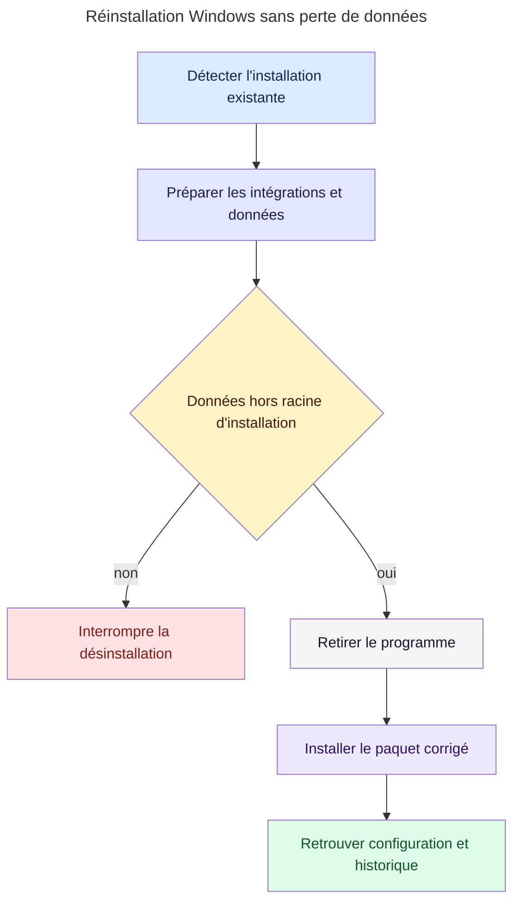
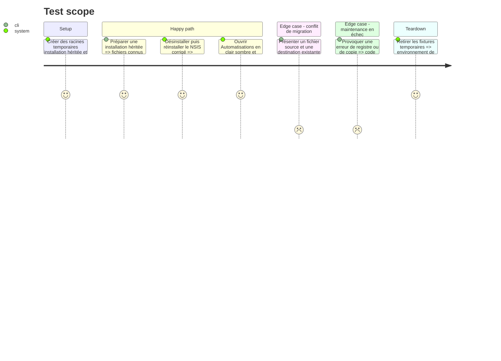

# Instruction: Séparer les données, empaqueter et qualifier Windows

## Architecture projection

> Tree of the final files. ✅ create · ✏️ modify · ❌ delete

```txt
.
├── docs
│   └── release-readiness.md          ✏️ consigner contraste fallback désinstallation et conservation
├── packager.toml                     ✏️ déclarer le template NSIS contrôlé
├── packaging
│   └── windows
│       └── installer.nsi             ✅ préparer la désinstallation avant toute suppression
├── scripts
│   └── verify-package-config.py      ✏️ vérifier le template et les invariants Windows
└── src
    ├── main.rs                       ✏️ migrer avant journalisation et retourner un code de maintenance fiable
    ├── platform
    │   └── windows.rs                ✏️ séparer état local et racine d'installation avec migration ciblée
    └── uninstall.rs                  ✏️ préparer et valider la conservation avant retrait
```

## User Journey



## Test Scope



## Wireframe

```txt
┌─────────────────────────────────────────────────────────────────┐
│ (1) Chrome de fenêtre                                           │
├─────────────────────────────────────────────────────────────────┤
│ (2) Navigation horizontale                                     │
├─────────────────────────────────────────────────────────────────┤
│ (3) En-tête de la vue                                          │
│ (4) Rangée d'actions                                           │
├─────────────────────────────────────────────────────────────────┤
│ (5) Tableau                                                    │
│     en-tête · lignes alternées · colonnes                       │
│                                                                 │
└─────────────────────────────────────────────────────────────────┘
```

1. Chrome : confirme que l'exécutable réinstallé utilise la fenêtre Windows attendue.
2. Navigation : permet de rejoindre la vue de qualification sans nouvelle structure.
3. En-tête : identifie la vue qualifiée.
4. Actions : contrôle la lisibilité des commandes et de leurs états.
5. Tableau : matérialise la régression initiale et ses lignes alternées.

## Tasks to do

### `1)` Séparer et migrer l'état local

> Sortir les données machine de la racine que NSIS possède et supprime.

1. Résoudre les nouveaux logs, commandes machine et historiques sous `%LOCALAPPDATA%\RebelliousSmile\DevToolBox`.
2. Définir une migration testable limitée aux noms de fichiers connus, sans suivre de lien ni parcourir arbitrairement l'ancienne racine.
3. Copier vers une destination temporaire, valider, renommer atomiquement puis supprimer la source seulement après succès.
4. Ne jamais écraser une destination existante ; signaler le conflit et conserver les deux copies tant qu'une résolution sûre n'est pas prouvée.
5. Exécuter la migration avant l'ouverture du nouveau journal afin que le fichier source ne soit pas verrouillé.

### `2)` Rendre la maintenance bloquante pour NSIS

> Empêcher l'installeur de poursuivre après une préparation partielle.

1. Remplacer le booléen de dispatch maintenance par un résultat portant un code de sortie stable.
2. Faire échouer `--prepare-uninstall` lorsqu'une intégration ou une migration indispensable échoue.
3. Adapter un template NSIS versionné qui exécute la commande, attend son résultat et interrompt le retrait sur code non nul avant de supprimer la racine programme.
4. Vérifier statiquement que `packager.toml` référence ce template et que celui-ci appelle l'option exacte.

### `3)` Tester la propriété de conservation

> Prouver le comportement sur fichiers plutôt que faire confiance au texte de l'interface.

1. Tester migration réussie, source absente, destination existante, lien symbolique et erreur d'écriture avec racines injectées.
2. Tester les codes de sortie des commandes de maintenance sans supprimer de données réelles.
3. Construire le NSIS puis inspecter ou exécuter son chemin de désinstallation dans une fixture utilisateur.

### `4)` Reconstruire et qualifier l'installation

> Remplacer la version locale dégradée par le paquet `0.10.0` vérifié.

1. Exécuter les validateurs de paquet et de release, puis construire l'installeur NSIS.
2. Fermer l'instance installée et exécuter `--prepare-uninstall` depuis le binaire corrigé construit hors de `%LOCALAPPDATA%\DevToolBox`, car l'ancien désinstalleur installé ne contient pas encore le nouveau hook.
3. Vérifier que les données sont sorties de la racine programme, puis appeler l'ancien désinstalleur et installer le paquet corrigé.
4. Avant le premier lancement, comparer les empreintes des fichiers migrés aux empreintes prises avant la désinstallation.
5. Capturer les thèmes clair et sombre avec Mica, puis le repli opaque sur la vue Automatisations.
6. Vérifier l'absence du mélange clair/sombre, l'entrée de désinstallation et la version installée ; distinguer ensuite les mises à jour normales du journal ou de l'historique d'une perte liée à l'installeur.
7. Reporter les preuves et toute limite matérielle dans `docs/release-readiness.md` sans déclarer les autres OS qualifiés.

## Test acceptance criteria

| Task | Acceptance criteria |
| ---- | ------------------- |
| 1 | Aucun chemin de données machine Windows n'est enfant de la racine installée et chaque fichier hérité est migré atomiquement ou conservé sans écrasement. |
| 2 | Une préparation réussie autorise NSIS à poursuivre ; toute erreur indispensable retourne un code non nul et empêche la suppression. |
| 3 | Les tests couvrent les conflits et erreurs sans toucher au profil réel, et le paquet référence le template testé. |
| 4 | Avant le premier redémarrage, le paquet `0.10.0` conserve les empreintes des données migrées ; après lancement, Automatisations est lisible dans les trois profils et le désinstalleur reste fonctionnel. |
