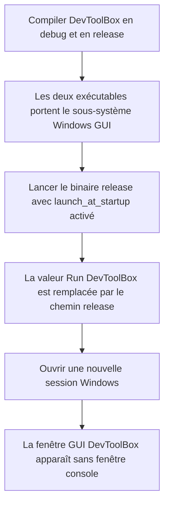
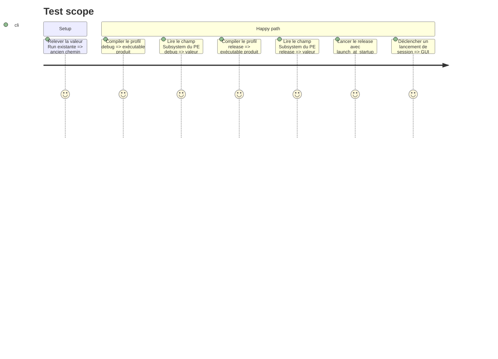

# Instruction: Sous-système GUI pour tous les builds et rafraîchissement de l'entrée Run

## Architecture projection

> Tree of the final files. ✅ create · ✏️ modify · ❌ delete

```txt
.
└── src
    └── main.rs   ✏️ appliquer le sous-système Windows GUI aux profils debug et release
```

## User Journey



## Test Scope



## Tasks to do

### `1)` Rendre le sous-système GUI inconditionnel

> Empêcher tout binaire Windows DevToolBox, y compris debug, de demander une console au système.

1. Remplacer l'attribut conditionné par `debug_assertions` en tête de `src/main.rs` par l'attribut crate-root `#![windows_subsystem = "windows"]`.
2. Ne pas modifier le pipeline de journalisation vers `%LOCALAPPDATA%\DevToolBox\devtoolbox.log` ni la logique de registre : `current_exe()` doit continuer à enregistrer le binaire réellement lancé.

### `2)` Vérifier les artefacts debug et release

> Prouver le comportement au niveau du PE généré, là où se situe la régression.

1. Compiler les profils debug et release sous Windows.
2. Pour chacun de `target\debug\devtoolbox.exe` et `target\release\devtoolbox.exe`, lire avec PowerShell `e_lfanew` à l'offset `0x3c`, puis le champ `Subsystem` à `e_lfanew + 0x5c` ; confirmer la valeur `2` (`IMAGE_SUBSYSTEM_WINDOWS_GUI`) et non `3` (`IMAGE_SUBSYSTEM_WINDOWS_CUI`). Cette lecture directe reste disponible même sans `dumpbin`, `llvm-readobj` ou `objdump`.
3. Exécuter les assertions Rust du projet (`cargo check`, `cargo clippy`, `cargo fmt --check`, `cargo test`). Aucun `cfg` de remplacement n'est requis pour Linux : la Rust Reference garantit que l'attribut est ignoré sur les cibles non-Windows.

### `3)` Rafraîchir et valider le lancement au login

> Éliminer l'ancien chemin debug déjà persisté dans le profil utilisateur.

1. Vérifier que `default_settings.launch_at_startup` est actif, puis lancer `target\release\devtoolbox.exe` : le boot sync existant appelle l'upsert du Run key avec `current_exe()` et remplace ainsi l'ancien chemin debug. Pour éprouver aussi la désactivation, passer explicitement le réglage à `false`, relancer le release, le remettre à `true`, puis relancer une seconde fois.
2. Vérifier que `HKCU\Software\Microsoft\Windows\CurrentVersion\Run`, valeur `DevToolBox`, contient exactement le chemin cité vers `target\release\devtoolbox.exe` ; ne jamais écrire cette valeur directement pendant la validation.
3. Tester un lancement de session Windows et confirmer que seule la fenêtre GUI DevToolBox apparaît, sans fenêtre console ni Windows Terminal vide.

## Test acceptance criteria

| Task | Acceptance criteria |
| ---- | ------------------- |
| 1... | `src/main.rs` applique `windows_subsystem = "windows"` sans condition de profil ; le démarrage, la journalisation fichier et `src/windows/registry.rs` restent fonctionnellement inchangés. |
| 2... | Une lecture directe du champ PE `Subsystem` retourne `2` pour les exécutables Windows debug et release ; les assertions Rust passent, et l'attribut ne nécessite aucune adaptation des sources non-Windows. |
| 3... | La valeur Run `DevToolBox` cible exactement le binaire release cité ; à l'ouverture de session, DevToolBox affiche sa GUI sans créer de console ni de fenêtre Windows Terminal vide. |
