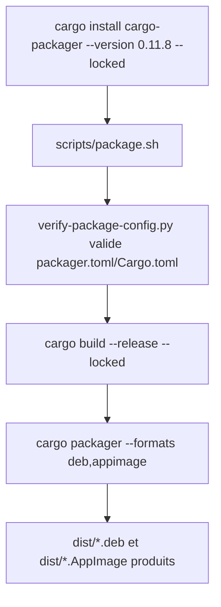
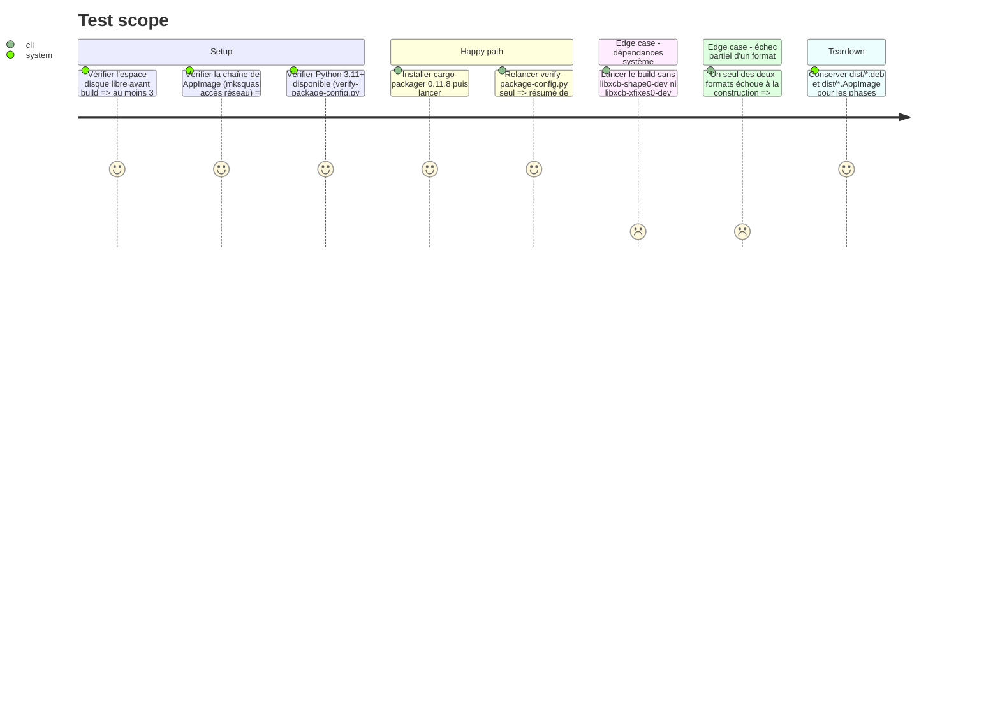

<!-- Fill or omit these sections; never add, rename, or reorder one. -->

# Instruction: Outillage et build des paquets .deb + AppImage

## Architecture projection

> Tree of the final files. ✅ create · ✏️ modify · ❌ delete

```txt
.
└── dist/                                    (généré par cargo-packager, non versionné)
    ├── devtoolbox_0.10.0_amd64.deb           ✅
    └── devtoolbox_0.10.0_x86_64.AppImage      ✅
```

## User Journey



## Test Scope

<!-- Required for every phase. Keep Setup, Happy path, any qualifying Edge cases, and any required Teardown in this one journey. -->



## Tasks to do

### `1)` Installer l'outil cargo-packager et vérifier la chaîne de build AppImage

> Disposer du binaire CLI épinglé par `scripts/package.sh`, absent de cette machine, et confirmer que la construction de l'AppImage peut aboutir (dépendance jamais vérifiée avant ce plan).

1. `cargo install cargo-packager --version 0.11.8 --locked`
2. Vérifier `cargo packager --version` contient `0.11.8`
3. Vérifier `which mksquashfs` (paquet `squashfs-tools`) ; si absent, confirmer un accès réseau sortant (cargo-packager télécharge alors `appimagetool`/`linuxdeploy` lui-même) ou installer `squashfs-tools` via `apt`. Si ni `mksquashfs` ni l'accès réseau ne sont disponibles, la construction de l'AppImage est bloquante : repasser `status: blocked` dans `plan.md` avant la tâche 2, sans tenter de contournement.
4. Vérifier `python3 --version` ; si < 3.11, installer `python3.11` via `apt` (requis par `tomllib` dans `verify-package-config.py`) sans modifier l'alternative système `python3` (pas d'`update-alternatives`) — préparer un répertoire de shim local (`ln -sf $(which python3.11) <shim_dir>/python3`) à préfixer au `PATH` uniquement pour l'exécution de `scripts/package.sh` en tâche 2

### `2)` Construire les deux paquets Linux

> Produire les artefacts réels que les phases 2 et 3 installeront/exécuteront.

1. Vérifier l'espace disque libre (`df -h .`) avant de lancer le build : au moins 3 Go libres ; si insuffisant, libérer de l'espace (ex. `cargo clean` sur d'anciens artefacts) avant de poursuivre
2. Exécuter `sh scripts/package.sh` depuis la racine du dépôt, avec le shim `python3` → `python3.11` de la tâche 1 en tête de `PATH` si la version système est < 3.11
3. Confirmer que `verify-package-config.py`, `cargo build --release --locked` et `cargo packager --release --formats deb,appimage` se terminent en succès
4. Si un seul des deux formats échoue, documenter l'erreur exacte et retenter ce format isolément (`cargo packager --release --formats deb` ou `--formats appimage`) avant de considérer la phase bloquante
5. Lister `dist/` et noter les noms de fichiers exacts produits

## Test acceptance criteria

<!-- Each criterion is an observable behavior, not a command. -->

| Task | Acceptance criteria              |
| ---- | -------------------------------- |
| 1... | `cargo packager --version` affiche `0.11.8`, `mksquashfs` est présent ou l'accès réseau pour le téléchargement automatique d'`appimagetool` est confirmé, et un `python3.11`+ est disponible (nativement ou via le shim local) pour `verify-package-config.py`. |
| 2... | `dist/` contient un `.deb` x64 et un `.AppImage` x64 issus de la version `0.10.0`, sans erreur de `verify-package-config.py` ni de `cargo packager` ; tout échec partiel d'un format est documenté avec sa cause. |
