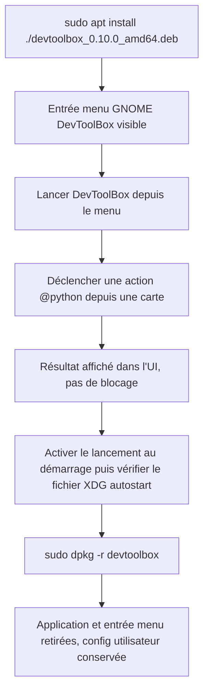

<!-- Fill or omit these sections; never add, rename, or reorder one. -->

# Instruction: Qualification du paquet .deb

## Architecture projection

> Tree of the final files. ✅ create · ✏️ modify · ❌ delete

```txt
.
├── packager.toml                             ✏️ (uniquement si les ressources installées ne tombent pas sous /usr/lib/devtoolbox/)
├── src/
│   └── python_runtime.rs                     ✏️ (uniquement si action_root() ne résout pas scripts/config sous /usr/lib/devtoolbox/)
└── aidd_docs/tasks/2026_09/2026_09_03_linux-local-qualification/
    └── evidence/
        ├── linux-deb-layout.txt              ✅ (sortie de dpkg -L devtoolbox)
        └── linux-deb-menu-entry.png           ✅ (capture de l'entrée GNOME)
```

## User Journey



## Test Scope

<!-- Required for every phase. Keep Setup, Happy path, any qualifying Edge cases, and any required Teardown in this one journey. -->

```mermaid
---
title: Test scope
---
journey
  %% Every task has exactly one actor: browser, api, cli, or system.
  section Setup
    Partir d'une machine sans DevToolBox installé en paquet => aucune trace résiduelle d'une install précédente: 5: system
    Confirmer un accès sudo disponible sur cette machine => installation et désinstallation possibles ; si indisponible, repasser `status: blocked` dans `plan.md` avant la tâche 1: 5: system
  section Happy path
    Installer le .deb avec apt install ./fichier.deb => code de sortie 0, dépendances résolues automatiquement, paquet listé par dpkg -l: 5: cli
    Inspecter dpkg -L devtoolbox => config/ et scripts/ présents sous /usr/lib/devtoolbox/: 5: cli
    Lancer DevToolBox depuis le menu GNOME => fenêtre affichée avec la grille de favoris et la police embarquée rendue (pas de repli visible vers une police système): 5: system
    Déclencher l'action @python « rapport d'applications » depuis une carte => résultat visible sans exception ni carte bloquée en désactivé: 5: system
    Activer « Lancer au démarrage » => fichier .desktop créé sous $XDG_CONFIG_HOME/autostart/: 5: system
  section Edge case - ressources introuvables
    Simuler une résolution de ressources en échec => action_root() retombe sur un chemin lisible sans crash de l'app: 1: system
  section Edge case - apt sans réseau
    apt install échoue faute de réseau pour résoudre une dépendance => repli sur sudo dpkg -i puis sudo apt --fix-broken install: 1: cli
  section Teardown
    Désinstaller avec dpkg -r devtoolbox => binaire, entrée menu et /usr/lib/devtoolbox retirés, config utilisateur XDG conservée: 5: cli
```

## Tasks to do

### `1)` Installer et inspecter le paquet

> Confirmer que le paquet réel place `config/` et `scripts/` là où `cargo-packager-resource-resolver` les attend pour un format Deb. Nécessite un accès sudo sur cette machine.

1. `sudo apt install ./dist/devtoolbox_0.10.0_amd64.deb` (résout automatiquement les dépendances manquantes) ; si `apt` échoue faute de réseau, replier sur `sudo dpkg -i dist/devtoolbox_0.10.0_amd64.deb` puis `sudo apt --fix-broken install`
2. `dpkg -L devtoolbox > evidence/linux-deb-layout.txt` puis vérifier la présence de `/usr/lib/devtoolbox/config` et `/usr/lib/devtoolbox/scripts`
3. Vérifier les dépendances déclarées (`libc6 (>= 2.35)`, `libx11-6`, `libwayland-client0`) sont satisfaites (`dpkg -s` sur chacune)

### `2)` Vérifier le comportement réel hors arbre de dev

> S'assurer que l'app fonctionne identiquement une fois installée par le système, pas seulement depuis `target/release/`.

1. Lancer DevToolBox depuis le menu applications GNOME, capturer `evidence/linux-deb-menu-entry.png`
2. Confirmer que la police embarquée (ressource `assets/fonts` de `packager.toml`) est bien celle rendue à l'écran, et non un repli silencieux vers une police système
3. Déclencher l'action `@python` « rapport d'applications » (`scripts/app_recommendations`) depuis une carte et confirmer un résultat exploitable dans l'UI
4. Activer « Lancer au démarrage » dans les Préférences et confirmer la création du fichier sous `$XDG_CONFIG_HOME/autostart/` (ou `~/.config/autostart/`)
5. Localiser où `config.json`, `application-usage.json` et le journal atterrissent réellement (`find ~/.config ~/.local/share ~/.local/state -iname '*devtoolbox*'`) et comparer avec `aidd_docs/memory/architecture.md`/`platform::`

### `3)` Corriger si la résolution diverge

> N'agir que si la tâche 1 ou 2 révèle un écart réel de résolution de ressources — ne pas anticiper de correctif. Si l'écart observé est d'une autre nature (crash, rendu cassé, régression fonctionnelle), ne pas corriger ici : repasser `status: blocked` dans `plan.md` et ouvrir une tâche dédiée.

1. Si `scripts/`/`config/` ne sont pas sous `/usr/lib/devtoolbox/`, ajuster les cibles `resources` de `packager.toml`
2. Si `action_root()` ne retrouve pas la racine empaquetée malgré un layout correct, corriger `src/python_runtime.rs`
3. Avant reconstruction, faire passer `cargo fmt --check`, `cargo clippy -- -D warnings` et `cargo test`
4. Reconstruire le `.deb` (retour à la phase 1, tâche 2) et revalider la tâche 1 de cette phase

### `4)` Désinstaller proprement

> Vérifier qu'un retrait ne laisse pas l'app à moitié présente ni ne supprime les données utilisateur.

1. `sudo dpkg -r devtoolbox`
2. Confirmer l'absence de `/usr/lib/devtoolbox`, du binaire et de l'entrée menu
3. Confirmer que `config.json` et les données utilisateur XDG restent en place

## Test acceptance criteria

<!-- Each criterion is an observable behavior, not a command. -->

| Task | Acceptance criteria              |
| ---- | -------------------------------- |
| 1... | `apt install ./*.deb` (ou son repli `dpkg -i` + `apt --fix-broken install`) se termine en succès, `dpkg -L devtoolbox` liste `config/` et `scripts/` sous `/usr/lib/devtoolbox/`, et les trois dépendances sont satisfaites. |
| 2... | L'app se lance depuis le menu GNOME avec la police embarquée correctement rendue, l'action « rapport d'applications » produit un résultat visible, et le fichier autostart XDG existe après activation. |
| 3... | Si un correctif de résolution de ressources a été nécessaire, `cargo fmt --check`/`clippy`/`test` passent puis le `.deb` reconstruit repasse la tâche 1 sans écart résiduel ; si l'écart trouvé n'est pas une question de ressources, le plan passe à `status: blocked` et aucun correctif n'est tenté ; sinon la tâche est marquée sans changement. |
| 4... | Après `dpkg -r devtoolbox`, `/usr/lib/devtoolbox` et l'entrée menu ont disparu et la configuration utilisateur XDG est toujours présente. |
