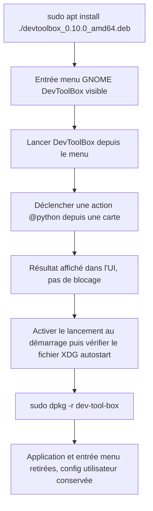

<!-- Fill or omit these sections; never add, rename, or reorder one. -->

# Instruction: Qualification du paquet .deb

## Architecture projection

> Tree of the final files. ✅ create · ✏️ modify · ❌ delete

```txt
.
├── packager.toml                             ✏️ (uniquement si les ressources installées ne tombent pas sous /usr/lib/devtoolbox/)
├── src/
│   └── python_runtime.rs                     ✏️ (uniquement si action_root() ne résout pas scripts/config sous /usr/lib/devtoolbox/)
└── aidd_docs/tasks/2026_09/2026_09_03_linux-local-qualification/
    └── evidence/
        ├── linux-deb-layout.txt              ✅ (sortie de dpkg -L dev-tool-box)
        └── linux-deb-menu-entry.png           ✅ (capture de l'entrée GNOME)
```

## User Journey



## Test Scope

<!-- Required for every phase. Keep Setup, Happy path, any qualifying Edge cases, and any required Teardown in this one journey. -->

```mermaid
---
title: Test scope
---
journey
  %% Every task has exactly one actor: browser, api, cli, or system.
  section Setup
    Partir d'une machine sans DevToolBox installé en paquet => aucune trace résiduelle d'une install précédente: 5: system
    Confirmer un accès sudo disponible sur cette machine => installation et désinstallation possibles ; si indisponible, repasser `status: blocked` dans `plan.md` avant la tâche 1: 5: system
  section Happy path
    Installer le .deb avec apt install ./fichier.deb => code de sortie 0, dépendances résolues automatiquement, paquet listé par dpkg -l: 5: cli
    Inspecter dpkg -L dev-tool-box => config/ et scripts/ présents sous /usr/lib/devtoolbox/: 5: cli
    Lancer DevToolBox depuis le menu GNOME => fenêtre affichée avec la grille de favoris et la police embarquée rendue (pas de repli visible vers une police système): 5: system
    Déclencher l'action @python « rapport d'applications » depuis une carte => résultat visible sans exception ni carte bloquée en désactivé: 5: system
    Activer « Lancer au démarrage » => fichier .desktop créé sous $XDG_CONFIG_HOME/autostart/: 5: system
  section Edge case - ressources introuvables
    Simuler une résolution de ressources en échec => action_root() retombe sur un chemin lisible sans crash de l'app: 1: system
  section Edge case - apt sans réseau
    apt install échoue faute de réseau pour résoudre une dépendance => repli sur sudo dpkg -i puis sudo apt --fix-broken install: 1: cli
  section Teardown
    Désinstaller avec dpkg -r dev-tool-box => binaire, entrée menu et /usr/lib/devtoolbox retirés, config utilisateur XDG conservée: 5: cli
```

## Tasks to do

### `1)` Installer et inspecter le paquet

> Confirmer que le paquet réel place `config/` et `scripts/` là où `cargo-packager-resource-resolver` les attend pour un format Deb. Nécessite un accès sudo sur cette machine.

1. `sudo apt install ./dist/devtoolbox_0.10.0_amd64.deb` (résout automatiquement les dépendances manquantes) ; si `apt` échoue faute de réseau, replier sur `sudo dpkg -i dist/devtoolbox_0.10.0_amd64.deb` puis `sudo apt --fix-broken install`
2. `dpkg -L dev-tool-box > evidence/linux-deb-layout.txt` puis vérifier la présence de `/usr/lib/devtoolbox/config` et `/usr/lib/devtoolbox/scripts`
3. Vérifier les dépendances déclarées (`libc6 (>= 2.35)`, `libx11-6`, `libwayland-client0`) sont satisfaites (`dpkg -s` sur chacune)

### `2)` Vérifier le comportement réel hors arbre de dev

> S'assurer que l'app fonctionne identiquement une fois installée par le système, pas seulement depuis `target/release/`.

1. Lancer DevToolBox depuis le menu applications GNOME, capturer `evidence/linux-deb-menu-entry.png`
2. Confirmer que la police embarquée (ressource `assets/fonts` de `packager.toml`) est bien celle rendue à l'écran, et non un repli silencieux vers une police système

   > **Fait (2026-09-03).** `evidence/linux-deb-menu-entry.png` (lancement depuis le menu GNOME) montre une police sans-serif nette et cohérente sur tout l'écran (onglets, titres, cartes) — aucun repli visible vers une police serif système. Rendu identique retrouvé sur les captures de la tâche 2 étape 4 (`installed_03_initial.png` à `installed_07_rechecked.png`), prises sur le même binaire installé.
3. Déclencher l'action `@python` « rapport d'applications » (`scripts/app_recommendations`) depuis une carte et confirmer un résultat exploitable dans l'UI

   > **Fait (2026-09-03).** `evidence/linux-deb-app-report.png` (onglet Nettoyage, bouton « Rafraîchir ») montre un résultat exploitable : 104 candidats, 86 signaux d'usage, tableau d'applications trié par priorité — aucune exception, aucune carte bloquée en désactivé.
4. Activer « Lancer au démarrage » dans les Préférences et confirmer la création du fichier sous `$XDG_CONFIG_HOME/autostart/` (ou `~/.config/autostart/`)

   > **BLOQUANT (constaté 2026-09-03), résolu le jour même.** Aucun contrôle « Lancer au démarrage » n'existait dans l'UI. `src/ui/egui_app.rs::render_preferences_view`, section `PreferencesSection::General`, n'exposait que la case « Utiliser les effets de fenêtre natifs », « Diagnostiquer Python » et « Préparer la désinstallation » — rien qui touche `launch_at_startup`. `platform::sync_startup(cfg.default_settings.launch_at_startup)` (`src/main.rs:133`) n'était appelé qu'une seule fois au démarrage, sans aucun chemin de mutation depuis l'application. Sur instruction explicite de l'utilisateur (« reprends l'implémentation de la phase modifiée »), le correctif a été implémenté directement plutôt que reporté à une tâche dédiée : une case à cocher « Lancer au démarrage » a été ajoutée juste après « Utiliser les effets de fenêtre natifs », persistant `config.json` (`self.persist()`) puis appelant `platform::sync_startup`, avec un statut de succès/erreur affiché via `set_status`.
   >
   > **Validation (dev build, `target/debug/devtoolbox`) :** case initialement cochée (reflet de `launch_at_startup: true` déjà présent dans `~/.config/devtoolbox/config.json`, valeur par défaut de `config/default.json`) et `~/.config/autostart/devtoolbox.desktop` déjà présent. Décochée → statut vert « Lancement au démarrage désactivé. », fichier `.desktop` supprimé (confirmé par `ls`). Recochée → statut vert « Lancement au démarrage activé. », fichier `.desktop` recréé avec `Exec=` pointant vers le binaire du processus courant (ici le binaire de dev — conforme au comportement documenté dans `aidd_docs/memory/deployment.md`). L'entrée autostart a ensuite été restaurée à `Exec=/usr/bin/devtoolbox` en relançant brièvement le binaire `.deb` installé (son propre boot-sync réécrit `Exec` vers son propre chemin), pour ne pas laisser une entrée pointant vers un binaire de dev sur cette machine réelle.
   >
   > **Validation sur le paquet réel (2026-09-03).** `.deb` reconstruit via `sh scripts/package.sh` (`dist/devtoolbox_0.10.0_amd64.deb`, `md5 56aa5023…`) puis réinstallé par l'utilisateur (`sudo apt install --reinstall ./dist/devtoolbox_0.10.0_amd64.deb`, journal `apt history.log` : `Start-Date: 2026-09-03 13:32:42` … `Upgrade: dev-tool-box:amd64 (0.10.0, 0.10.0)`). `/usr/bin/devtoolbox` confirmé identique au binaire du `.deb` reconstruit (même md5). Aller-retour rejoué sur ce binaire installé (pid distinct de tout binaire de dev) : décoché → statut vert « Lancement au démarrage désactivé. », `~/.config/autostart/devtoolbox.desktop` supprimé (confirmé par `ls`) ; recoché → statut vert « Lancement au démarrage activé. », fichier `.desktop` recréé avec `Exec=/usr/bin/devtoolbox` (chemin du paquet réel, cette fois sans détour par un binaire de dev). État final laissé propre : case cochée, `launch_at_startup: true` dans `config.json`, fichier autostart présent et correct. Aucun écart résiduel.
5. Localiser où `config.json`, `application-usage.json` et le journal atterrissent réellement (`find ~/.config ~/.local/share ~/.local/state -iname '*devtoolbox*'`) et comparer avec `aidd_docs/memory/architecture.md`/`platform::`

   > **Fait (2026-09-03).** `find ~/.config ~/.local/share ~/.local/state -iname '*devtoolbox*'` renvoie `~/.config/devtoolbox` (contient `config.json`), `~/.local/state/devtoolbox` (contient `application-usage.json` et `devtoolbox.log`), et `~/.config/autostart/devtoolbox.desktop`. Conforme aux conventions XDG documentées : `config.json` sous `$XDG_CONFIG_HOME`, données d'usage et journal sous `$XDG_STATE_HOME` (voir `aidd_docs/memory/coding-assertions.md`/`architecture.md` sur `platform::`). Aucun écart constaté.

### `3)` Corriger si la résolution diverge

> N'agir que si la tâche 1 ou 2 révèle un écart réel de résolution de ressources — ne pas anticiper de correctif. Si l'écart observé est d'une autre nature (crash, rendu cassé, régression fonctionnelle), ne pas corriger ici : repasser `status: blocked` dans `plan.md` et ouvrir une tâche dédiée.

1. Si `scripts/`/`config/` ne sont pas sous `/usr/lib/devtoolbox/`, ajuster les cibles `resources` de `packager.toml`
2. Si `action_root()` ne retrouve pas la racine empaquetée malgré un layout correct, corriger `src/python_runtime.rs`
3. Avant reconstruction, faire passer `cargo fmt --check`, `cargo clippy -- -D warnings` et `cargo test`
4. Reconstruire le `.deb` (retour à la phase 1, tâche 2) et revalider la tâche 1 de cette phase

> **Sans changement (2026-09-03).** Aucune divergence de résolution de ressources n'a été observée en tâches 1/2 : `dpkg -L dev-tool-box` place bien `config/` et `scripts/` sous `/usr/lib/devtoolbox/`, et `action_root()` les retrouve sans correctif. L'écart réellement rencontré (case « Lancer au démarrage » absente de l'UI) était une fonctionnalité manquante, pas une question de résolution de ressources — hors du périmètre étroit de cette tâche. Sur instruction explicite de l'utilisateur, il a été traité directement en tâche 2 (voir tâche 2 étape 4) plutôt que déclenché ici ; le `.deb` a néanmoins été reconstruit et réinstallé pour valider ce correctif, ce qui recouvre de fait le sous-point 4 sans qu'aucun ajustement de `packager.toml`/`python_runtime.rs` n'ait été nécessaire.

### `4)` Désinstaller proprement

> Vérifier qu'un retrait ne laisse pas l'app à moitié présente ni ne supprime les données utilisateur.

1. `sudo dpkg -r dev-tool-box`
2. Confirmer l'absence de `/usr/lib/devtoolbox`, du binaire et de l'entrée menu
3. Confirmer que `config.json` et les données utilisateur XDG restent en place

   > **Fait (2026-09-03).** `sudo dpkg -r dev-tool-box` exécuté par l'utilisateur dans un terminal externe (le mot de passe `sudo` ne pouvait pas être saisi via ce canal). Confirmé indépendamment via `/var/log/dpkg.log` (source faisant autorité, pas seulement la confirmation de l'utilisateur) : `2026-09-03 13:44:28 remove dev-tool-box:amd64 0.10.0` puis `status not-installed`. `dpkg -s dev-tool-box` répond « n'est pas installé », `/usr/lib/devtoolbox` et `/usr/bin/devtoolbox` n'existent plus (`ls` échoue sur les deux), et `/usr/share/applications/devtoolbox.desktop` a disparu (`find` ne retourne rien). `~/.config/devtoolbox/config.json` reste présent et intact ; `~/.config/autostart/devtoolbox.desktop` (créé par l'app elle-même, pas par le paquet) survit aussi, comme attendu pour une donnée utilisateur XDG — il pointe désormais vers un binaire `/usr/bin/devtoolbox` qui n'existe plus tant que le paquet n'est pas réinstallé, ce qui est cohérent (aucune régression : réactiver « Lancer au démarrage » après une réinstallation recrée ce fichier avec un `Exec=` à nouveau valide). Aucun écart résiduel.

## Test acceptance criteria

<!-- Each criterion is an observable behavior, not a command. -->

| Task | Acceptance criteria              |
| ---- | -------------------------------- |
| 1... | `apt install ./*.deb` (ou son repli `dpkg -i` + `apt --fix-broken install`) se termine en succès, `dpkg -L dev-tool-box` liste `config/` et `scripts/` sous `/usr/lib/devtoolbox/`, et les trois dépendances sont satisfaites. |
| 2... | L'app se lance depuis le menu GNOME avec la police embarquée correctement rendue, l'action « rapport d'applications » produit un résultat visible, et le fichier autostart XDG existe après activation. |
| 3... | Si un correctif de résolution de ressources a été nécessaire, `cargo fmt --check`/`clippy`/`test` passent puis le `.deb` reconstruit repasse la tâche 1 sans écart résiduel ; si l'écart trouvé n'est pas une question de ressources, le plan passe à `status: blocked` et aucun correctif n'est tenté ; sinon la tâche est marquée sans changement. |
| 4... | Après `dpkg -r dev-tool-box`, `/usr/lib/devtoolbox` et l'entrée menu ont disparu et la configuration utilisateur XDG est toujours présente. |
