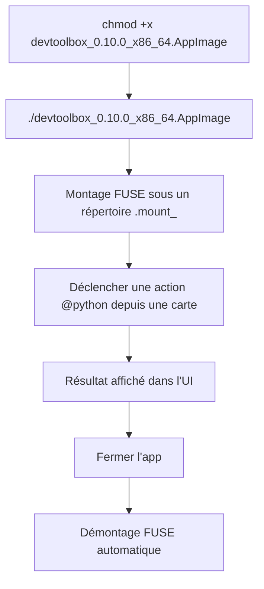
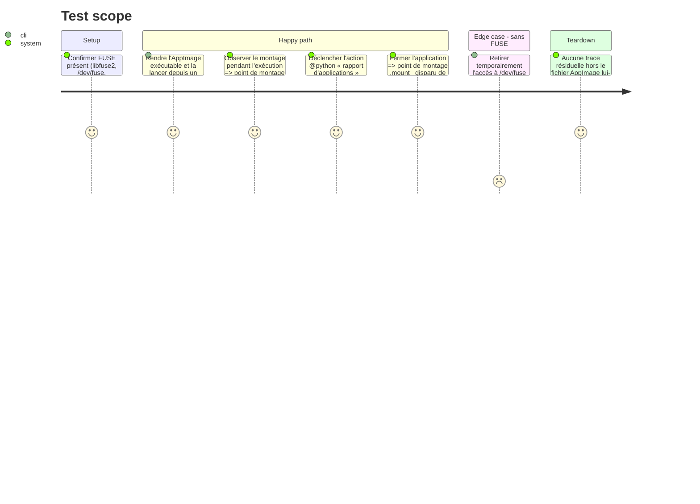

<!-- Fill or omit these sections; never add, rename, or reorder one. -->

# Instruction: Qualification de l'AppImage

## Architecture projection

> Tree of the final files. ✅ create · ✏️ modify · ❌ delete

```txt
.
├── src/
│   └── python_runtime.rs                     ✏️ (uniquement si action_root() ne résout pas scripts/config sous $APPDIR/usr/lib/devtoolbox)
└── aidd_docs/tasks/2026_09/2026_09_03_linux-local-qualification/
    └── evidence/
        ├── linux-appimage-mount.txt          ✅ (sortie de mount | grep .mount_ pendant l'exécution)
        └── linux-appimage-run.png             ✅ (capture de l'app lancée depuis l'AppImage)
```

## User Journey



## Test Scope

<!-- Required for every phase. Keep Setup, Happy path, any qualifying Edge cases, and any required Teardown in this one journey. -->



## Tasks to do

### `1)` Exécuter l'AppImage hors arbre de dev

> Vérifier le mode portable réel : aucune installation, résolution de ressources relative à `$APPDIR`.

1. Copier `dist/devtoolbox_0.10.0_x86_64.AppImage` dans un répertoire hors du dépôt (ex. `~/Téléchargements/`)
2. `chmod +x` puis lancer directement le fichier
3. Pendant l'exécution, capturer `mount | grep '\.mount_'` dans `evidence/linux-appimage-mount.txt`
4. Capturer `evidence/linux-appimage-run.png`

**Fait (2026-09-04).** AppImage reconstruite, copiée sous `~/Téléchargements/`, rendue exécutable,
lancée directement. `mount | grep '.mount_devtoo'` confirme le montage FUSE
(`evidence/linux-appimage-mount.txt`) : `libfuse2`, `/dev/fuse` et
`fusermount`/`fusermount3` présents, montage réussi sans intervention. Capture
`evidence/linux-appimage-run.png` : fenêtre rendue correctement, police
embarquée nette (pas de repli visible vers une police système), puis rapport
d'applications visible.

### `2)` Vérifier le comportement réel

> Confirmer que les actions `@python` et les chemins de config/données fonctionnent identiquement au `.deb`.

1. Confirmer que la police embarquée (ressource `assets/fonts` de `packager.toml`) est bien celle rendue à l'écran, et non un repli silencieux vers une police système
2. Déclencher l'action `@python` « rapport d'applications » depuis une carte et confirmer un résultat exploitable
3. Confirmer que `config.json`/données utilisateur restent sous les répertoires XDG habituels et non sous le point de montage `.mount_` (qui disparaît à la fermeture)
4. Fermer l'application et confirmer la disparition du point de montage `.mount_`

**Fait (2026-09-04).** Étape 1 est confirmée avec la tâche 1 ci-dessus. L'étape 2 avait
révélé un vrai écart, traité en tâche 3 ci-dessous : le clic sur l'action
« rapport d'applications » (onglet Nettoyage → Applications installées)
produisait auparavant un `Fatal Python error: init_fs_encoding` /
`ModuleNotFoundError: No module named 'encodings'`, absent du `.deb` (voir
`linux-deb-app-report.png` en phase 2). Après reconstruction, le rapport
affiche 103 candidats sans exception. `~/.config/devtoolbox` et
`~/.local/state/devtoolbox` restent les seuls emplacements de données observés ;
aucune donnée utilisateur ne réside sous `/tmp/.mount_devtoo*`. La fermeture
de la fenêtre retire ce point de montage.

### `3)` Corriger si la résolution diverge

> N'agir que si un écart réel de résolution de ressources est observé. Si l'écart observé est d'une autre nature (crash, rendu cassé, régression fonctionnelle), ne pas corriger ici : repasser `status: blocked` dans `plan.md` et ouvrir une tâche dédiée.

1. Si `action_root()` ne retrouve pas `scripts/`/`config/` sous `$APPDIR/usr/lib/devtoolbox`, corriger `src/python_runtime.rs`
2. Avant reconstruction, faire passer `cargo fmt --check`, `cargo clippy -- -D warnings` et `cargo test`
3. Reconstruire l'AppImage (retour à la phase 1, tâche 2) et revalider les tâches 1-2 de cette phase

**Fait (2026-09-04).** `action_root()` résolvait déjà correctement
`scripts/`/`config/` sous `$APPDIR/usr/lib/devtoolbox` (confirmé par
inspection directe du point de montage) — ce n'était donc pas la cause. La
cause réelle, hors du périmètre initialement prévu pour cette tâche mais
validée avec l'utilisateur (même traitement que le blocage « Lancer au
démarrage » de la phase 2 : correctif direct plutôt qu'une tâche séparée) :
l'`AppRun` générique de l'AppImage pose systématiquement
`PYTHONHOME=$APPDIR/usr/` et `PYTHONPATH=$APPDIR/usr/share/pyshared/` dans
l'environnement du process — un comportement boilerplate du runtime AppImage
pour les apps qui embarquent leur propre Python, ce que DevToolBox ne fait
pas. Ces variables sont héritées par tout `python3` système lancé en enfant,
qui échoue alors à charger sa propre stdlib (`PYTHONHOME` pointe vers un
répertoire sans installation Python valide).

Correctif : nouvelle fonction partagée `python_runtime::clear_appimage_python_env`
(`env_remove("PYTHONHOME")` + `env_remove("PYTHONPATH")`), appelée aux quatre
points de spawn Python de l'app : `python_runtime::recommendation_command_from_root`,
`python_runtime::model_orchestrator_command_from_root`,
`cleanup::spawn::clean_command_from_root`, et
`ui::terminal_view::launch_captured_program` (chemin partagé des cartes
`@python`, du panneau Terminal et de Docker compose — retrait inoffensif pour
les commandes non-Python). `src/windows/process.rs` n'est pas touché : pas
d'AppImage sous Windows, et ce chemin n'est de toute façon pas câblé depuis la
grille de cartes.

Étape 2 : `cargo fmt --check`, `cargo clippy -- -D warnings` passent sans
avertissement ; `cargo test` : 712 tests passants, 0 échec.

Étape 3 : la reconstruction (`cargo build --release --locked` puis
`cargo packager --release --formats deb,appimage`) a produit les deux paquets
le 2026-09-04. L'AppImage reconstruite a repassé les tâches 1-2 sans écart :
montage FUSE, police et rapport d'applications fonctionnels, données XDG hors
montage, et démontage à la fermeture. Le repli
`--appimage-extract-and-run` démarre aussi DevToolBox sans créer de montage
FUSE. Côté intégration bureau, le lanceur installé par le `.deb` associe
désormais correctement la fenêtre via `StartupWMClass=DevToolBox` ; l'AppImage
portable lancée directement reste, elle, un binaire non installé et n'est donc
pas qualifiée ici comme favori GNOME persistant.

## Test acceptance criteria

<!-- Each criterion is an observable behavior, not a command. -->

| Task | Acceptance criteria              |
| ---- | -------------------------------- |
| 1... | L'AppImage se lance depuis un répertoire hors dépôt, un point de montage `.mount_` apparaît pendant l'exécution. |
| 2... | La police embarquée est correctement rendue, l'action « rapport d'applications » produit un résultat visible, et les données utilisateur restent sous les répertoires XDG plutôt que sous le point de montage. |
| 3... | Si un correctif de résolution de ressources a été nécessaire, `cargo fmt --check`/`clippy`/`test` passent puis l'AppImage reconstruite repasse les tâches 1-2 sans écart résiduel ; si l'écart trouvé n'est pas une question de ressources, le plan passe à `status: blocked` et aucun correctif n'est tenté ; sinon la tâche est marquée sans changement. |
