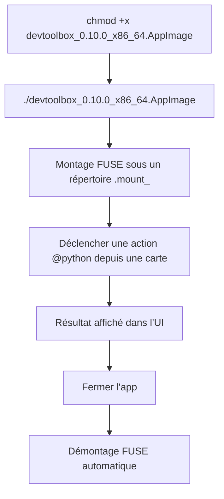
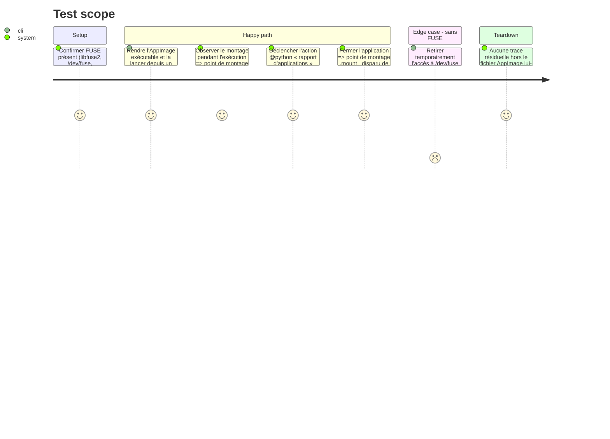

<!-- Fill or omit these sections; never add, rename, or reorder one. -->

# Instruction: Qualification de l'AppImage

## Architecture projection

> Tree of the final files. ✅ create · ✏️ modify · ❌ delete

```txt
.
├── src/
│   └── python_runtime.rs                     ✏️ (uniquement si action_root() ne résout pas scripts/config sous $APPDIR/usr/lib/devtoolbox)
└── aidd_docs/tasks/2026_09/2026_09_03_linux-local-qualification/
    └── evidence/
        ├── linux-appimage-mount.txt          ✅ (sortie de mount | grep .mount_ pendant l'exécution)
        └── linux-appimage-run.png             ✅ (capture de l'app lancée depuis l'AppImage)
```

## User Journey



## Test Scope

<!-- Required for every phase. Keep Setup, Happy path, any qualifying Edge cases, and any required Teardown in this one journey. -->



## Tasks to do

### `1)` Exécuter l'AppImage hors arbre de dev

> Vérifier le mode portable réel : aucune installation, résolution de ressources relative à `$APPDIR`.

1. Copier `dist/devtoolbox_0.10.0_x86_64.AppImage` dans un répertoire hors du dépôt (ex. `~/Téléchargements/`)
2. `chmod +x` puis lancer directement le fichier
3. Pendant l'exécution, capturer `mount | grep '\.mount_'` dans `evidence/linux-appimage-mount.txt`
4. Capturer `evidence/linux-appimage-run.png`

### `2)` Vérifier le comportement réel

> Confirmer que les actions `@python` et les chemins de config/données fonctionnent identiquement au `.deb`.

1. Confirmer que la police embarquée (ressource `assets/fonts` de `packager.toml`) est bien celle rendue à l'écran, et non un repli silencieux vers une police système
2. Déclencher l'action `@python` « rapport d'applications » depuis une carte et confirmer un résultat exploitable
3. Confirmer que `config.json`/données utilisateur restent sous les répertoires XDG habituels et non sous le point de montage `.mount_` (qui disparaît à la fermeture)
4. Fermer l'application et confirmer la disparition du point de montage `.mount_`

### `3)` Corriger si la résolution diverge

> N'agir que si un écart réel de résolution de ressources est observé. Si l'écart observé est d'une autre nature (crash, rendu cassé, régression fonctionnelle), ne pas corriger ici : repasser `status: blocked` dans `plan.md` et ouvrir une tâche dédiée.

1. Si `action_root()` ne retrouve pas `scripts/`/`config/` sous `$APPDIR/usr/lib/devtoolbox`, corriger `src/python_runtime.rs`
2. Avant reconstruction, faire passer `cargo fmt --check`, `cargo clippy -- -D warnings` et `cargo test`
3. Reconstruire l'AppImage (retour à la phase 1, tâche 2) et revalider les tâches 1-2 de cette phase

## Test acceptance criteria

<!-- Each criterion is an observable behavior, not a command. -->

| Task | Acceptance criteria              |
| ---- | -------------------------------- |
| 1... | L'AppImage se lance depuis un répertoire hors dépôt, un point de montage `.mount_` apparaît pendant l'exécution. |
| 2... | La police embarquée est correctement rendue, l'action « rapport d'applications » produit un résultat visible, et les données utilisateur restent sous les répertoires XDG plutôt que sous le point de montage. |
| 3... | Si un correctif de résolution de ressources a été nécessaire, `cargo fmt --check`/`clippy`/`test` passent puis l'AppImage reconstruite repasse les tâches 1-2 sans écart résiduel ; si l'écart trouvé n'est pas une question de ressources, le plan passe à `status: blocked` et aucun correctif n'est tenté ; sinon la tâche est marquée sans changement. |
