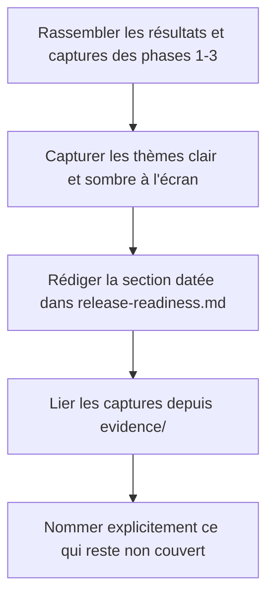
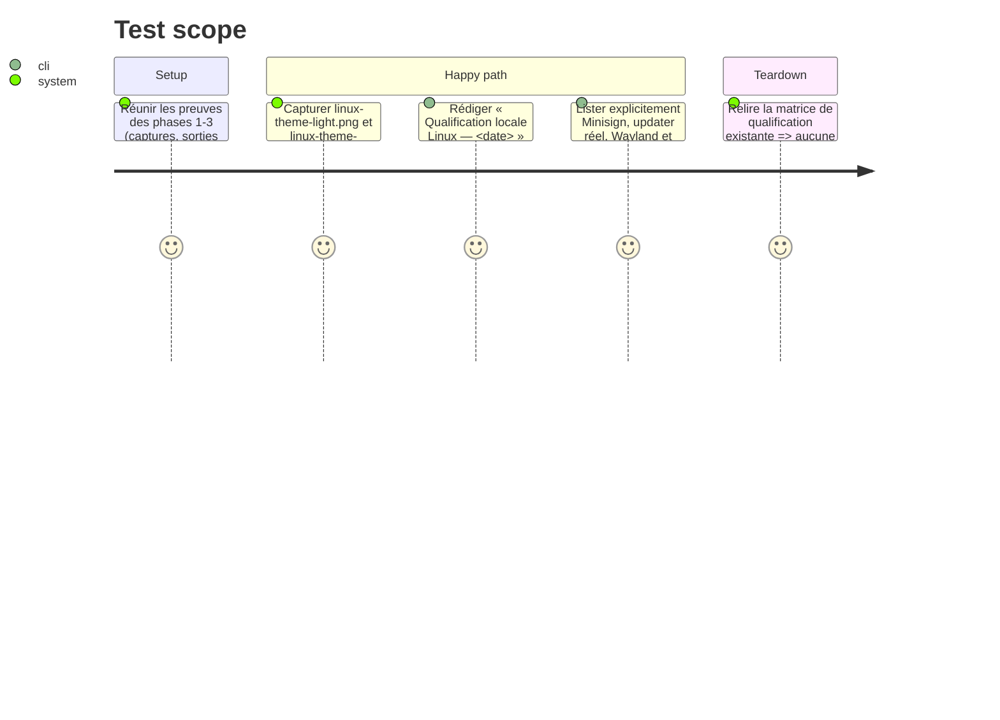

<!-- Fill or omit these sections; never add, rename, or reorder one. -->

# Instruction: Documentation de la preuve datée

## Architecture projection

> Tree of the final files. ✅ create · ✏️ modify · ❌ delete

```txt
.
├── docs/
│   └── release-readiness.md                  ✏️ (ajout de la section « Qualification locale Linux — <date> »)
└── aidd_docs/tasks/2026_09/2026_09_03_linux-local-qualification/
    └── evidence/
        ├── linux-theme-light.png              ✅ (capture en thème clair)
        └── linux-theme-dark.png                ✅ (capture en thème sombre)
```

## User Journey



## Test Scope

<!-- Required for every phase. Keep Setup, Happy path, any qualifying Edge cases, and any required Teardown in this one journey. -->



## Tasks to do

### `1)` Rédiger la section de preuve

> Suivre exactement la forme de « Qualification locale Windows — 2 septembre 2026 » : ce qui a été construit, installé/désinstallé, avec quel résultat, et les limites explicites.

1. Ajouter une section `## Qualification locale Linux — <date du jour>` en fin de `docs/release-readiness.md`
2. Décrire la construction (`.deb` + AppImage 0.10.0), l'installation/désinstallation réelles, et le résultat de la résolution des ressources (`/usr/lib/devtoolbox/` pour le deb, `$APPDIR/usr/lib/devtoolbox/` pour l'AppImage)
3. Capturer `evidence/linux-theme-light.png` et `evidence/linux-theme-dark.png` (thème clair puis sombre, basculé dans les Préférences) depuis l'application installée par le `.deb` (résultat de la phase 2), à l'image des deux captures de la section Windows
4. Lier les captures et sorties de `evidence/` (thèmes clair/sombre, menu GNOME, exécution AppImage, layout dpkg, montage FUSE)
5. Nommer explicitement ce que cette preuve NE qualifie PAS : Minisign, activation réelle de l'updater, Wayland, Ubuntu 24.04 — sur le modèle de la phrase finale de la section Windows

## Test acceptance criteria

<!-- Each criterion is an observable behavior, not a command. -->

| Task | Acceptance criteria              |
| ---- | -------------------------------- |
| 1... | `docs/release-readiness.md` contient une section datée du jour, avec les captures thème clair et thème sombre liées, les autres preuves liées, et une phrase explicite sur ce qui reste non couvert (Minisign, updater, Wayland, Ubuntu 24.04). |
