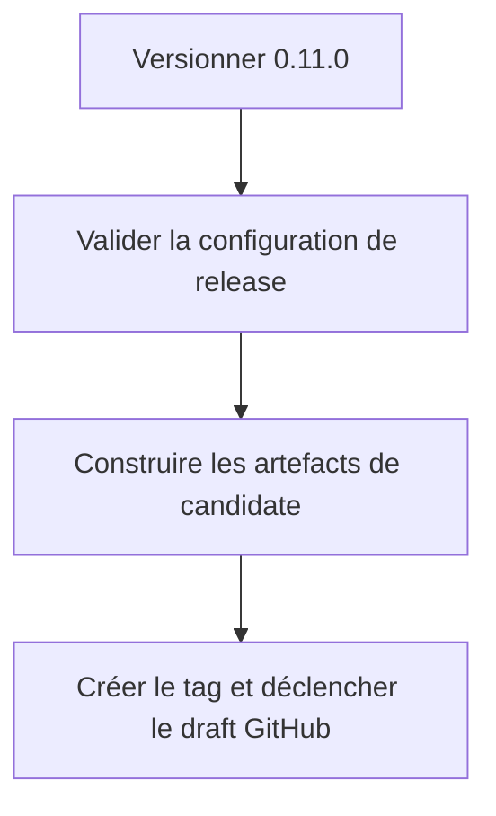
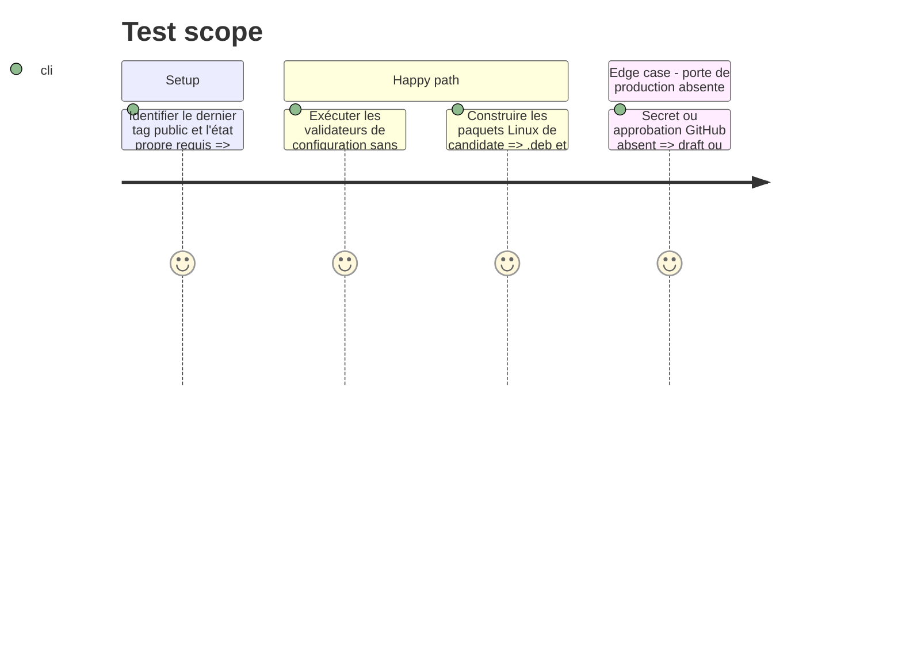

<!-- Fill or omit these sections; never add, rename, or reorder one. -->

# Instruction: Préparer la candidate 0.11.0 et la porte de release

## Architecture projection

> Tree of the final files. ✅ create · ✏️ modify · ❌ delete

```txt
.
├── Cargo.toml                              ✏️ version de candidate 0.11.0
├── packager.toml                           ✏️ version de candidate cohérente
├── CHANGELOG.md                            ✏️ section 0.11.0 et notes de qualification
└── aidd_docs/tasks/2026_09/2026_09_07_linux-release-qualification/
    └── evidence/
        └── release-gate.txt                ✅ contrôles secrets-free et identifiant de candidate
```

## User Journey



## Test Scope



## Tasks to do

### `1)` Préparer une candidate publiable

> Passer la version cohérente à 0.11.0, documenter les changements et exécuter les portes sans secrets.

1. Publier d'abord 0.10.0 avec l'entrée manuelle `qualification` : le workflow la traite comme la première release compatible sans feed, mais ses assets deviennent la récupération de 0.11.0.
2. Vérifier que le changement vers 0.11.0, les notes et le tag cible ne recouvrent aucun travail utilisateur.
3. Mettre à jour les versions de paquet et le changelog conformément aux règles de release existantes.
4. Exécuter `verify-package-config.py`, `verify-release-config.py`, les auto-tests de manifeste, puis les assertions Rust.
5. Construire les paquets Linux 0.11.0 et enregistrer leurs empreintes dans l’évidence locale.

### `2)` Déclencher la candidate protégée

> Donner au mainteneur de release un tag et un draft vérifiables sans exposer les secrets.

1. Créer le tag de candidate et lancer le workflow `Release candidate` avec publication désactivée.
2. Vérifier que le job atteint l’environnement `production-release` et s’arrête proprement si les approbations ou secrets font défaut.

## Test acceptance criteria

| Task | Acceptance criteria |
| --- | --- |
| 1 | Les versions des fichiers de paquet concordent en 0.11.0, les validateurs et assertions passent, et les artefacts Linux portent cette version. |
| 2 | Une candidate GitHub est créée en draft uniquement ; aucun asset stable n’est publié sans porte protégée satisfaite. |
