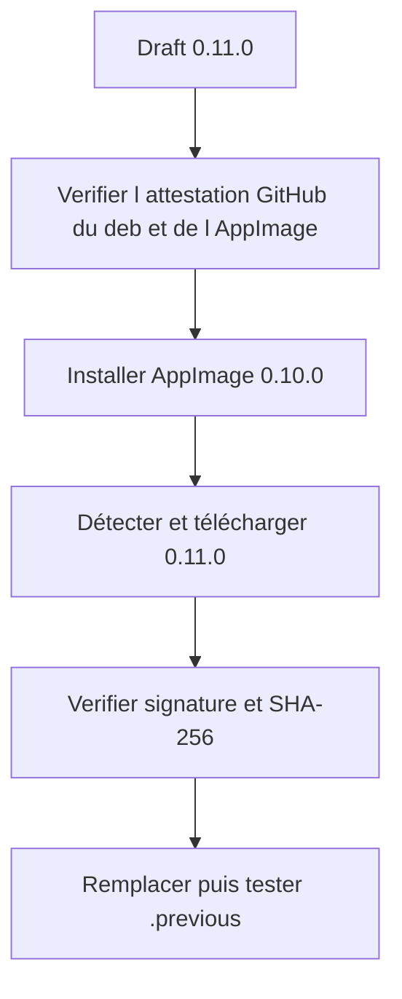
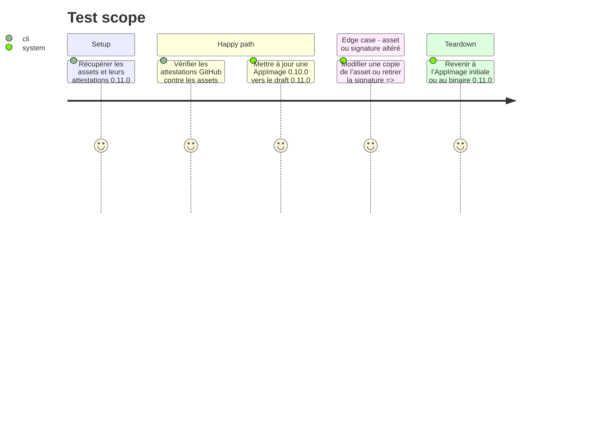

<!-- Fill or omit these sections; never add, rename, or reorder one. -->

# Instruction: Attester les artefacts et valider l’updater réel sur draft

## Architecture projection

> Tree of the final files. ✅ create · ✏️ modify · ❌ delete

```txt
.
├── docs/release-readiness.md                ✏️ résultat de signature et update réel
└── aidd_docs/tasks/2026_09/2026_09_07_linux-release-qualification/
    └── evidence/
        ├── github-attestation-0.11.0.txt    ✅ vérification des attestations Linux
        ├── updater-appimage-0.10-to-0.11.md ✅ parcours d’update et récupération
        └── release-draft-assets.txt         ✅ inventaire et empreintes du draft
```

## User Journey



## Test Scope



## Tasks to do

### `1)` Vérifier les attestations Linux publiées

> Prouver que les octets `.deb` et AppImage du draft proviennent du workflow de release attendu.

1. Télécharger les assets du draft puis vérifier leur provenance avec `gh attestation verify` et le workflow de release attendu.
2. Consigner l’identifiant du workflow, le commit et les empreintes sans écrire de secret.
3. Consigner les commandes, empreintes SHA-256 et résultats sans écrire de secret.

### `2)` Exécuter le parcours d’updater réel

> Tester sur AppImage la détection du feed, les signatures de rotation, le remplacement et le rollback.

1. Démarrer depuis une AppImage 0.10.0 connue et cibler le feed du draft 0.11.0.
2. Vérifier le téléchargement, la signature Ed25519, le hash et le redémarrage sur 0.11.0.
3. Forcer un échec sur une copie altérée et vérifier le refus, puis tester la restauration depuis `.previous`.

## Test acceptance criteria

| Task | Acceptance criteria |
| --- | --- |
| 1 | Les attestations GitHub du `.deb` et de l’AppImage 0.11.0 sont validées contre le workflow de release attendu et leurs empreintes sont conservées. |
| 2 | L’AppImage 0.10.0 atteint réellement 0.11.0, refuse un payload altéré et peut restaurer le binaire précédent sans perte des données XDG. |
