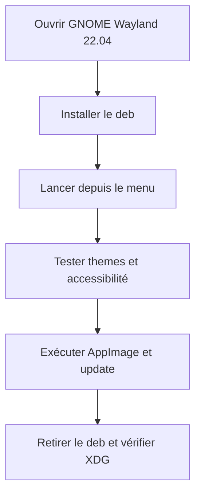
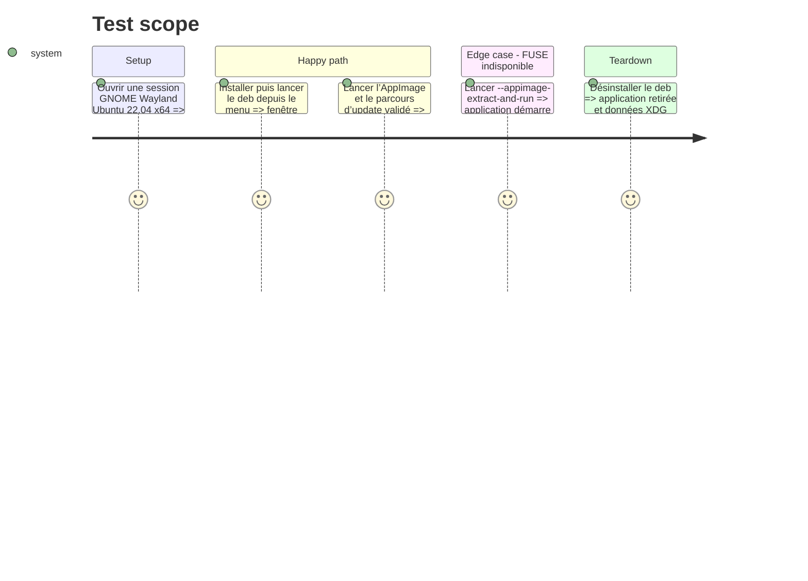

<!-- Fill or omit these sections; never add, rename, or reorder one. -->

# Instruction: Qualifier Ubuntu 22.04 sous Wayland

## Architecture projection

> Tree of the final files. ✅ create · ✏️ modify · ❌ delete

```txt
.
└── aidd_docs/tasks/2026_09/2026_09_07_linux-release-qualification/
    └── evidence/
        ├── ubuntu-22-wayland-deb.png        ✅ rendu et intégration deb
        ├── ubuntu-22-wayland-appimage.png   ✅ rendu et update AppImage
        └── ubuntu-22-wayland-session.txt    ✅ version OS, session et pilote
```

## User Journey



## Test Scope



## Tasks to do

### `1)` Qualifier les paquets sous Wayland

> Rejouer la qualification fonctionnelle et visuelle dans la session que la précédente preuve X11 ne couvrait pas.

1. Capturer les métadonnées de session et vérifier l’absence de repli X11 non documenté.
2. Tester le `.deb`, l’AppImage, les thèmes, navigation clavier, animations réduites et contraste.
3. Rejouer l’action Python, les chemins XDG, le retrait `.deb` et le repli sans FUSE.
4. Lier les captures et résultats au dossier d’évidence.

## Test acceptance criteria

| Task | Acceptance criteria |
| --- | --- |
| 1 | Sous Ubuntu 22.04 Wayland, les deux formats affichent une UI lisible et utilisable ; les ressources, XDG, FUSE/repli et retrait `.deb` satisfont la matrice. |
