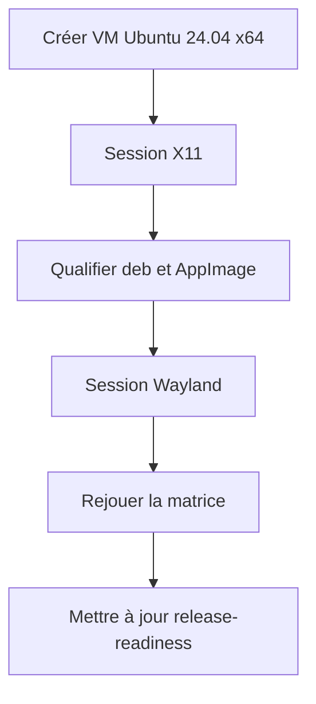
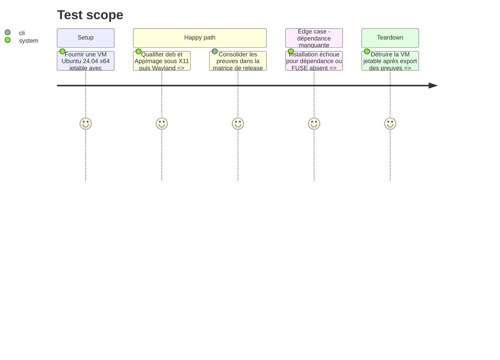

<!-- Fill or omit these sections; never add, rename, or reorder one. -->

# Instruction: Qualifier Ubuntu 24.04 et consigner la matrice

## Architecture projection

> Tree of the final files. ✅ create · ✏️ modify · ❌ delete

```txt
.
├── docs/release-readiness.md                ✏️ matrice Linux complétée ou limites datées
└── aidd_docs/tasks/2026_09/2026_09_07_linux-release-qualification/
    └── evidence/
        ├── ubuntu-24-x11.md                 ✅ qualification deb et AppImage X11
        ├── ubuntu-24-wayland.md             ✅ qualification deb et AppImage Wayland
        └── ubuntu-24-visual/                ✅ captures clair, sombre et accessibilité
```

## User Journey



## Test Scope



## Tasks to do

### `1)` Créer et qualifier les deux sessions Ubuntu 24.04

> Obtenir la preuve qui manque à la matrice, sans extrapoler depuis Ubuntu 22.04 ou un conteneur.

1. Préparer une VM x64 jetable disposant de GNOME X11 et GNOME Wayland ; documenter l’image et les pilotes.
2. Sur chaque session, installer le `.deb`, exécuter l’AppImage, vérifier update/rollback, thèmes, accessibilité, ressources et XDG.
3. Tester explicitement FUSE présent et le repli sans FUSE, puis retirer le `.deb` en préservant les données.

### `2)` Clore la documentation de release

> Mettre à jour uniquement après validation de toutes les preuves et conserver les limites réelles si une porte échoue.

1. Ajouter les liens et résultats de Minisign, updater, Wayland 22.04 et Ubuntu 24.04 à `docs/release-readiness.md`.
2. Faire vérifier la matrice par l’opérateur QA et le mainteneur de release, puis laisser le draft intact tant que l’approbation protégée manque.

## Test acceptance criteria

| Task | Acceptance criteria |
| --- | --- |
| 1 | Ubuntu 24.04 x64 est qualifié séparément sous X11 et Wayland pour le `.deb` et l’AppImage, avec preuves de ressources, rendu, update, rollback, FUSE et retrait. |
| 2 | La matrice de release référence toutes les preuves demandées ; la candidate ne devient stable qu’après validation humaine protégée. |
